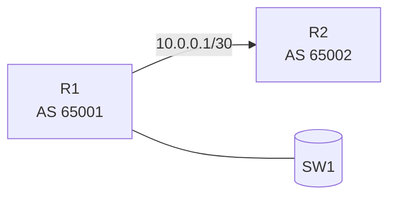
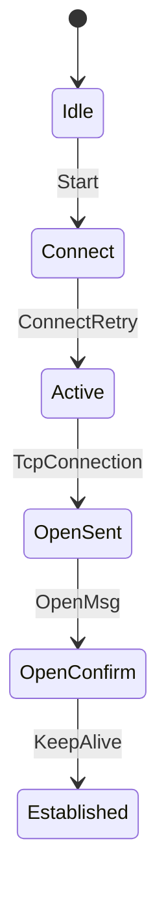
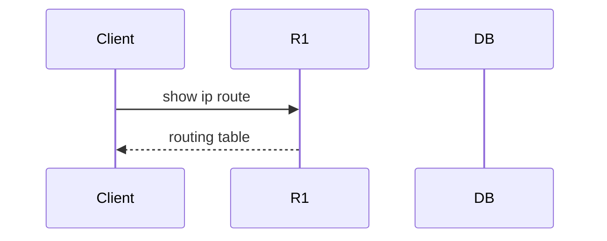

# Mermaid Diagram Syntax — Quick Reference

Use this reference when generating Mermaid diagrams. Load only when needed.

## Supported Diagram Types

```
flowchart LR / TD / BT / RL
sequenceDiagram
classDiagram
stateDiagram-v2
erDiagram
gantt
pie
xychart-beta
```

## Network Topology (flowchart)



**Rules:**
- Node IDs must not contain spaces — use underscore: `R1_Lo0`
- Labels in `[]` for routers, `()` for endpoints, `[()]` for databases, `[(name)]` for storage
- Edge labels go between `|` pipes
- Direction: `LR` = left-right, `TD` = top-down

## BGP State Diagram



## Sequence Diagram



## Common Mistakes to Avoid

- ❌ `flowchart-LR` (wrong separator) → ✅ `flowchart LR`
- ❌ Node label with colon: `R1[10.0.0.1:8080]` → ✅ `R1["10.0.0.1:8080"]`
- ❌ Special chars in node ID: `R1-Lo0` → ✅ `R1_Lo0`
- ❌ `-->|label` without closing pipe → ✅ `-->|label|`
- ❌ Mixing graph and flowchart keywords

## Rendering Notes

- Wrap in ` ```mermaid ` fenced code blocks
- For large topologies: prefer `LR` direction and group nodes with `subgraph`
- Max ~20 nodes for readable output; use clustering for larger topologies
