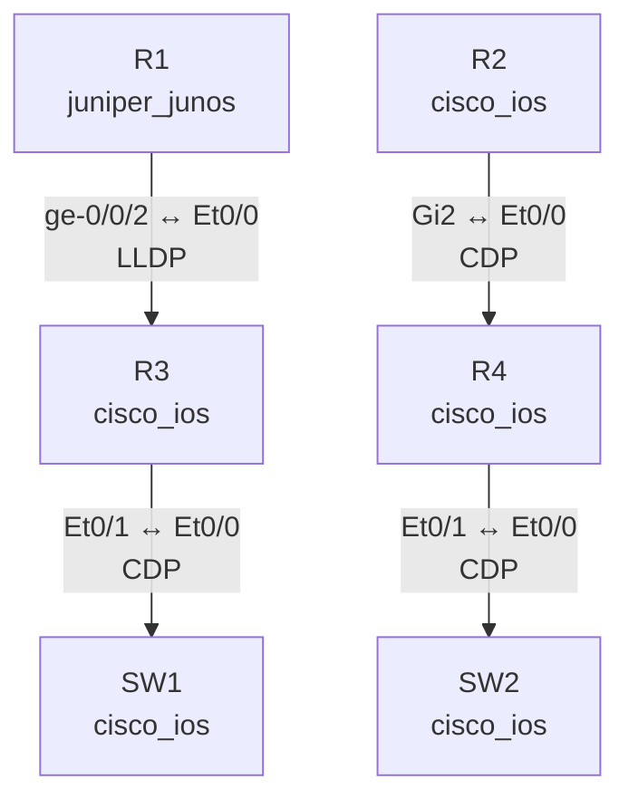

# Report Type: topology_diagram

## When to use
Tag: `report_type: topology_diagram`
Input: topology links data (source_device, source_interface, destination_device, destination_interface, protocol)

## Format Rules

1. Generate a **Mermaid `graph TD`** diagram showing all links.
2. Node format: `R1[R1 juniper_junos]` — device name + platform if available.
3. Edge format: `R1 -->|ge-0/0/2 ↔ Et0/0 LLDP| R3` — interfaces + protocol.
4. Group by protocol: solid lines for CDP, dashed for LLDP.
5. After the diagram, include a summary table of all links.
6. Call `format_and_export(data=<mermaid_text>, format="mmd", filename="topology")`.

## Example Output

| Source | Port | Dest | Port | Protocol |
|---|---|---|---|---|
| R1 | ge-0/0/2 | R3 | Et0/0 | LLDP |
| R2 | Gi2 | R4 | Et0/0 | CDP |

共 N 条链接

## Export
Call `format_and_export` with the Mermaid text and `format="mmd"`.
