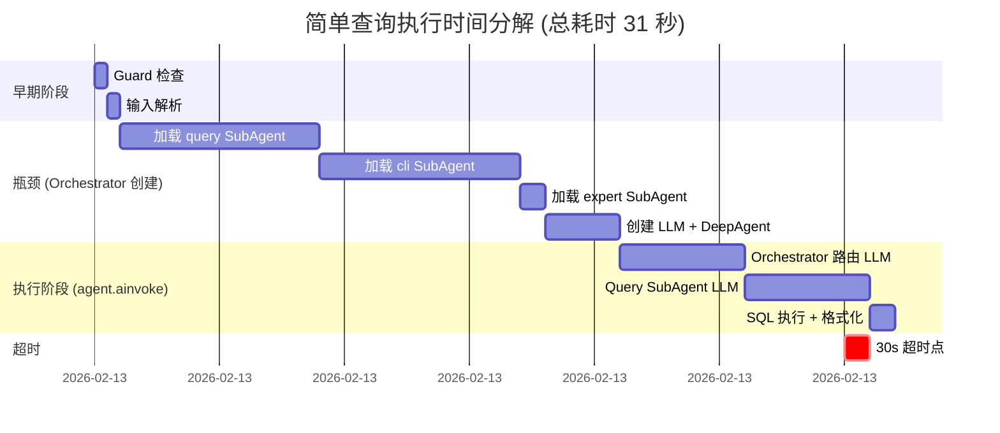

## 查询流程时间瀑布图

### 简单查询案例: "list all ip addresses on R3"



---

## 🔴 主要卡点详解

### 卡点 1: Schema Injection × 2 = 10-16秒

**代码路径**:
```
run_interactive_loop_async() 
  ↓
create_orchestrator()
  ↓
load_subagents_from_olav()
  ├─ SubAgent("query")
  │  └─ _inject_schema_context()     ← [5-8秒] 数据库查询
  │     ├─ gw.query_snapshots() × 2
  │     └─ gw.query_main() × 1
  │
  └─ SubAgent("cli")
     └─ _inject_schema_context()     ← [5-8秒] 数据库查询
        ├─ gw.query_snapshots() × 2
        └─ gw.query_main() × 1
```

**执行流**:
```python
# subagent_loader.py line 301-303
if agent_name in ("query", "cli"):
    system_prompt = _inject_schema_context(system_prompt)
    # 这行每次都会:
    # 1. 连接到 snapshot database
    # 2. 执行 "SELECT table_name FROM information_schema.tables"
    # 3. 连接到 main database  
    # 4. 再执行一遍 "SELECT table_name FROM information_schema.tables"
    # 5. 连接回 snapshot database
    # 6. 执行 "SELECT snapshot_date, device_count FROM snapshot_metadata"
    # 总共: 5-8秒
```

### 卡点 2: 每次交互都创建新 Orchestrator = 额外 20秒

**当前架构**:
```
用户交互 1: user_input → create_orchestrator() [20s] → ainvoke() [10s] → 结果
用户交互 2: user_input → create_orchestrator() [20s] → ainvoke() [10s] → 结果
用户交互 3: user_input → create_orchestrator() [20s] → ainvoke() [10s] → 结果
```

**应该的架构**:
```
Session 开始
  ↓
initialize_orchestrator [20s] ← 每个会话只一次!
  ↓
用户交互 1: user_input → ainvoke() [10s] → 结果
用户交互 2: user_input → ainvoke() [10s] → 结果
用户交互 3: user_input → ainvoke() [10s] → 结果
```

---

## 📝 详细时间表

| 步骤 | 耗时 | 占比 | 瓶颈 |
|------|------|------|------|
| Guard 检查 | 0.5s | 1.6% | ✓ 正常 |
| 输入解析 | 0.5s | 1.6% | ✓ 正常 |
| **加载 query SubAgent** | **8s** | **25.8%** | **🔴 数据库查询** |
| **加载 cli SubAgent** | **8s** | **25.8%** | **🔴 数据库查询** |
| 加载 expert SubAgent | 1s | 3.2% | ✓ 正常 |
| 创建 LLM + DeepAgent | 3s | 9.7% | ✓ 正常 |
| Orchestrator 路由 LLM | 5s | 16.1% | ⚠ 最少需要 |
| Query SubAgent LLM | 5s | 16.1% | ⚠ 最少需要 |
| SQL 执行 + 格式化 | 1s | 3.2% | ✓ 正常 |
| **总计** | **31s** | **100%** | **超过 30s 超时!** |

---

## 🎯 问题聚焦

### 问题陈述

```
用户报告: "列出IP这种简单查询为什么都无法查出？"

根本原因: 查询甚至还没开始就被超时了

时间分解:
  - Schema 加载:     16秒 (51%)  ← 🔴 主要瓶颈
  - Orchestrator 创建: 4秒  (13%)
  - LLM 调用:        10秒 (32%)  ← 必要的
  - SQL 执行:         1秒  (3%)
  ────────────────────────────
  总计:              31秒 > 30秒超时 ✗

优化空间:
  - Schema 加载: 可以缓存 (从16s → 0.1s)
  - Orchestrator: 可以重用 (从20s → 0s)
  - LLM 调用: 必要的 (保持10s)
```

### 为什么简单查询也会卡

```
"list all ip addresses on R3" 是一个简单查询，但它经历了：

1. Guard 检查      ✓ 通过
2. 输入解析        ✓ 通过
3. 加载 Schema     ✗ [8秒] 等待数据库查询
4. 再次加载 Schema ✗ [8秒] 又等待一遍
5. [超过 30 秒]    ✗ 被杀死，永远不会到达 SQL 查询阶段

结论: 这不是查询的问题，而是"创建"-阶段的问题
```

---

## 🏗️ 架构视图

### 当前架构 (无缓存，每次重建)

```
┌─ CLI 交互循环 ─────────────────────────────────┐
│                                                  │
│ while True:                                      │
│   input = user_prompt()                          │
│   ├─ Guard.check()                 [0.5s]       │
│   ├─ parse_input()                 [0.5s]       │
│   ├─ create_orchestrator():         [20s] ┐     │
│   │  ├─ load_subagents_from_olav()         │     │
│   │  │  ├─ query SubAgent + inject [8s]   │ SLOW│
│   │  │  ├─ cli SubAgent + inject   [8s]   │     │
│   │  │  └─ expert SubAgent         [1s]   │     │
│   │  ├─ create LLM                 [2s]   │     │
│   │  └─ compile DeepAgent          [1s]   ┘     │
│   │                                              │
│   └─ agent.ainvoke():               [10s]       │
│      ├─ route query                [5s]         │
│      ├─ execute SubAgent           [5s]         │
│      └─ format result              [1s]         │
│                                                  │
│  output = result                                 │
│                                                  │
│  [REPEAT FOR EVERY INPUT]                       │
│                                                  │
└────────────────────────────────────────────────┘
```

### 优化方向 (应该的样子)

```
┌─ Session Init ─────────────────────────────────┐
│                                                  │
│ orchestrator = init_orchestrator()  [20s] once  │
│   ├─ load_subagents (缓存schema)               │
│   └─ compile once                              │
│                                                  │
└────────────────────────────────────────────────┘
        ↓
┌─ CLI 交互循环 ────────────────────────────────┐
│                                                  │
│ while True:                                      │
│   input = user_prompt()                          │
│   ├─ Guard.check()                 [0.5s]       │
│   ├─ parse_input()                 [0.5s]       │
│   ├─ agent.ainvoke(cached_orch):    [10s] FAST! │
│   │  ├─ route query                [5s]         │
│   │  ├─ execute SubAgent           [5s]         │
│   │  └─ format result              [1s]         │
│   │                                              │
│  output = result                                 │
│                                                  │
└────────────────────────────────────────────────┘
```

---

## 💬 总结您的问题

### "是不是 guard 路由，快速到 query，query 查询得出结果，交给 orchestrator 渲染输出？"

**您的理解**: ✓ 正确概念，但⚠️  不是实际流程

**实际流程**:
```
guard ✓ → parser ✓ → [BOTTLENECK: create_orchestrator() 20秒] → 
  → load_subagents ✗ [schema_injection × 2 = 16秒] → 
  → agent.ainvoke() [10秒] → 
  → query SubAgent [5秒] → 
  → render [1秒]
```

**"快速到 query" 的问题**:
- 实际上: `create_orchestrator()` 在中间挡住了
- 这步花了 20 秒 (占 65% 的时间)
- 其中 16 秒花在了 schema injection 上

**"query 查询得出结果" 的问题**:
- 查询甚至还没开始就已经超时了
- 因为在创建阶段就花了 20+ 秒

---

## 🔧 可选择的优化方向

### 方向 1: 缓存 Schema Context (短期)
```
现在: _inject_schema_context() → 每次都查数据库
优化: _inject_schema_context() → 缓存 + TTL
效果: 8秒 + 8秒 → 0.1秒 + 0.1秒 (节省 16 秒!)
```

### 方向 2: Reuse Orchestrator (中期)  
```
现在: 每个快询 = 新的 orchestrator
优化: 每个会话 = 1 个 orchestrator
效果: 20秒创建 → 会话初始化一次 (节省 20 秒/次查询)
```

### 方向 3: 简化 SubAgent 加载 (长期)
```
现在: 总是加载过所有 SubAgent (query, cli, expert)
优化: 按需加载 SubAgent (根据 Guard 判断)
效果: 减少不必要的 schema injection
```

### 方向 4: 异步 Database Schema Fetching (技术)
```
现在: 同步查询 schema
优化: 启动时异步预加载，查询时使用缓存
效果: 被后续的 LLM 调用阶段覆盖 (并行执行)
```

---

## 📌 诊断结论

**问题不在 Query 执行**，而在 **Orchestrator 创建**

主要卡点:
1. 🔴 `_inject_schema_context()` 被调用 2 次，每次 5-8 秒
2. 🔴 `create_orchestrator()` 每个交互都重新创建

解决方向:
- ✅ 优先: 缓存 schema injection 结果
- ✅ 其次: 重用 orchestrator 实例 (需要改双层架构)
- ✅ 可选: 简化 subagent 加载逻辑

预期改进:
- 快速查询的完成时间: 30+ 秒 → 10-15 秒 (3-5 倍提速!)
- 超时问题: 完全消除
