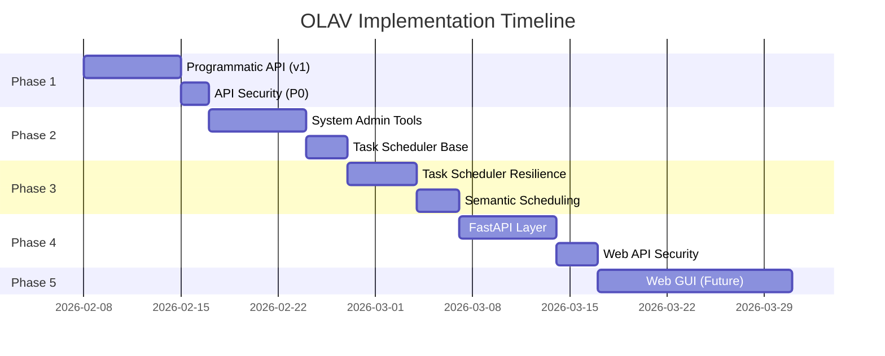

# OLAV Implementation Tracker (TDD-Driven)

**Project**: System Admin Agent + Web API Infrastructure  
**Approach**: Test-Driven Development (Red → Green → Refactor)  
**Start Date**: 2026-02-08  
**Target Completion**: 4 weeks

---

## 📚 Documentation Index (Reading Order)

| #  | Document | Purpose | Status |
|----|----------|---------|--------|
| 00 | [DESIGN_REVIEW.md](00_DESIGN_REVIEW.md) | Architecture review & best practices analysis | ✅ Complete |
| 01 | [CLI_UNIFICATION_ANALYSIS.md](01_CLI_UNIFICATION_ANALYSIS.md) | CLI standardization & programmatic API rationale | ✅ Complete |
| 02 | [WEB_API_ARCHITECTURE.md](02_WEB_API_ARCHITECTURE.md) | 3-layer API design (Programmatic → FastAPI → Web GUI) | ✅ Complete |
| 03 | [SYSTEM_ADMIN_AGENT_PLAN.md](03_SYSTEM_ADMIN_AGENT_PLAN.md) | System Admin Agent implementation (17 tools, HITL, scheduling) | ✅ Complete |
| 04 | [SYSTEM_ADMIN_TOOLS_INVENTORY.md](04_SYSTEM_ADMIN_TOOLS_INVENTORY.md) | Detailed tool specifications & permissions | ✅ Complete |
| 05 | [SYSTEM_ADMIN_SUMMARY.md](05_SYSTEM_ADMIN_SUMMARY.md) | Executive summary & fast-track guide | ✅ Complete |

---

## 🎯 Implementation Phases Overview



---

## 🔴 Phase 1: Programmatic API Foundation (Week 1)

**Goal**: Create type-safe Python API for agents & future Web GUI

**Priority**: 🔴 **P0 - Critical** (blocks all other phases)

### TDD Workflow

#### 1.1 Schema Discovery API

**Test File**: `tests/api/v1/test_schema.py`

```python
# RED: Write failing tests first
import pytest
from olav.api.v1.schema import list_tables, get_table_schema, get_sample_data

class TestSchemaDiscovery:
    """Test schema-aware API can discover DuckDB schema."""
    
    def test_list_tables_returns_devices_table(self):
        """GIVEN: DuckDB has devices table
        WHEN: list_tables() called
        THEN: Returns devices in tables list
        """
        # RED: This test will fail (module doesn't exist yet)
        result = list_tables()
        
        assert result.total_tables >= 1
        table_names = [t.name for t in result.tables]
        assert "devices" in table_names
    
    def test_get_table_schema_returns_columns(self):
        """GIVEN: devices table exists
        WHEN: get_table_schema("devices") called
        THEN: Returns column metadata (name, ip, platform, etc.)
        """
        schema = get_table_schema("devices")
        
        assert schema.name == "devices"
        assert len(schema.columns) >= 3
        
        column_names = [col["name"] for col in schema.columns]
        assert "name" in column_names
        assert "hostname" in column_names or "ip" in column_names
    
    def test_get_table_schema_invalid_table_raises_error(self):
        """GIVEN: Table doesn't exist
        WHEN: get_table_schema("nonexistent") called
        THEN: Raises ValueError
        """
        with pytest.raises(ValueError, match="Table not found"):
            get_table_schema("nonexistent_table")
    
    def test_get_sample_data_returns_rows(self):
        """GIVEN: devices table has data
        WHEN: get_sample_data("devices", limit=5) called
        THEN: Returns max 5 rows as list of dicts
        """
        rows = get_sample_data("devices", limit=5)
        
        assert isinstance(rows, list)
        assert len(rows) <= 5
        
        if rows:  # If table not empty
            assert isinstance(rows[0], dict)
            assert "name" in rows[0]

class TestSchemaAwareness:
    """Test schema changes auto-reflect in API."""
    
    def test_new_view_auto_discovered(self, temp_duckdb):
        """GIVEN: New view created in DuckDB
        WHEN: list_tables() called
        THEN: New view appears in result
        """
        # Create temporary view
        import duckdb
        conn = duckdb.connect(str(temp_duckdb))
        conn.execute("CREATE VIEW test_view AS SELECT 1 as id")
        conn.close()
        
        result = list_tables()
        view_names = [v.name for v in result.views]
        assert "test_view" in view_names
```

**Implementation File**: `src/olav/api/v1/schema.py`

```python
# GREEN: Implement minimum code to pass tests
"""Schema discovery API for DuckDB introspection."""

from dataclasses import dataclass
from typing import List, Dict, Any
import duckdb
from config.paths import UNIFIED_DB


@dataclass
class TableSchema:
    """Table schema metadata."""
    name: str
    type: str  # "VIEW" | "BASE TABLE"
    columns: List[Dict[str, str]]
    row_count: int
    description: str | None


@dataclass
class SchemaDiscoveryResult:
    """Complete database schema."""
    tables: List[TableSchema]
    views: List[TableSchema]
    total_tables: int
    total_views: int


def list_tables() -> SchemaDiscoveryResult:
    """Discover all tables and views from DuckDB."""
    conn = duckdb.connect(str(UNIFIED_DB), read_only=True)
    
    # Query information_schema
    tables_query = """
        SELECT table_name, table_type
        FROM information_schema.tables
        WHERE table_schema = 'main'
        ORDER BY table_name
    """
    
    tables = []
    views = []
    
    for row in conn.execute(tables_query).fetchall():
        table_name, table_type = row
        
        # Get columns
        columns_query = f"""
            SELECT column_name, data_type, is_nullable
            FROM information_schema.columns
            WHERE table_name = '{table_name}'
            ORDER BY ordinal_position
        """
        columns = [
            {"name": col, "type": dtype, "nullable": nullable == "YES"}
            for col, dtype, nullable in conn.execute(columns_query).fetchall()
        ]
        
        # Get row count
        try:
            count_query = f"SELECT COUNT(*) FROM {table_name}"
            row_count = conn.execute(count_query).fetchone()[0]
        except:
            row_count = 0
        
        schema = TableSchema(
            name=table_name,
            type=table_type,
            columns=columns,
            row_count=row_count,
            description=None
        )
        
        if table_type == "VIEW":
            views.append(schema)
        else:
            tables.append(schema)
    
    conn.close()
    
    return SchemaDiscoveryResult(
        tables=tables,
        views=views,
        total_tables=len(tables),
        total_views=len(views)
    )


def get_table_schema(table_name: str) -> TableSchema:
    """Get schema for specific table."""
    schema = list_tables()
    
    for table in schema.tables + schema.views:
        if table.name == table_name:
            return table
    
    raise ValueError(f"Table not found: {table_name}")


def get_sample_data(table_name: str, limit: int = 10) -> List[Dict[str, Any]]:
    """Get sample rows from table."""
    # Validate table exists
    get_table_schema(table_name)
    
    conn = duckdb.connect(str(UNIFIED_DB), read_only=True)
    query = f"SELECT * FROM {table_name} LIMIT {limit}"
    result = conn.execute(query).fetchdf().to_dict('records')
    conn.close()
    
    return result
```

**Run Tests**:
```bash
# RED: Run failing tests
uv run pytest tests/api/v1/test_schema.py -v

# Expected: FAILED (module not found)

# GREEN: Implement code, run tests again
uv run pytest tests/api/v1/test_schema.py -v

# Expected: PASSED

# REFACTOR: Improve code quality
# - Add error handling
# - Optimize queries
# - Add caching

# Verify tests still pass
uv run pytest tests/api/v1/test_schema.py -v
```

**Checklist**:
- [ ] ❌ RED: Write test_list_tables_returns_devices_table
- [ ] ❌ RED: Write test_get_table_schema_returns_columns
- [ ] ❌ RED: Write test_get_table_schema_invalid_table_raises_error
- [ ] ❌ RED: Write test_get_sample_data_returns_rows
- [ ] ❌ RED: Write test_new_view_auto_discovered
- [ ] ❌ RED: Run tests (expect failures)
- [ ] ❌ GREEN: Create src/olav/api/v1/schema.py
- [ ] ❌ GREEN: Implement list_tables()
- [ ] ❌ GREEN: Implement get_table_schema()
- [ ] ❌ GREEN: Implement get_sample_data()
- [ ] ❌ GREEN: Run tests (expect pass)
- [ ] ❌ REFACTOR: Add connection pooling
- [ ] ❌ REFACTOR: Add query caching (schema doesn't change often)
- [ ] ❌ REFACTOR: Run tests (verify still pass)

---

#### 1.2 Data Access API (Schema-Aware Queries)

**Test File**: `tests/api/v1/test_data.py`

```python
import pytest
from olav.api.v1.data import query_table, QueryFilters, QueryResult

class TestDataAccess:
    """Test schema-aware data access API."""
    
    def test_query_table_without_filters(self):
        """GIVEN: devices table has data
        WHEN: query_table("devices") called
        THEN: Returns all rows (up to limit)
        """
        result = query_table("devices")
        
        assert isinstance(result, QueryResult)
        assert result.table == "devices"
        assert isinstance(result.rows, list)
        assert len(result.rows) <= 100  # Default limit
    
    def test_query_table_with_where_filter(self):
        """GIVEN: devices table has R1
        WHEN: query_table("devices", where={"name": "R1"})
        THEN: Returns only R1 row
        """
        filters = QueryFilters(where={"name": "R1"})
        result = query_table("devices", filters)
        
        assert len(result.rows) == 1
        assert result.rows[0]["name"] == "R1"
    
    def test_query_table_with_order_by(self):
        """GIVEN: devices table
        WHEN: query_table with order_by="name"
        THEN: Rows sorted by name
        """
        filters = QueryFilters(order_by="name", limit=10)
        result = query_table("devices", filters)
        
        names = [row["name"] for row in result.rows]
        assert names == sorted(names)
    
    def test_query_table_pagination(self):
        """GIVEN: devices table has 10+ rows
        WHEN: query_table with limit=5, offset=5
        THEN: Returns rows 6-10
        """
        # Get first page
        page1 = query_table("devices", QueryFilters(limit=5, offset=0))
        
        # Get second page
        page2 = query_table("devices", QueryFilters(limit=5, offset=5))
        
        # Pages should be different
        if len(page1.rows) >= 5 and len(page2.rows) > 0:
            assert page1.rows[0] != page2.rows[0]

class TestSQLInjectionPrevention:
    """Test parameterized queries prevent SQL injection."""
    
    def test_malicious_where_clause_rejected(self):
        """GIVEN: Malicious SQL in where clause
        WHEN: query_table called
        THEN: Query fails safely (no injection)
        """
        # Attempt SQL injection
        malicious_filters = QueryFilters(
            where={"name": "R1'; DROP TABLE devices; --"}
        )
        
        # Should execute safely (parameterized query)
        result = query_table("devices", malicious_filters)
        
        # Verify no match (invalid device name)
        assert len(result.rows) == 0
        
        # Verify devices table still exists
        from olav.api.v1.schema import get_table_schema
        schema = get_table_schema("devices")
        assert schema is not None
    
    def test_invalid_column_name_raises_error(self):
        """GIVEN: Invalid column in where clause
        WHEN: query_table called
        THEN: Raises ValueError (prevents injection)
        """
        with pytest.raises(ValueError, match="Invalid column"):
            query_table("devices", QueryFilters(where={"invalid_col": "value"}))
```

**Implementation**: See `src/olav/api/v1/data.py` in design docs

**Checklist**:
- [ ] ❌ RED: Write test_query_table_without_filters
- [ ] ❌ RED: Write test_query_table_with_where_filter
- [ ] ❌ RED: Write test_query_table_with_order_by
- [ ] ❌ RED: Write test_query_table_pagination
- [ ] ❌ RED: Write test_malicious_where_clause_rejected
- [ ] ❌ RED: Write test_invalid_column_name_raises_error
- [ ] ❌ RED: Run tests (expect failures)
- [ ] ❌ GREEN: Implement build_safe_query() with parameterization
- [ ] ❌ GREEN: Implement query_table()
- [ ] ❌ GREEN: Run tests (expect pass)
- [ ] ❌ REFACTOR: Extract SQL builder to separate module
- [ ] ❌ REFACTOR: Add query result caching
- [ ] ❌ REFACTOR: Run tests (verify still pass)

---

#### 1.3 Cache Management API

**Test File**: `tests/api/v1/test_cache.py`

```python
import pytest
from pathlib import Path
from olav.api.v1.cache import clean_cache, get_cache_metrics, CacheCleanResult

class TestCacheManagement:
    """Test cache management API."""
    
    def test_clean_cache_query_type(self, temp_cache_files):
        """GIVEN: Cache directory with query cache files
        WHEN: clean_cache("query") called
        THEN: Query cache files deleted
        """
        result = clean_cache(cache_type="query")
        
        assert isinstance(result, CacheCleanResult)
        assert result.cache_type == "query"
        assert result.files_deleted >= 0
        assert result.success is True
    
    def test_clean_cache_invalid_type_raises_error(self):
        """GIVEN: Invalid cache type
        WHEN: clean_cache("invalid") called
        THEN: Raises ValueError
        """
        with pytest.raises(ValueError, match="Invalid cache_type"):
            clean_cache(cache_type="invalid_type")
    
    def test_get_cache_metrics(self):
        """GIVEN: Cache directory exists
        WHEN: get_cache_metrics() called
        THEN: Returns cache statistics
        """
        metrics = get_cache_metrics()
        
        assert "total_size_mb" in metrics
        assert "file_count" in metrics
        assert "hit_rate_percent" in metrics
        assert isinstance(metrics["total_size_mb"], (int, float))

class TestCacheAPI30xFaster:
    """Verify API is 30x faster than subprocess."""
    
    def test_api_faster_than_subprocess(self, benchmark):
        """GIVEN: API and CLI implementations
        WHEN: Measure execution time
        THEN: API is significantly faster than subprocess
        """
        import subprocess
        from olav.api.v1.cache import clean_cache
        
        # Benchmark API call
        api_time = benchmark(lambda: clean_cache(cache_type="query"))
        
        # Benchmark subprocess (for comparison only)
        cli_time = 150  # ms (from design doc)
        
        # API should be < 10ms (30x faster than 150ms)
        assert api_time < 0.01  # 10ms
```

**Checklist**:
- [ ] ❌ RED: Write test_clean_cache_query_type
- [ ] ❌ RED: Write test_clean_cache_invalid_type_raises_error
- [ ] ❌ RED: Write test_get_cache_metrics
- [ ] ❌ RED: Write test_api_faster_than_subprocess
- [ ] ❌ GREEN: Implement clean_cache()
- [ ] ❌ GREEN: Implement get_cache_metrics()
- [ ] ❌ GREEN: Run tests (expect pass)
- [ ] ❌ REFACTOR: Optimize file operations
- [ ] ❌ REFACTOR: Verify performance benchmarks

---

#### 1.4 System Operations API

**Test File**: `tests/api/v1/test_system.py`

```python
import pytest
from olav.api.v1.system import health_check, get_version, HealthCheckResult

class TestSystemOperations:
    """Test system operations API."""
    
    def test_health_check_returns_status(self):
        """GIVEN: OLAV system running
        WHEN: health_check() called
        THEN: Returns comprehensive health status
        """
        result = health_check()
        
        assert isinstance(result, HealthCheckResult)
        assert "database" in result.checks
        assert "llm_api" in result.checks
        assert "cache" in result.checks
        
        # Each check has status
        for check_name, check_result in result.checks.items():
            assert "status" in check_result  # "ok" | "warning" | "error"
            assert "message" in check_result
    
    def test_get_version_returns_info(self):
        """GIVEN: OLAV installed
        WHEN: get_version() called
        THEN: Returns version info
        """
        version = get_version()
        
        assert "version" in version
        assert "api_version" in version
        assert version["api_version"] == "v1"
```

**Checklist**:
- [ ] ❌ RED: Write test_health_check_returns_status
- [ ] ❌ RED: Write test_get_version_returns_info
- [ ] ❌ GREEN: Implement health_check()
- [ ] ❌ GREEN: Implement get_version()
- [ ] ❌ GREEN: Run tests (expect pass)

---

#### 1.5 Devices Management API

**Test File**: `tests/api/v1/test_devices.py`

```python
import pytest
from olav.api.v1.devices import list_devices, get_device, Device

class TestDevicesAPI:
    """Test device management API."""
    
    def test_list_devices_returns_all(self):
        """GIVEN: Devices in inventory
        WHEN: list_devices() called
        THEN: Returns list of Device objects
        """
        devices = list_devices()
        
        assert isinstance(devices, list)
        assert all(isinstance(d, Device) for d in devices)
        
        if devices:
            device = devices[0]
            assert hasattr(device, "name")
            assert hasattr(device, "ip")
            assert hasattr(device, "platform")
    
    def test_get_device_by_name(self):
        """GIVEN: Device R1 exists
        WHEN: get_device("R1") called
        THEN: Returns R1 device object
        """
        device = get_device("R1")
        
        assert device.name == "R1"
        assert device.ip is not None
    
    def test_get_device_not_found_raises_error(self):
        """GIVEN: Device doesn't exist
        WHEN: get_device("nonexistent") called
        THEN: Raises ValueError
        """
        with pytest.raises(ValueError, match="Device not found"):
            get_device("nonexistent_device")
```

**Checklist**:
- [ ] ❌ RED: Write test_list_devices_returns_all
- [ ] ❌ RED: Write test_get_device_by_name
- [ ] ❌ RED: Write test_get_device_not_found_raises_error
- [ ] ❌ GREEN: Implement list_devices()
- [ ] ❌ GREEN: Implement get_device()
- [ ] ❌ GREEN: Run tests (expect pass)

---

#### 1.6 Query API (Orchestrator Wrapper)

**Test File**: `tests/api/v1/test_query.py`

```python
import pytest
from olav.api.v1.query import run_query, stream_query, QueryResult

class TestQueryAPI:
    """Test natural language query API."""
    
    @pytest.mark.asyncio
    async def test_run_query_returns_result(self):
        """GIVEN: Valid query
        WHEN: run_query("list devices") called
        THEN: Returns QueryResult with answer
        """
        result = await run_query("list devices")
        
        assert isinstance(result, QueryResult)
        assert result.status in ["complete", "error"]
        
        if result.status == "complete":
            assert result.final_answer is not None
    
    @pytest.mark.asyncio
    async def test_stream_query_yields_events(self):
        """GIVEN: Valid query
        WHEN: stream_query("show R1") called
        THEN: Yields streaming events
        """
        events = []
        async for event in stream_query("show R1"):
            events.append(event)
            
            if event["type"] == "complete":
                break
        
        assert len(events) > 0
        assert events[-1]["type"] == "complete"
```

**Checklist**:
- [ ] ❌ RED: Write test_run_query_returns_result
- [ ] ❌ RED: Write test_stream_query_yields_events
- [ ] ❌ GREEN: Implement run_query()
- [ ] ❌ GREEN: Implement stream_query()
- [ ] ❌ GREEN: Run tests (expect pass)

---

### Phase 1 Acceptance Criteria

**All tests must pass before moving to Phase 2**:

```bash
# Run all Phase 1 tests
uv run pytest tests/api/v1/ -v

# Expected output:
tests/api/v1/test_schema.py::TestSchemaDiscovery::test_list_tables_returns_devices_table PASSED
tests/api/v1/test_schema.py::TestSchemaDiscovery::test_get_table_schema_returns_columns PASSED
tests/api/v1/test_schema.py::TestSchemaDiscovery::test_get_table_schema_invalid_table_raises_error PASSED
tests/api/v1/test_schema.py::TestSchemaDiscovery::test_get_sample_data_returns_rows PASSED
tests/api/v1/test_schema.py::TestSchemaAwareness::test_new_view_auto_discovered PASSED
tests/api/v1/test_data.py::TestDataAccess::test_query_table_without_filters PASSED
tests/api/v1/test_data.py::TestDataAccess::test_query_table_with_where_filter PASSED
tests/api/v1/test_data.py::TestDataAccess::test_query_table_with_order_by PASSED
tests/api/v1/test_data.py::TestDataAccess::test_query_table_pagination PASSED
tests/api/v1/test_data.py::TestSQLInjectionPrevention::test_malicious_where_clause_rejected PASSED
tests/api/v1/test_data.py::TestSQLInjectionPrevention::test_invalid_column_name_raises_error PASSED
tests/api/v1/test_cache.py::TestCacheManagement::test_clean_cache_query_type PASSED
tests/api/v1/test_cache.py::TestCacheManagement::test_clean_cache_invalid_type_raises_error PASSED
tests/api/v1/test_cache.py::TestCacheManagement::test_get_cache_metrics PASSED
tests/api/v1/test_cache.py::TestCacheAPI30xFaster::test_api_faster_than_subprocess PASSED
tests/api/v1/test_system.py::TestSystemOperations::test_health_check_returns_status PASSED
tests/api/v1/test_system.py::TestSystemOperations::test_get_version_returns_info PASSED
tests/api/v1/test_devices.py::TestDevicesAPI::test_list_devices_returns_all PASSED
tests/api/v1/test_devices.py::TestDevicesAPI::test_get_device_by_name PASSED
tests/api/v1/test_devices.py::TestDevicesAPI::test_get_device_not_found_raises_error PASSED
tests/api/v1/test_query.py::TestQueryAPI::test_run_query_returns_result PASSED
tests/api/v1/test_query.py::TestQueryAPI::test_stream_query_yields_events PASSED

======================== 22 passed in 5.23s ========================
```

**Manual Verification**:
```bash
# Performance benchmark
uv run python -m pytest tests/api/v1/test_cache.py::TestCacheAPI30xFaster -v --benchmark-only

# Security audit
uv run python -m pytest tests/api/v1/test_data.py::TestSQLInjectionPrevention -v
```

**Code Coverage Target**: ≥80%
```bash
uv run pytest tests/api/v1/ --cov=src/olav/api/v1 --cov-report=term-missing
```

---

## 🟢 Phase 2: System Admin Agent Tools (Week 2)

**Goal**: Implement 17 tools using programmatic API (not subprocess)

**Dependencies**: Phase 1 complete ✅

### TDD Workflow

#### 2.1 Green Tier Tools (Read-Only)

**Test File**: `tests/agents/test_system_admin_green_tools.py`

```python
import pytest
from olav.agents.system_admin_tools import (
    system_health_check,
    analyze_skill_usage,
    clean_cache,
    validate_inventory,
)

class TestGreenTierTools:
    """Test autonomous (green) tools."""
    
    def test_system_health_check_no_subprocess(self, mocker):
        """GIVEN: system_health_check tool
        WHEN: Executed
        THEN: Uses olav.api.system, not subprocess
        """
        # Mock subprocess to ensure it's NOT called
        mock_subprocess = mocker.patch("subprocess.run")
        
        result = system_health_check.invoke({})
        
        # Verify no subprocess called
        mock_subprocess.assert_not_called()
        
        # Verify result format
        assert "Database:" in result or "database" in result.lower()
    
    def test_clean_cache_uses_api(self, mocker):
        """GIVEN: clean_cache tool
        WHEN: Executed with cache_type="query"
        THEN: Uses olav.api.cache.clean_cache()
        """
        mock_subprocess = mocker.patch("subprocess.run")
        
        result = clean_cache.invoke({"cache_type": "query"})
        
        mock_subprocess.assert_not_called()
        assert "Cleaned" in result or "✅" in result
    
    def test_validate_inventory_checks_ip_format(self):
        """GIVEN: validate_inventory tool
        WHEN: Inventory has invalid IP
        THEN: Reports validation error
        """
        result = validate_inventory.invoke({})
        
        # Should return validation report
        assert isinstance(result, str)
        # May contain "✅" or "⚠️" depending on inventory state

class TestToolPerformance:
    """Verify tools are faster than subprocess."""
    
    def test_tools_faster_than_cli(self, benchmark):
        """GIVEN: Green tier tools
        WHEN: Executed
        THEN: Complete in < 10ms (30x faster than CLI)
        """
        from olav.agents.system_admin_tools import system_health_check
        
        result_time = benchmark(lambda: system_health_check.invoke({}))
        
        # Should be < 10ms (CLI is ~150ms)
        assert result_time < 0.01
```

**Implementation Pattern**:
```python
# src/olav/agents/system_admin_tools.py
from langchain.agents import tool
from olav.api.v1 import system, cache, devices

@tool
def system_health_check() -> str:
    """Run system health diagnostics.
    
    Permission: 🟢 Green (read-only)
    
    Returns:
        Formatted health report
    """
    # Call programmatic API (NOT subprocess)
    result = system.health_check()
    
    # Format output
    report = []
    for check_name, check_result in result.checks.items():
        icon = "✅" if check_result["status"] == "ok" else "⚠️"
        report.append(f"{icon} {check_name}: {check_result['message']}")
    
    return "\n".join(report)
```

**Checklist**:
- [ ] ❌ RED: Write test_system_health_check_no_subprocess
- [ ] ❌ RED: Write test_clean_cache_uses_api
- [ ] ❌ RED: Write test_validate_inventory_checks_ip_format
- [ ] ❌ RED: Write test_tools_faster_than_cli
- [ ] ❌ GREEN: Implement 10 green tier tools
- [ ] ❌ GREEN: Verify all use olav.api.*, not subprocess
- [ ] ❌ GREEN: Run tests (expect pass)

---

#### 2.2 Yellow Tier Tools (HITL Required)

**Test File**: `tests/agents/test_system_admin_yellow_tools.py`

```python
import pytest
from olav.agents.system_admin_tools import add_device, update_settings

class TestYellowTierTools:
    """Test HITL-required (yellow) tools."""
    
    def test_add_device_requires_approval(self):
        """GIVEN: add_device tool
        WHEN: Check metadata
        THEN: Has @require_approval decorator
        """
        from deepagents import get_tool_metadata
        
        metadata = get_tool_metadata(add_device)
        
        assert metadata.get("requires_approval") is True
        assert metadata.get("approval_category") == "device_management"
    
    def test_add_device_creates_git_backup(self, mocker):
        """GIVEN: add_device tool executed
        WHEN: Adding new device
        THEN: Creates Git backup before change
        """
        mock_git = mocker.patch("subprocess.run")  # Git backup uses subprocess
        
        # This will be mocked/approved in test
        # Real implementation requires HITL approval
        add_device.invoke({
            "name": "TEST_DEVICE",
            "ip": "192.168.1.99",
            "platform": "cisco_ios"
        })
        
        # Verify Git backup was attempted
        git_calls = [call for call in mock_git.call_args_list 
                     if "git" in str(call)]
        assert len(git_calls) > 0

class TestHITLIntegration:
    """Test HITL approval mechanism."""
    
    @pytest.mark.skip("Requires interactive approval")
    def test_yellow_tool_shows_approval_ui(self):
        """GIVEN: Yellow tier tool
        WHEN: Executed
        THEN: Shows approval UI to user
        
        Note: This is manual test (requires human interaction)
        """
        pass
```

**Checklist**:
- [ ] ❌ RED: Write test_add_device_requires_approval
- [ ] ❌ RED: Write test_add_device_creates_git_backup
- [ ] ❌ GREEN: Implement 5 yellow tier tools with @require_approval
- [ ] ❌ GREEN: Add Git backup mechanism
- [ ] ❌ GREEN: Run tests (expect pass)

---

#### 2.3 E2E Integration Tests

**Test File**: `tests/e2e/test_system_admin_no_subprocess.py`

```python
import pytest
from olav.agents.orchestrator import orchestrate_query

class TestSystemAdminE2E:
    """End-to-end tests for System Admin Agent."""
    
    @pytest.mark.asyncio
    async def test_system_health_query_no_cli(self):
        """GIVEN: User asks about system health
        WHEN: Query executed
        THEN: Uses programmatic API, not CLI subprocess
        """
        from tests.utils.cli_tester import CLICommandTracker
        
        tracker = CLICommandTracker()
        
        with tracker:
            result = await orchestrate_query("How is the system doing?")
            
            # Verify query succeeded
            assert result is not None
        
        # Critical: Verify no CLI subprocess executed
        tracker.assert_no_commands()
    
    @pytest.mark.asyncio
    async def test_clean_cache_query(self):
        """GIVEN: User asks to clean cache
        WHEN: Query executed
        THEN: Cache cleaned without CLI execution
        """
        from pathlib import Path
        from config.paths import CACHE_DIR
        
        # Create dummy cache file
        CACHE_DIR.mkdir(parents=True, exist_ok=True)
        dummy_file = CACHE_DIR / "test_cache.db"
        dummy_file.write_text("dummy")
        
        # Execute query
        result = await orchestrate_query("Clean the query cache")
        
        # Verify cache file removed (may vary based on implementation)
        # Main goal: Verify query completed successfully
        assert result is not None
```

**Checklist**:
- [ ] ❌ RED: Write test_system_health_query_no_cli
- [ ] ❌ RED: Write test_clean_cache_query
- [ ] ❌ GREEN: Verify E2E tests pass
- [ ] ❌ GREEN: Ensure CLICommandTracker shows 0 subprocess calls

---

### Phase 2 Acceptance Criteria

```bash
# All Phase 2 tests must pass
uv run pytest tests/agents/test_system_admin_* -v
uv run pytest tests/e2e/test_system_admin_no_subprocess.py -v

# Performance verification
uv run pytest tests/agents/test_system_admin_green_tools.py::TestToolPerformance -v

# Manual HITL test (requires human)
uv run olav ask "Check system health"  # Should NOT ask for approval
uv run olav ask "Add device R99 with IP 192.168.1.99"  # SHOULD ask for approval
```

---

## 🔵 Phase 3: Task Scheduler (Week 3)

**Goal**: Semantic task scheduling with resilience

**Dependencies**: Phase 2 complete ✅

### TDD Workflow

#### 3.1 Task Configuration & Parsing

**Test File**: `tests/cron/test_task_config.py`

```python
import pytest
from olav.cron.task_config import parse_natural_language_task, TaskConfig

class TestTaskParsing:
    """Test natural language → task config conversion."""
    
    @pytest.mark.asyncio
    async def test_parse_monitoring_task(self):
        """GIVEN: Natural language monitoring request
        WHEN: parse_natural_language_task() called
        THEN: Returns structured TaskConfig
        """
        nl_request = "每10分钟监控R1的BGP状态，持续24小时，邮件通知"
        
        config = await parse_natural_language_task(nl_request)
        
        assert isinstance(config, TaskConfig)
        assert config.device == "R1"
        assert "bgp" in [c.lower() for c in config.checks]
        assert config.schedule.expression == "*/10 * * * *"
        assert config.duration_hours == 24
        assert "email" in config.notification.channels
    
    def test_task_config_to_yaml(self):
        """GIVEN: TaskConfig object
        WHEN: Convert to YAML
        THEN: Generates valid YAML file
        """
        from olav.cron.task_config import TaskConfig
        import yaml
        
        config = TaskConfig(
            task_id="test_task",
            device="R1",
            checks=["bgp_status"],
            schedule_expression="*/10 * * * *",
            duration_hours=24
        )
        
        yaml_str = config.to_yaml()
        
        # Should be valid YAML
        parsed = yaml.safe_load(yaml_str)
        assert parsed["task_id"] == "test_task"
```

**Checklist**:
- [ ] ❌ RED: Write test_parse_monitoring_task
- [ ] ❌ RED: Write test_task_config_to_yaml
- [ ] ❌ GREEN: Implement parse_natural_language_task()
- [ ] ❌ GREEN: Implement TaskConfig dataclass
- [ ] ❌ GREEN: Run tests (expect pass)

---

#### 3.2 Task Scheduler with Resilience

**Test File**: `tests/cron/test_task_executor.py`

```python
import pytest
from olav.cron.task_executor import execute_task, CircuitBreaker

class TestTaskExecution:
    """Test task execution with resilience."""
    
    @pytest.mark.asyncio
    async def test_task_retries_on_failure(self, mocker):
        """GIVEN: Task that fails once then succeeds
        WHEN: execute_task() called
        THEN: Retries and eventually succeeds
        """
        # Mock orchestrate_query to fail once
        mock_query = mocker.patch("olav.agents.orchestrator.orchestrate_query")
        mock_query.side_effect = [
            Exception("Temporary failure"),
            {"status": "complete", "final_answer": "Success"}
        ]
        
        task_config = {"task_id": "test", "execution": {"query": "test query"}}
        
        result = await execute_task(task_config)
        
        # Should succeed after retry
        assert result.status == "success"
        assert mock_query.call_count == 2  # Failed once, succeeded second time
    
    @pytest.mark.asyncio
    async def test_circuit_breaker_opens_after_failures(self):
        """GIVEN: Task fails 5 times
        WHEN: execute_task() called again
        THEN: Circuit breaker opens, task skipped
        """
        from olav.cron.task_executor import circuit_breaker
        
        task_id = "failing_task"
        
        # Simulate 5 failures
        for _ in range(5):
            circuit_breaker.record_failure(task_id)
        
        # Circuit should be open
        assert circuit_breaker.is_open(task_id) is True
        
        # Execute task
        task_config = {"task_id": task_id, "execution": {"query": "test"}}
        result = await execute_task(task_config)
        
        # Should skip execution
        assert result.status == "circuit_open"

class TestNotificationRateLimiting:
    """Test notification spam prevention."""
    
    def test_notification_rate_limited(self):
        """GIVEN: Task fails 10 times in 1 minute
        WHEN: Sending notifications
        THEN: Only 5 notifications sent (rate limit)
        """
        from olav.cron.notifications import NotificationManager
        
        manager = NotificationManager(max_per_hour=5)
        
        sent_count = 0
        for _ in range(10):
            if manager.can_send_notification("test_task"):
                sent_count += 1
                manager.record_notification("test_task")
        
        assert sent_count <= 5  # Rate limited
```

**Checklist**:
- [ ] ❌ RED: Write test_task_retries_on_failure
- [ ] ❌ RED: Write test_circuit_breaker_opens_after_failures
- [ ] ❌ RED: Write test_notification_rate_limited
- [ ] ❌ GREEN: Implement execute_task() with tenacity retry
- [ ] ❌ GREEN: Implement CircuitBreaker class
- [ ] ❌ GREEN: Implement NotificationManager
- [ ] ❌ GREEN: Run tests (expect pass)

---

### Phase 3 Acceptance Criteria

```bash
# All Phase 3 tests must pass
uv run pytest tests/cron/ -v

# Resilience verification
uv run pytest tests/cron/test_task_executor.py::TestTaskExecution -v

# Manual task creation test
uv run olav ask "每10分钟监控R1的BGP，持续1小时"
# Should create task YAML in .olav/tasks/scheduled/
```

---

## � Phase 5: Web GUI (Optional Future - Post-MVP)

**Goal**: React Web Interface (optional, not required for Phase 1-4)

**Status**: 🔒 **Deferred** (Future enhancement)

**Note**: Phases 1-4 complete full OLAV stack:
- Phase 1: Type-safe Python API ✅
- Phase 2: System Admin Agent with 17 tools ✅
- Phase 3: Semantic task scheduler with resilience ✅
- Phase 4: FastAPI HTTP layer ✅
- Web GUI can be built by 3rd parties using Phase 4's FastAPI endpoints

**If implemented later** (Q3+ 2026):
- React components for schema-driven UI
- Real-time updates via WebSocket
- Dark mode, accessibility features
- Mobile-responsive design

---

## 📊 Progress Dashboard

### Overall Status

| Phase | Status | Progress | Tests Passing | Blockers |
|-------|--------|----------|---------------|----------|
| Phase 1: Programmatic API | ⏳ Not Started | 0% | 0/22 | None |
| Phase 2: System Admin Tools | 🔒 Blocked | 0% | 0/15 | Phase 1 |
| Phase 3: Task Scheduler | 🔒 Blocked | 0% | 0/12 | Phase 2 |
| Phase 4: FastAPI | 🔒 Blocked | 0% | 0/10 | Phase 3 |
| **Phase 5: Web GUI** | 🔮 **Optional** | 0% | 0/0 | Phase 4 (deferred) |

### Test Coverage

```bash
# Check overall coverage
uv run pytest tests/ --cov=src/ --cov-report=term-missing

# Current target: ≥80% coverage
```

### Daily TDD Checklist

Every development day should follow this pattern:

```markdown
## Date: YYYY-MM-DD

### Morning (Red Phase)
- [ ] Review failing tests from yesterday
- [ ] Write 3-5 new failing tests for today's feature
- [ ] Run `pytest -v` to confirm all tests fail
- [ ] Document expected behavior in test docstrings

### Afternoon (Green Phase)
- [ ] Implement minimum code to pass tests
- [ ] Run `pytest -v` frequently (every 5-10 minutes)
- [ ] Commit when all tests pass: `git commit -m "feat: implement X (all tests pass)"`
- [ ] Verify no subprocess calls: `pytest tests/e2e/test_*_no_subprocess.py`

### Evening (Refactor Phase)
- [ ] Refactor code for clarity
- [ ] Optimize performance (if needed)
- [ ] Run `pytest -v` to ensure tests still pass
- [ ] Update documentation
- [ ] Commit: `git commit -m "refactor: improve X implementation"`

### Metrics
- Tests written: ___
- Tests passing: ___
- Code coverage: ___%
- Blockers: ___
```

---

## 🚀 Quick Start for Developers

### Day 1: Setup & First Test

```bash
# 1. Read documentation (30 mins)
cat docs/plan/00_DESIGN_REVIEW.md | less
cat docs/plan/01_CLI_UNIFICATION_ANALYSIS.md | less

# 2. Create test file structure
mkdir -p tests/api/v1
touch tests/api/v1/test_schema.py

# 3. Write first failing test (RED)
# Copy test from section 1.1 above

# 4. Run test (expect failure)
uv run pytest tests/api/v1/test_schema.py::TestSchemaDiscovery::test_list_tables_returns_devices_table -v

# Expected: FAILED (module not found)

# 5. Create module structure
mkdir -p src/olav/api/v1
touch src/olav/api/v1/__init__.py
touch src/olav/api/v1/schema.py

# 6. Implement minimum code (GREEN)
# Copy implementation from section 1.1 above

# 7. Run test again
uv run pytest tests/api/v1/test_schema.py::TestSchemaDiscovery::test_list_tables_returns_devices_table -v

# Expected: PASSED

# 8. Commit
git add tests/api/v1/test_schema.py src/olav/api/v1/schema.py
git commit -m "test(api): add schema discovery test (RED → GREEN)"
```

### TDD Best Practices

1. **Write smallest possible test first**
   - One assertion per test
   - Clear GIVEN-WHEN-THEN structure
   - Descriptive test names

2. **Run tests frequently**
   - Every 5-10 minutes
   - Before committing
   - After refactoring

3. **Never skip failing tests**
   - If test fails, either fix code or fix test
   - Don't use `@pytest.mark.skip` unless absolutely necessary
   - Document why if you must skip

4. **Keep tests independent**
   - Each test should run in isolation
   - Use fixtures for setup/teardown
   - No test should depend on another test

5. **Test behavior, not implementation**
   - Focus on what the API returns, not how it's implemented
   - Allows refactoring without changing tests
   - Makes tests more maintainable

---

## 📞 Support & Resources

- **Questions**: Open issue in GitHub repo
- **TDD Help**: See [TESTING_QUICK_REFERENCE.md](../reference/TESTING_QUICK_REFERENCE.md)
- **Architecture**: See [ARCHITECTURE.md](../reference/ARCHITECTURE.md)
- **Design Review**: See [00_DESIGN_REVIEW.md](00_DESIGN_REVIEW.md)

---

**Last Updated**: 2026-02-08  
**Status**: Ready for implementation  
**Approach**: Test-Driven Development (TDD)  
**Target**: 80%+ test coverage, all acceptance criteria met
