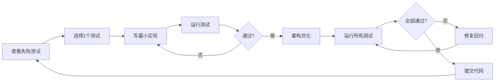

# TDD快速开始指南

## 🎯 当前状态: RED阶段完成

**已创建**: 44个测试用例 (768行)  
**测试状态**: 26个失败 (预期) + 2个跳过  
**下一步**: GREEN阶段 - 实现最小功能

---

## 🚀 快速命令

### 查看所有TDD测试
```bash
# 单元测试 (26个测试)
uv run pytest tests/unit/test_security_tools.py -v
uv run pytest tests/unit/test_cache_middleware.py -v  
uv run pytest tests/unit/test_rate_limiter.py -v

# E2E测试 (18个测试)
uv run pytest tests/e2e/test_subagent_routing.py -v
uv run pytest tests/e2e/test_performance_benchmark.py -v
```

### 查看测试统计
```bash
# 收集所有TDD测试
uv run pytest tests/unit/test_security_tools.py tests/unit/test_cache_middleware.py tests/unit/test_rate_limiter.py tests/e2e/test_subagent_routing.py tests/e2e/test_performance_benchmark.py --collect-only

# 运行全部 (预期大部分失败)
uv run pytest tests/unit/test_security_tools.py tests/unit/test_cache_middleware.py tests/unit/test_rate_limiter.py -v --tb=short
```

---

## 📋 TDD循环示例

### 示例: 实现安全扫描工具

#### 1️⃣ RED - 测试先行 (已完成)
```python
# tests/unit/test_security_tools.py
def test_security_scan_vulnerability():
    result = await security_scan(target="R1", scan_type="vulnerability")
    assert "vulnerabilities" in result
```

运行测试:
```bash
uv run pytest tests/unit/test_security_tools.py::TestSecurityScanBasic::test_security_scan_vulnerability -v
# ❌ ModuleNotFoundError: No module named 'olav.tools.security'
```

---

#### 2️⃣ GREEN - 最小实现

创建模块:
```bash
mkdir -p src/olav/tools
touch src/olav/tools/__init__.py
```

最小实现 (让测试通过):
```python
# src/olav/tools/security.py
async def security_scan(target: str, scan_type: str = "vulnerability") -> dict:
    """最简单的实现"""
    if scan_type == "vulnerability":
        return {"vulnerabilities": []}
    elif scan_type == "compliance":
        return {"compliance_score": 100}
    else:
        raise ValueError(f"Invalid scan_type: {scan_type}")
```

运行测试:
```bash
uv run pytest tests/unit/test_security_tools.py::TestSecurityScanBasic -v
# ✅ 3 passed
```

---

#### 3️⃣ REFACTOR - 优化代码

添加真实逻辑:
```python
# src/olav/tools/security.py
from olav.database import get_device_config

async def security_scan(target: str, scan_type: str = "vulnerability") -> dict:
    """完整实现 - 检查真实漏洞"""
    if scan_type == "vulnerability":
        config = await get_device_config(target)
        vulns = await _check_vulnerabilities(config)
        return {"vulnerabilities": vulns}
    elif scan_type == "compliance":
        score = await _calculate_compliance_score(target)
        issues = await _get_compliance_issues(target)
        return {"compliance_score": score, "issues": issues}
    else:
        raise ValueError(f"Invalid scan_type: {scan_type}")

async def _check_vulnerabilities(config: dict) -> list:
    """检查配置中的漏洞"""
    vulns = []
    
    # 检查弱密码
    if "enable secret" not in config:
        vulns.append({
            "severity": "HIGH",
            "type": "weak_password",
            "description": "Enable secret not configured"
        })
    
    # 检查未加密协议
    if "telnet" in config.get("services", []):
        vulns.append({
            "severity": "CRITICAL",
            "type": "insecure_protocol",
            "description": "Telnet enabled (use SSH instead)"
        })
    
    return vulns
```

运行所有测试:
```bash
uv run pytest tests/unit/test_security_tools.py -v
# ✅ 7 passed, 1 skipped
```

---

## 📊 进度检查

### 查看哪些测试通过了
```bash
# 简洁输出
uv run pytest tests/unit/test_security_tools.py -v --tb=no

# 只显示失败的
uv run pytest tests/unit/test_security_tools.py -v --tb=short --failed-first
```

### 检查覆盖率
```bash
# 生成覆盖率报告
uv run pytest tests/unit/test_security_tools.py --cov=src/olav/tools/security --cov-report=term-missing

# HTML报告
uv run pytest tests/unit/test_security_tools.py --cov=src/olav/tools --cov-report=html
open htmlcov/index.html
```

---

## 🎓 TDD最佳实践

### ✅ DO (推荐做法)

1. **测试先行**: 先写测试，再写实现
2. **小步迭代**: 一次只让一个测试通过
3. **快速反馈**: 每次修改后立即运行测试
4. **重构保护**: 测试通过后才重构
5. **命名清晰**: 测试名称描述预期行为

### ❌ DON'T (避免做法)

1. **跳过RED**: 不要先写实现再补测试
2. **过度设计**: GREEN阶段不要写超出需求的代码
3. **忽略失败**: 不要在测试失败时继续添加功能
4. **批量重构**: 不要在多个测试未通过时重构
5. **复杂测试**: 避免测试逻辑过于复杂

---

## 📈 验收标准

### Phase 1: 安全SubAgent (预计1天)
- [ ] 8个单元测试全部通过
- [ ] 代码覆盖率 >90%
- [ ] 能检测至少5种常见漏洞
- [ ] 扫描性能 <5秒

### Phase 2.1: 缓存Middleware (预计1天)
- [ ] 10个单元测试全部通过
- [ ] 缓存命中率 >60% (实际运行)
- [ ] 缓存命中响应 <50ms
- [ ] 内存占用 <100MB (1000条缓存)

### Phase 2.2: 限流熔断 (预计1天)
- [ ] 8个单元测试全部通过
- [ ] 限流准确率 100%
- [ ] 熔断器自动恢复
- [ ] 性能开销 <10ms

### Phase 4.1: 路由测试 (预计1天)
- [ ] 9个E2E测试通过 >8个
- [ ] 路由准确率 >95%
- [ ] 多SubAgent协作成功率 >90%

### Phase 4.2: 性能基准 (预计2天)
- [ ] 9个性能测试全部通过
- [ ] 简单查询 <2秒
- [ ] 复杂查询 <5秒
- [ ] 并发10查询 <15秒
- [ ] 内存稳定 (1000次查询 <100MB增长)

---

## 🔄 工作流程



---

## 📚 相关文档

- [TDD_IMPLEMENTATION_STATUS.md](TDD_IMPLEMENTATION_STATUS.md) - 详细实施状态
- [ARCHITECTURE_COMPARISON.md](ARCHITECTURE_COMPARISON.md) - 架构对比与方案
- [04_ISSUES.md](04_ISSUES.md) - Issue追踪

---

**更新时间**: 2026-02-04  
**当前状态**: RED阶段完成 ✅  
**下一个milestone**: 安全工具实现 (GREEN阶段)
