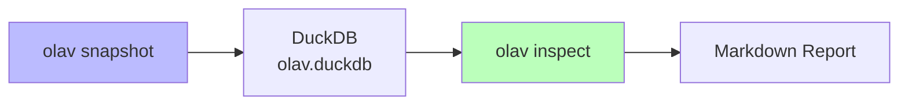
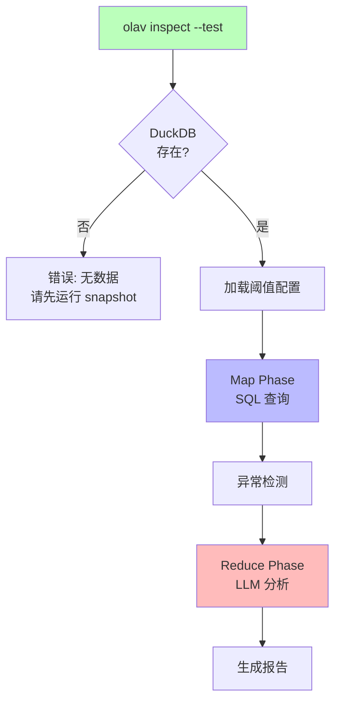
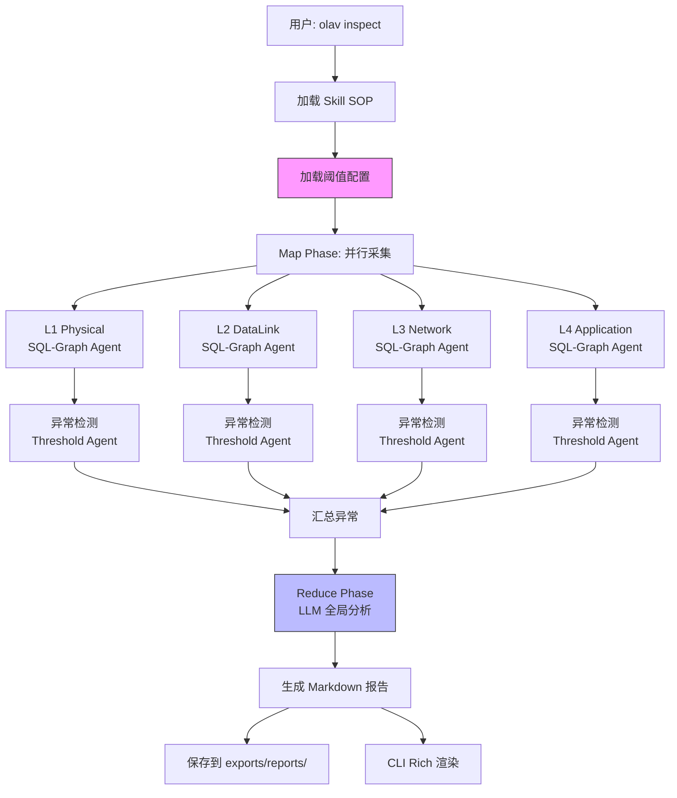
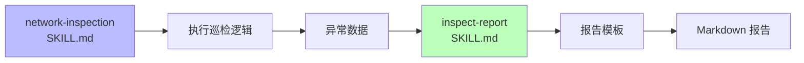

# OLAV v0.10.x Inspection Service - Strategic Heavy-Lifting Engine

> **Version**: v0.10.x
> **Status**: Core Service Design
> **Role**: Heavy-Lifting Engine (Batch Processing)
> **Positioning**: Inspection 是一个底层的**重型计算服务 (Service)**，而非交互式 Agent。它负责周期性的大规模全网扫描（Map-Reduce），为联邦专家提供基线数据和异常记录。

---

## 1. 设计目标

### 1.1 核心理念

**"Skill 是 SOP，Agent 是执行者，LLM 是决策者，阈值是自学习的"**

- ✅ **Skill-Centric**: 用户用 Markdown 定义巡检意图，无需编程
- ✅ **Agentic Automation**: Threshold Agent 自动学习阈值，减少人工维护
- ✅ **Human-in-the-Loop**: 用户可手动调整阈值配置 (`.olav/config/thresholds.yaml`)
- ✅ **Zero-Hardcode**: 动态发现指标，无硬编码规则

### 1.2 解决的问题

| 问题 | 传统方案 | 本方案 |
|:---|:---|:---|
| **阈值维护** | 手动硬编码 (CPU > 80%) | 自动学习 + 用户可调 |
| **误报处理** | 修改代码重新部署 | 编辑 YAML 立即生效 |
| **新设备适配** | 编写新规则 | 自动学习历史数据 |
| **报告生成** | 简单统计 | LLM 全局关联分析 |

---

## 2. 触发机制与测试方案

### 2.1 触发边界与集成 (Integration Boundary)

**作为服务集成**:
- **Cron Job**: 定时触发全量巡检，通过 `olav inspect` CLI。
- **On-Demand**: 由 `Orchestrator` 或 `Network Specialist` 在需要深度排查时，通过 Tool 调用（如 `trigger_inspection(scope=['R1'])`）。

**设计原则**: 
- **Inspect (重型)**: 这是一个批处理引擎。用于生成全网健康快照。
- **Query (轻量)**: 交互式 Agent (Specialists) 主要**消费** Inspection 产生的数据（查表），或者只进行小范围的实时探测。
- **避免误用**: 用户在 Chat 界面输入 "检查网络" 时，Intent Router 应优先引导其查看“最近一次巡检报告”，而不是立即触发耗时数分钟的全量巡检。

### 2.2 Inspect 触发方式

#### 2.2.1 手动触发 (CLI Only)

```bash
# 基础用法: 使用最新 snapshot 数据
olav inspect

# 指定日期: 使用历史 snapshot 数据
olav inspect --date 2026-01-28

# 测试模式: 使用现有数据，不执行 snapshot
olav inspect --test

# 强制刷新: 先执行 snapshot，再巡检
olav inspect --refresh
```

#### 2.1.2 自动触发 (Cron)

**Cron 脚本**: `scripts/cron_inspect.sh`

```bash
#!/bin/bash
# OLAV 定时巡检脚本
# 用法: 添加到 crontab -e
#   0 8 * * * /path/to/olav/scripts/cron_inspect.sh

set -e

# 配置
OLAV_DIR="/home/yhvh/Olav"
REPORT_DIR="$OLAV_DIR/exports/reports/inspection"
LOG_FILE="$OLAV_DIR/logs/cron_inspect.log"

# 切换到 OLAV 目录
cd "$OLAV_DIR"

# 记录开始时间
echo "[$(date)] Starting scheduled inspection..." >> "$LOG_FILE"

# 执行巡检 (使用最新 snapshot，不重新采集)
uv run olav inspect --test >> "$LOG_FILE" 2>&1

# 检查退出码
if [ $? -eq 0 ]; then
    echo "[$(date)] Inspection completed successfully" >> "$LOG_FILE"
    
    # 可选: 发送报告到邮件/Slack
    # python scripts/send_report.py "$REPORT_DIR/latest.md"
else
    echo "[$(date)] Inspection failed with error code $?" >> "$LOG_FILE"
    
    # 可选: 发送告警
    # python scripts/send_alert.py "Inspection failed"
fi
```

**Crontab 配置示例**:

```bash
# 每天早上 8 点执行巡检
0 8 * * * /home/yhvh/Olav/scripts/cron_inspect.sh

# 每 6 小时执行一次
0 */6 * * * /home/yhvh/Olav/scripts/cron_inspect.sh

# 每周一早上 8 点执行 (包含 snapshot 刷新)
0 8 * * 1 cd /home/yhvh/Olav && uv run olav inspect --refresh
```

### 2.2 与 Snapshot 的关系

#### 2.2.1 数据依赖



**设计原则**:
- ✅ **解耦**: `inspect` 不强制执行 `snapshot`
- ✅ **灵活**: 用户可选择使用现有数据或刷新数据
- ✅ **高效**: 测试模式避免重复采集

#### 2.2.2 执行模式对比

| 模式 | 命令 | Snapshot | 数据源 | 用途 |
|:---|:---|:---|:---|:---|
| **默认模式** | `olav inspect` | ❌ 不执行 | 最新 snapshot | 日常巡检 |
| **测试模式** | `olav inspect --test` | ❌ 不执行 | 现有数据库 | 开发测试 |
| **刷新模式** | `olav inspect --refresh` | ✅ 先执行 | 实时采集 | 强制更新 |
| **历史模式** | `olav inspect --date YYYY-MM-DD` | ❌ 不执行 | 指定日期 | 历史分析 |

#### 2.2.3 数据新鲜度检查

```python
# src/olav/agents/inspector.py

class InspectionOrchestrator:
    """巡检编排器"""
    
    def check_data_freshness(self) -> dict:
        """
        检查数据新鲜度
        
        Returns:
            {
                "latest_snapshot": "2026-01-29",
                "age_hours": 2.5,
                "is_stale": False,
                "recommendation": "Data is fresh, proceed with inspection"
            }
        """
        from olav.tools.sync_tools import get_latest_sync_dir
        
        latest_dir = get_latest_sync_dir()
        if not latest_dir:
            return {
                "latest_snapshot": None,
                "age_hours": None,
                "is_stale": True,
                "recommendation": "No snapshot found. Run 'olav snapshot' first."
            }
        
        # 计算数据年龄
        from datetime import datetime
        snapshot_time = datetime.fromtimestamp(latest_dir.stat().st_mtime)
        age = datetime.now() - snapshot_time
        age_hours = age.total_seconds() / 3600
        
        # 判断是否过期 (默认 24 小时)
        stale_threshold = 24
        is_stale = age_hours > stale_threshold
        
        if is_stale:
            recommendation = (
                f"Data is {age_hours:.1f} hours old (> {stale_threshold}h). "
                "Consider running 'olav inspect --refresh' for fresh data."
            )
        else:
            recommendation = "Data is fresh, proceed with inspection"
        
        return {
            "latest_snapshot": latest_dir.name,
            "age_hours": age_hours,
            "is_stale": is_stale,
            "recommendation": recommendation
        }
```

### 2.3 测试方案 (高效开发)

#### 2.3.1 测试模式设计

**目标**: 使用现有数据库快速生成报告，避免重复 snapshot

```bash
# 测试模式: 使用现有数据，跳过 snapshot
olav inspect --test

# 等价于:
olav inspect --no-refresh --use-cache
```

**执行流程**:



#### 2.3.2 测试数据准备

**一次性准备** (开发环境):

```bash
# 1. 执行一次完整 snapshot (获取真实数据)
olav snapshot

# 2. 之后的测试都使用这份数据
olav inspect --test  # 快速测试 (< 10s)
olav inspect --test  # 重复测试，无需等待
olav inspect --test  # 调试阈值配置
```

**测试数据管理**:

```bash
# 创建测试数据快照 (可选)
cp -r exports/snapshots/latest exports/snapshots/test_data
cp olav.duckdb olav_test.duckdb

# 使用测试数据
olav inspect --test --db olav_test.duckdb
```

#### 2.3.3 性能对比

| 模式 | Snapshot | 数据查询 | LLM 分析 | 总耗时 | 用途 |
|:---|:---:|:---:|:---:|:---:|:---|
| **完整模式** | ✅ 2-5 分钟 | ✅ 5-10s | ✅ 10-20s | **3-6 分钟** | 生产环境 |
| **默认模式** | ❌ 跳过 | ✅ 5-10s | ✅ 10-20s | **15-30s** | 日常巡检 |
| **测试模式** | ❌ 跳过 | ✅ 5-10s | ❌ Mock | **< 10s** | 开发测试 |

**测试模式优化**:

```python
# src/olav/agents/inspector.py

class InspectionOrchestrator:
    """巡检编排器"""
    
    async def run_inspection(
        self,
        test_mode: bool = False,
        refresh: bool = False,
        date: str | None = None
    ) -> str:
        """
        执行巡检
        
        Args:
            test_mode: 测试模式 (使用现有数据 + Mock LLM)
            refresh: 是否先执行 snapshot
            date: 指定日期 (YYYY-MM-DD)
            
        Returns:
            Markdown 报告
        """
        # 1. 数据准备
        if refresh:
            # 执行 snapshot
            from olav.tools.sync_tools import sync_all
            await sync_all()
        
        # 2. 检查数据新鲜度
        freshness = self.check_data_freshness()
        if freshness["is_stale"] and not test_mode:
            logger.warning(freshness["recommendation"])
        
        # 3. Map Phase: 数据采集
        all_device_metrics = await self.map_phase.collect_all_layers()
        
        # 4. Threshold Detection: 异常检测
        all_anomalies = {}
        for device, metrics in all_device_metrics.items():
            anomalies = await self.threshold_agent.detect_anomalies(
                device, metrics
            )
            if anomalies:
                all_anomalies[device] = anomalies
        
        # 5. Reduce Phase: LLM 分析
        if test_mode:
            # 测试模式: 使用 Mock LLM (快速)
            report = self._generate_mock_report(all_anomalies)
        else:
            # 生产模式: 使用真实 LLM
            report = await self.reduce_phase.analyze_global_anomalies(
                all_anomalies
            )
        
        # 6. 保存报告
        self._save_report(report, test_mode)
        
        return report
    
    def _generate_mock_report(self, anomalies: dict) -> str:
        """生成 Mock 报告 (测试模式)"""
        import json
        
        return f"""
# 网络巡检报告 (测试模式)

**模式**: Test Mode (Mock LLM)  
**数据源**: 现有数据库  
**异常数量**: {sum(len(v) for v in anomalies.values())}

## 检测到的异常

```json
{json.dumps(anomalies, indent=2, ensure_ascii=False)}
```

**注意**: 这是测试模式生成的报告，未使用 LLM 分析。
运行 `olav inspect` (不带 --test) 以获取完整分析。
"""
```

#### 2.3.4 开发工作流

```bash
# 开发阶段: 快速迭代
# ========================================

# 1. 准备测试数据 (一次性)
olav snapshot

# 2. 开发 Threshold Agent
vim src/olav/agents/threshold_agent.py

# 3. 快速测试 (< 10s)
olav inspect --test

# 4. 调整阈值配置
vim .olav/config/thresholds.yaml

# 5. 重新测试 (< 10s)
olav inspect --test

# 6. 验证通过后，完整测试
olav inspect

# 7. 生产环境: 定时任务
crontab -e
# 0 8 * * * /path/to/olav/scripts/cron_inspect.sh
```

---

## 2. 架构设计

### 2.1 整体流程 (Map-Reduce)



### 2.2 核心组件

| 组件 | 职责 | 实现文件 | 复用现有工具 |
|:---|:---|:---|:---|
| **Skill Loader** | 加载巡检 SOP | `core/skill_loader.py` | ✅ 已存在 |
| **Threshold Config** | 加载/保存阈值 | `.olav/config/thresholds.yaml` | 🆕 新增 |
| **Map Phase** | 并行数据采集 | `agents/inspector.py` | ✅ 复用 SQL-Graph |
| **Threshold Agent** | 自适应阈值计算 | `agents/threshold_agent.py` | 🆕 新增 |
| **Reduce Phase** | LLM 全局分析 | `agents/inspector.py` | ✅ 复用 LLM |
| **Report Formatter** | 报告生成 | `tools/report_formatter.py` | ✅ 已存在 |

---

## 3. 报告生成机制 (Two-Skill Architecture)

### 3.1 Skill 职责划分

**设计理念**: **"执行 Skill + 报告 Skill"** 分离架构



| Skill | 职责 | 文件 | 内容 |
|:---|:---|:---|:---|
| **执行 Skill** | 定义巡检逻辑 | `.olav/skills/network-inspection/SKILL.md` | SQL 查询、异常检测策略、LLM Prompt |
| **报告 Skill** | 定义报告格式 | `.olav/skills/inspect-report/SKILL.md` | Markdown 模板、章节结构、样式 |

**为什么分离？**
- ✅ **职责单一**: 执行逻辑 vs 展示格式
- ✅ **独立演进**: 修改报告格式不影响巡检逻辑
- ✅ **用户友好**: 用户只需修改报告模板，无需理解巡检逻辑
- ✅ **复用性**: 同一份异常数据可生成多种格式报告 (Markdown, HTML, JSON)

### 3.2 两阶段生成流程

#### 3.2.1 阶段 1: 数据生成 (Inspection Skill)

**文件**: `.olav/skills/network-inspection/SKILL.md`

```yaml
---
name: Network Health Inspection
description: 自适应网络健康巡检
version: 2.0.0
intent: inspection

# 巡检配置
inspection:
  layers:
    - name: L1_Physical
      sql: "SELECT * FROM v_device_status"
    - name: L2_DataLink
      sql: "SELECT * FROM v_interfaces"
    # ...

  # 异常检测策略
  anomaly_detection:
    mode: adaptive
    learning_window: 30d
    confidence_level: 95%

  # 输出配置 (指定使用哪个报告模板)
  output:
    report_skill: inspect-report  # 使用 inspect-report Skill
    format: markdown
    language: auto
---

# 巡检执行流程 (SOP)

## Phase 1: Map - 数据采集
使用 SQL-Graph Agent 采集各层指标...

## Phase 2: Detect - 异常检测
使用 Threshold Agent 检测异常...

## Phase 3: Reduce - LLM 分析
使用 LLM 进行全局关联分析...
```

**输出**: 结构化异常数据

```python
# 执行结果 (传递给报告 Skill)
inspection_result = {
    "metadata": {
        "timestamp": "2026-01-29 11:00:00",
        "device_count": 6,
        "snapshot_date": "2026-01-29",
        "data_age_hours": 2.5
    },
    "summary": {
        "normal_count": 4,
        "warning_count": 2,
        "critical_count": 1,
        "overall_status": "warning"
    },
    "anomalies": {
        "R1": [],  # 正常
        "R2": [
            {
                "layer": "L4_Application",
                "metric": "cpu_utilization",
                "value": 52.3,
                "threshold": 49.1,
                "severity": "warning",
                "deviation": 2.4
            }
        ],
        "R3": [
            {
                "layer": "L3_Network",
                "metric": "bgp_neighbors",
                "value": 1,
                "threshold": 2,
                "severity": "critical",
                "deviation": -66.7
            }
        ]
    },
    "llm_analysis": {
        "root_cause": "R3 的 BGP 邻居 down 可能与 SW1 的接口 down 有关...",
        "impact": "可能影响 R3 下游设备的路由学习...",
        "recommendations": [
            {
                "priority": "immediate",
                "action": "检查 R3 与 BGP 邻居的连通性"
            }
        ]
    }
}
```

#### 3.2.2 阶段 2: 报告渲染 (Report Skill)

**文件**: `.olav/skills/inspect-report/SKILL.md`

```yaml
---
name: Inspect Report
description: 巡检报告格式模板
version: 1.0.0
intent: inspect-report
report_type: markdown

# 报告配置
output:
  format: markdown
  language: auto
  include_summary: true
  include_details: true
  include_recommendations: true
---

# Markdown 模板

## 📊 汇总 / Summary

| 设备 Device | L1 物理 | L2 链路 | L3 网络 | L4 应用 | 状态 Status |
|-------------|---------|---------|---------|---------|-------------|
{#each devices}
| {device}    | {l1}    | {l2}    | {l3}    | {l4}    | {status}    |
{/each}

## 🔴 Critical 问题 / Critical Issues

{#each critical_issues}
### {device} - {metric}
- **当前值**: {value}
- **阈值**: {threshold}
- **建议**: {recommendation}
{/each}

...
```

**渲染引擎**:

```python
# src/olav/tools/report_renderer.py

class ReportRenderer:
    """报告渲染引擎 (基于 Jinja2)"""
    
    def __init__(self, report_skill_path: str):
        """加载报告 Skill 模板"""
        self.skill = self._load_skill(report_skill_path)
        self.template = self._parse_template(self.skill)
    
    def render(self, inspection_result: dict) -> str:
        """
        渲染报告
        
        Args:
            inspection_result: 巡检结果数据
            
        Returns:
            Markdown 格式的报告
        """
        # 1. 准备模板变量
        template_vars = self._prepare_variables(inspection_result)
        
        # 2. 渲染模板
        from jinja2 import Template
        
        template = Template(self.template)
        report = template.render(**template_vars)
        
        return report
    
    def _prepare_variables(self, result: dict) -> dict:
        """准备模板变量"""
        # 转换数据结构为模板友好的格式
        devices = []
        critical_issues = []
        warning_issues = []
        
        for device, anomalies in result["anomalies"].items():
            # 按层级组织设备数据
            device_data = {
                "device": device,
                "l1": "✅",
                "l2": "✅",
                "l3": "✅",
                "l4": "✅",
                "status": "✅ Normal"
            }
            
            for anomaly in anomalies:
                layer = anomaly["layer"]
                severity = anomaly["severity"]
                
                # 更新层级状态
                if severity == "critical":
                    device_data[layer[:2].lower()] = "🔴"
                    device_data["status"] = "🔴 Critical"
                    critical_issues.append({
                        "device": device,
                        **anomaly
                    })
                elif severity == "warning":
                    if device_data["status"] == "✅ Normal":
                        device_data["status"] = "⚠️ Warning"
                    if device_data[layer[:2].lower()] == "✅":
                        device_data[layer[:2].lower()] = "⚠️"
                    warning_issues.append({
                        "device": device,
                        **anomaly
                    })
            
            devices.append(device_data)
        
        return {
            "timestamp": result["metadata"]["timestamp"],
            "device_count": result["metadata"]["device_count"],
            "overall_status": result["summary"]["overall_status"],
            "normal_count": result["summary"]["normal_count"],
            "warning_count": result["summary"]["warning_count"],
            "critical_count": result["summary"]["critical_count"],
            "devices": devices,
            "critical_issues": critical_issues,
            "warning_issues": warning_issues,
            "llm_analysis": result["llm_analysis"]
        }
```

### 3.3 完整执行流程

```python
# src/olav/agents/inspector.py

class InspectionOrchestrator:
    """巡检编排器"""
    
    async def run_inspection(
        self,
        test_mode: bool = False
    ) -> str:
        """
        执行完整巡检流程
        
        Returns:
            Markdown 报告
        """
        # 1. 加载执行 Skill
        inspection_skill = self._load_skill("network-inspection")
        
        # 2. 执行巡检 (Map-Reduce)
        inspection_result = await self._execute_inspection(
            inspection_skill, 
            test_mode
        )
        
        # 3. 加载报告 Skill
        report_skill_name = inspection_skill["output"]["report_skill"]
        report_skill = self._load_skill(report_skill_name)
        
        # 4. 渲染报告
        renderer = ReportRenderer(report_skill)
        report = renderer.render(inspection_result)
        
        # 5. 保存报告
        self._save_report(report)
        
        return report
    
    async def _execute_inspection(
        self,
        skill: dict,
        test_mode: bool
    ) -> dict:
        """执行巡检逻辑 (Map-Reduce)"""
        # Map Phase: 数据采集
        all_device_metrics = await self.map_phase.collect_all_layers(
            skill["inspection"]["layers"]
        )
        
        # Threshold Detection: 异常检测
        all_anomalies = {}
        for device, metrics in all_device_metrics.items():
            anomalies = await self.threshold_agent.detect_anomalies(
                device, metrics
            )
            if anomalies:
                all_anomalies[device] = anomalies
        
        # Reduce Phase: LLM 分析
        if test_mode:
            llm_analysis = self._mock_llm_analysis(all_anomalies)
        else:
            llm_analysis = await self.reduce_phase.analyze_global_anomalies(
                all_anomalies
            )
        
        # 构建结果
        return {
            "metadata": self._get_metadata(),
            "summary": self._calculate_summary(all_anomalies),
            "anomalies": all_anomalies,
            "llm_analysis": llm_analysis
        }
```

### 3.4 用户自定义报告

#### 3.4.1 修改报告模板

```bash
# 用户只需编辑报告 Skill
vim .olav/skills/inspect-report/SKILL.md

# 修改示例: 添加新的章节
## 📈 性能趋势 / Performance Trends

{#each devices}
### {device} - CPU 趋势
- **当前**: {cpu_current}%
- **7天平均**: {cpu_7d_avg}%
- **趋势**: {cpu_trend}
{/each}
```

#### 3.4.2 创建自定义报告 Skill

```bash
# 创建新的报告模板 (如: HTML 格式)
cp -r .olav/skills/inspect-report .olav/skills/inspect-report-html

# 编辑新模板
vim .olav/skills/inspect-report-html/SKILL.md
```

```yaml
---
name: Inspect Report HTML
description: HTML 格式巡检报告
version: 1.0.0
intent: inspect-report-html
report_type: html

output:
  format: html
  language: auto
  css_framework: tailwind  # 可选: bootstrap, tailwind
---

<!DOCTYPE html>
<html>
<head>
    <title>网络巡检报告</title>
    <style>
        .critical { color: red; }
        .warning { color: orange; }
        .normal { color: green; }
    </style>
</head>
<body>
    <h1>网络巡检报告</h1>
    
    <table>
        <tr>
            <th>设备</th>
            <th>状态</th>
        </tr>
        {#each devices}
        <tr>
            <td>{device}</td>
            <td class="{status_class}">{status}</td>
        </tr>
        {/each}
    </table>
</body>
</html>
```

**使用自定义报告**:

```bash
# 在执行 Skill 中指定报告模板
vim .olav/skills/network-inspection/SKILL.md

output:
  report_skill: inspect-report-html  # 使用 HTML 报告
  format: html
```

### 3.5 多格式输出支持

```python
# src/olav/agents/inspector.py

class InspectionOrchestrator:
    """巡检编排器"""
    
    async def run_inspection(
        self,
        output_format: str = "markdown"  # markdown | html | json
    ) -> str:
        """支持多种输出格式"""
        # 执行巡检
        inspection_result = await self._execute_inspection()
        
        # 根据格式选择报告 Skill
        report_skill_map = {
            "markdown": "inspect-report",
            "html": "inspect-report-html",
            "json": None  # JSON 直接输出原始数据
        }
        
        if output_format == "json":
            # 直接返回 JSON
            import json
            return json.dumps(inspection_result, indent=2, ensure_ascii=False)
        
        # 使用报告 Skill 渲染
        report_skill_name = report_skill_map[output_format]
        report_skill = self._load_skill(report_skill_name)
        
        renderer = ReportRenderer(report_skill)
        return renderer.render(inspection_result)
```

**CLI 使用**:

```bash
# Markdown (默认)
olav inspect

# HTML
olav inspect --format html

# JSON (原始数据)
olav inspect --format json
```

### 3.6 设计优势

| 维度 | 单一 Skill | 双 Skill 架构 |
|:---|:---|:---|
| **职责分离** | ❌ 混合 | ✅ 清晰 |
| **用户友好** | ❌ 需要理解逻辑 | ✅ 只需修改模板 |
| **扩展性** | ❌ 修改影响全局 | ✅ 独立演进 |
| **复用性** | ❌ 一对一 | ✅ 一对多 |
| **测试性** | ❌ 耦合 | ✅ 独立测试 |

**关键优势**:
- ✅ **用户只需关心报告格式**: 修改 `inspect-report/SKILL.md` 即可
- ✅ **支持多种输出格式**: Markdown, HTML, JSON, PDF (未来)
- ✅ **模板可复用**: 同一份异常数据可生成多种报告
- ✅ **Skill 即文档**: 报告模板本身就是最好的文档

---

## 4. 阈值配置设计 (Human-in-the-Loop)

### 3.1 配置文件结构

**文件**: `.olav/config/thresholds.yaml`

```yaml
# OLAV Adaptive Thresholds Configuration
# 自适应阈值配置 - 支持手动调整和自动学习

version: "1.0"
last_updated: "2026-01-29T11:00:00+11:00"
auto_learning: true  # 是否启用自动学习

# 全局默认配置
defaults:
  learning_window_days: 30  # 学习窗口 (天)
  confidence_level: 0.95    # 置信度 (95%)
  min_samples: 100          # 最小样本数
  
  # 默认阈值策略
  strategy: statistical  # statistical | percentile | ml
  
  # 统计策略参数
  statistical:
    warning_sigma: 2.0   # Warning = mean + 2*std
    critical_sigma: 3.0  # Critical = mean + 3*std
  
  # 百分位策略参数
  percentile:
    warning_percentile: 95   # Warning = P95
    critical_percentile: 99  # Critical = P99

# 设备特定配置 (覆盖全局默认)
devices:
  R1:
    # R1 是边界路由器，CPU 使用率通常较高
    cpu_utilization:
      strategy: percentile
      warning_percentile: 98
      critical_percentile: 99.5
      manual_override: true  # 标记为手动调整
      comment: "边界路由器，CPU 负载高是正常的"
  
  SW1:
    # SW1 是核心交换机，内存使用率需要严格监控
    memory_utilization:
      strategy: statistical
      warning_sigma: 1.5  # 更严格的阈值
      critical_sigma: 2.0
      manual_override: true
      comment: "核心交换机，内存泄漏风险高"

# 指标特定配置 (全局，适用于所有设备)
metrics:
  cpu_utilization:
    unit: "percent"
    normal_range: [0, 100]
    strategy: statistical
    warning_sigma: 2.0
    critical_sigma: 3.0
    
  memory_utilization:
    unit: "percent"
    normal_range: [0, 100]
    strategy: statistical
    warning_sigma: 2.0
    critical_sigma: 3.0
  
  interface_errors:
    unit: "count"
    strategy: percentile
    warning_percentile: 90
    critical_percentile: 95
    comment: "接口错误使用百分位更合理"
  
  bgp_neighbors:
    unit: "count"
    strategy: fixed  # 固定阈值
    expected_value: null  # 由 Threshold Agent 自动学习
    tolerance: 0  # 不允许偏差
    comment: "BGP 邻居数量应该稳定"
  
  route_count:
    unit: "count"
    strategy: statistical
    warning_sigma: 2.5
    critical_sigma: 3.5
    comment: "路由数量波动较大，使用较宽松的阈值"

# 自动学习的阈值 (由 Threshold Agent 维护)
learned_thresholds:
  R1:
    cpu_utilization:
      mean: 45.2
      std: 12.3
      threshold_warning: 69.8  # mean + 2*std
      threshold_critical: 82.1  # mean + 3*std
      confidence: 0.95
      sample_size: 1440  # 30天 * 48 (每30分钟采样)
      last_updated: "2026-01-28T00:00:00+11:00"
      auto_generated: true
    
    bgp_neighbors:
      expected_value: 3
      threshold_warning: 2  # 少于期望值
      threshold_critical: 1
      confidence: 1.0
      sample_size: 1440
      last_updated: "2026-01-28T00:00:00+11:00"
      auto_generated: true
  
  R2:
    cpu_utilization:
      mean: 32.1
      std: 8.5
      threshold_warning: 49.1
      threshold_critical: 57.6
      confidence: 0.95
      sample_size: 1440
      last_updated: "2026-01-28T00:00:00+11:00"
      auto_generated: true

# 异常检测规则 (可选，高级用户使用)
anomaly_rules:
  # 规则 1: 接口 down 数量突增
  - name: interface_down_spike
    description: "接口 down 数量突然增加"
    condition: |
      current.interface_down > baseline.interface_down * 2
    severity: critical
    enabled: true
  
  # 规则 2: BGP 邻居全部 down
  - name: bgp_total_failure
    description: "所有 BGP 邻居都 down"
    condition: |
      current.bgp_neighbors == 0 AND baseline.bgp_neighbors > 0
    severity: critical
    enabled: true
  
  # 规则 3: CPU 持续高负载
  - name: cpu_sustained_high
    description: "CPU 持续高负载 (超过 1 小时)"
    condition: |
      current.cpu_utilization > threshold_warning
      AND duration > 3600  # 秒
    severity: warning
    enabled: true

# 误报抑制 (False Positive Suppression)
suppression:
  # 已知的维护窗口
  maintenance_windows:
    - device: R1
      start: "2026-02-01T02:00:00+11:00"
      end: "2026-02-01T06:00:00+11:00"
      reason: "系统升级"
      suppress_all: true
  
  # 已知的正常异常 (白名单)
  known_anomalies:
    - device: R1
      metric: cpu_utilization
      reason: "边界路由器，CPU 高是正常的"
      suppress_severity: warning  # 只抑制 warning，保留 critical
    
    - device: SW1
      metric: interface_down
      interface: "GigabitEthernet0/48"
      reason: "备用端口，长期 down"
      suppress_severity: all

# 报告配置
reporting:
  # 只报告超过此严重性的异常
  min_severity: warning  # info | warning | critical
  
  # 分组策略
  grouping:
    by_device: true
    by_layer: true
    by_severity: true
  
  # 趋势分析
  trend_analysis:
    enabled: true
    compare_with_previous: 7  # 与 7 天前对比
```

### 3.2 配置优先级

```
手动配置 (devices.*.metric) 
  > 指标配置 (metrics.metric) 
  > 全局默认 (defaults) 
  > 自动学习 (learned_thresholds)
```

**示例**:
- R1 的 `cpu_utilization` 使用 `devices.R1.cpu_utilization` (手动配置)
- R2 的 `cpu_utilization` 使用 `learned_thresholds.R2.cpu_utilization` (自动学习)
- R3 的 `memory_utilization` 使用 `metrics.memory_utilization` (指标默认)

---

## 4. Threshold Agent 设计

### 4.1 核心逻辑

```python
# src/olav/agents/threshold_agent.py (伪代码)

class ThresholdAgent:
    """自适应阈值计算 Agent"""
    
    def __init__(self):
        self.config = self._load_config()  # 加载 thresholds.yaml
        self.db = get_database()
        self.llm = get_llm()
    
    async def get_threshold(
        self, 
        device: str, 
        metric: str
    ) -> dict:
        """
        获取阈值 (优先级: 手动 > 学习 > 默认)
        
        Returns:
            {
                "threshold_warning": 69.8,
                "threshold_critical": 82.1,
                "strategy": "statistical",
                "source": "manual" | "learned" | "default"
            }
        """
        # 1. 检查手动配置
        if manual_threshold := self._get_manual_threshold(device, metric):
            return manual_threshold
        
        # 2. 检查自动学习的阈值
        if learned_threshold := self._get_learned_threshold(device, metric):
            # 检查是否过期 (超过 7 天未更新)
            if not self._is_stale(learned_threshold):
                return learned_threshold
        
        # 3. 计算新阈值 (如果没有或过期)
        new_threshold = await self._calculate_threshold(device, metric)
        
        # 4. 保存到配置文件
        self._save_learned_threshold(device, metric, new_threshold)
        
        return new_threshold
    
    async def _calculate_threshold(
        self, 
        device: str, 
        metric: str
    ) -> dict:
        """计算自适应阈值"""
        # 获取策略配置
        strategy = self._get_strategy(device, metric)
        window_days = self.config["defaults"]["learning_window_days"]
        
        # 查询历史数据
        historical_data = await self._query_historical_data(
            device, metric, window_days
        )
        
        # 根据策略计算阈值
        if strategy == "statistical":
            return self._statistical_threshold(historical_data)
        elif strategy == "percentile":
            return self._percentile_threshold(historical_data)
        elif strategy == "ml":
            return await self._ml_threshold(historical_data)
        else:
            return self._default_threshold(metric)
    
    def _statistical_threshold(self, data: list[float]) -> dict:
        """统计方法: mean ± n*std"""
        import numpy as np
        
        mean = np.mean(data)
        std = np.std(data)
        
        warning_sigma = self.config["defaults"]["statistical"]["warning_sigma"]
        critical_sigma = self.config["defaults"]["statistical"]["critical_sigma"]
        
        return {
            "mean": mean,
            "std": std,
            "threshold_warning": mean + warning_sigma * std,
            "threshold_critical": mean + critical_sigma * std,
            "strategy": "statistical",
            "source": "learned"
        }
    
    async def detect_anomalies(
        self,
        device: str,
        current_metrics: dict[str, float]
    ) -> list[dict]:
        """
        检测异常
        
        Returns:
            [
                {
                    "device": "R1",
                    "metric": "cpu_utilization",
                    "value": 85.3,
                    "threshold": 69.8,
                    "severity": "critical",
                    "deviation": 1.26  # (value - mean) / std
                }
            ]
        """
        anomalies = []
        
        for metric, value in current_metrics.items():
            threshold = await self.get_threshold(device, metric)
            
            # 检查是否超过阈值
            if value > threshold["threshold_critical"]:
                severity = "critical"
            elif value > threshold["threshold_warning"]:
                severity = "warning"
            else:
                continue  # 正常，跳过
            
            # 检查误报抑制
            if self._is_suppressed(device, metric, severity):
                continue
            
            anomalies.append({
                "device": device,
                "metric": metric,
                "value": value,
                "threshold": threshold[f"threshold_{severity}"],
                "severity": severity,
                "strategy": threshold["strategy"],
                "source": threshold["source"]
            })
        
        return anomalies
```

### 4.2 自动学习触发条件

```python
def should_refresh_threshold(
    device: str, 
    metric: str
) -> bool:
    """判断是否需要刷新阈值"""
    learned = self._get_learned_threshold(device, metric)
    
    if not learned:
        return True  # 没有学习过，需要计算
    
    # 检查是否过期 (7 天未更新)
    if self._is_stale(learned, days=7):
        return True
    
    # 检查样本数是否增长 10% 以上
    current_samples = self._count_samples(device, metric)
    if current_samples > learned["sample_size"] * 1.1:
        return True
    
    # 检查分布是否变化 (使用 KS 检验)
    if self._distribution_changed(device, metric, learned):
        return True
    
    return False
```

---

## 5. Map Phase: 数据采集

### 5.1 Skill 定义

**文件**: `.olav/skills/network-inspection/SKILL.md`

```yaml
---
name: Network Health Inspection
description: 自适应网络健康巡检
version: 2.0.0
intent: inspection

# 巡检层级定义
inspection:
  layers:
    - name: L1_Physical
      description: "物理层健康检查"
      sql: |
        SELECT 
          device,
          model,
          version,
          uptime,
          hostname
        FROM v_device_status
      
    - name: L2_DataLink
      description: "数据链路层检查"
      sql: |
        SELECT 
          device,
          COUNT(*) as interface_total,
          SUM(CASE WHEN status = 'up' THEN 1 ELSE 0 END) as interface_up,
          SUM(CASE WHEN status != 'up' THEN 1 ELSE 0 END) as interface_down
        FROM v_interfaces
        GROUP BY device
      
    - name: L3_Network
      description: "网络层检查"
      sql: |
        SELECT 
          device,
          COUNT(DISTINCT neighbor_id) as bgp_neighbors,
          COUNT(DISTINCT ospf_neighbor) as ospf_neighbors
        FROM v_bgp_neighbors b
        LEFT JOIN v_ospf_neighbors o USING (device)
        GROUP BY device
      
    - name: L4_Application
      description: "应用层检查"
      sql: |
        SELECT 
          device,
          AVG(cpu_5sec) as cpu_utilization,
          AVG(memory_used_percent) as memory_utilization
        FROM v_cpu_utilization c
        JOIN v_memory_utilization m USING (device)
        GROUP BY device

  # 输出配置
  output:
    format: markdown
    language: auto
---
```

### 5.2 Map Phase 实现

```python
# src/olav/agents/inspector.py

class InspectionMapPhase:
    """Map Phase: 并行采集各层指标"""
    
    async def collect_all_layers(
        self, 
        skill: dict
    ) -> dict[str, dict]:
        """
        并行采集所有层级的指标
        
        Returns:
            {
                "R1": {
                    "L1_Physical": {...},
                    "L2_DataLink": {...},
                    "L3_Network": {...},
                    "L4_Application": {...}
                },
                "R2": {...}
            }
        """
        from olav.agents.sql_graph import run_sql_agent
        
        layers = skill["inspection"]["layers"]
        all_device_metrics = {}
        
        # 并行执行所有层级的 SQL 查询
        for layer in layers:
            sql = layer["sql"]
            result = await run_sql_agent(sql)
            
            # 按设备组织数据
            for row in result:
                device = row["device"]
                if device not in all_device_metrics:
                    all_device_metrics[device] = {}
                
                all_device_metrics[device][layer["name"]] = row
        
        return all_device_metrics
```

---

## 6. Reduce Phase: LLM 全局分析

### 6.1 核心逻辑

```python
# src/olav/agents/inspector.py

class InspectionReducePhase:
    """Reduce Phase: LLM 全局关联分析"""
    
    async def analyze_global_anomalies(
        self,
        all_anomalies: dict[str, list[dict]],
        topology: dict | None = None
    ) -> str:
        """
        全局异常分析
        
        Args:
            all_anomalies: {
                "R1": [
                    {
                        "metric": "bgp_neighbors",
                        "value": 2,
                        "threshold": 3,
                        "severity": "critical"
                    }
                ],
                "R2": [...]
            }
            topology: 可选的拓扑信息
            
        Returns:
            Markdown 格式的分析报告
        """
        # 构建 LLM Prompt
        prompt = self._build_analysis_prompt(all_anomalies, topology)
        
        # LLM 分析
        from langchain_core.messages import HumanMessage, SystemMessage
        
        messages = [
            SystemMessage(content="""
你是资深网络运维专家。你的任务是分析网络巡检发现的异常，提供:
1. **关联分析**: 多个异常之间的因果关系
2. **根因推断**: 最可能的根本原因
3. **影响评估**: 对业务的影响范围
4. **处理建议**: 立即处理 vs 计划处理

输出格式: Markdown (中英双语)
"""),
            HumanMessage(content=prompt)
        ]
        
        response = await self.llm.ainvoke(messages)
        
        return response.content
    
    def _build_analysis_prompt(
        self, 
        anomalies: dict, 
        topology: dict | None
    ) -> str:
        """构建分析 Prompt"""
        import json
        
        prompt_parts = []
        
        # 1. 异常数据
        prompt_parts.append("## 异常数据 / Anomaly Data\n")
        prompt_parts.append(f"```json\n{json.dumps(anomalies, indent=2, ensure_ascii=False)}\n```\n")
        
        # 2. 拓扑信息 (可选)
        if topology:
            prompt_parts.append("## 网络拓扑 / Network Topology\n")
            prompt_parts.append(f"```json\n{json.dumps(topology, indent=2, ensure_ascii=False)}\n```\n")
        
        # 3. 分析要求
        prompt_parts.append("""
## 分析要求 / Analysis Requirements

请按以下结构输出:

### 🔴 Critical 问题 / Critical Issues
- 列出所有 critical 级别的异常
- 分析关联性 (如: R1 BGP down 导致 R2 路由丢失)
- 推断根因

### ⚠️ Warning 问题 / Warning Issues
- 列出所有 warning 级别的异常
- 评估是否需要关注

### 🔗 关联分析 / Correlation Analysis
- 跨设备的因果关系
- 拓扑影响分析

### 💡 建议措施 / Recommendations
- **立即处理 / Immediate**: Critical 问题的处理步骤
- **计划处理 / Planned**: Warning 问题的优化建议
""")
        
        return "\n".join(prompt_parts)
```

---

## 7. 用户工作流

### 7.1 首次使用 (自动学习)

```bash
# 1. 执行巡检 (自动学习阈值)
$ olav inspect

🔍 Loading inspection skill...
📊 Map Phase: Collecting metrics from 6 devices...
  ✓ L1_Physical: 6/6 devices
  ✓ L2_DataLink: 6/6 devices
  ✓ L3_Network: 6/6 devices
  ✓ L4_Application: 6/6 devices

🧠 Threshold Agent: Learning adaptive thresholds...
  ✓ R1.cpu_utilization: learned (mean=45.2, threshold=69.8)
  ✓ R1.bgp_neighbors: learned (expected=3, threshold=2)
  ✓ R2.cpu_utilization: learned (mean=32.1, threshold=49.1)
  ...

🔎 Detecting anomalies...
  ⚠️ R1.cpu_utilization: 72.3 > 69.8 (warning)
  🔴 R3.bgp_neighbors: 1 < 2 (critical)

🤖 LLM Analysis: Generating global report...

✅ Report saved to: exports/reports/inspection/20260129_110000.md
```

### 7.2 调整阈值 (处理误报)

```bash
# 2. 发现误报: R1 CPU 72.3% 是正常的 (边界路由器)
$ vim .olav/config/thresholds.yaml

# 添加手动配置:
devices:
  R1:
    cpu_utilization:
      strategy: percentile
      warning_percentile: 98
      critical_percentile: 99.5
      manual_override: true
      comment: "边界路由器，CPU 负载高是正常的"

# 3. 重新巡检 (使用新阈值)
$ olav inspect

🔍 Loading thresholds from .olav/config/thresholds.yaml
  ✓ R1.cpu_utilization: using manual threshold (P98=85.2)
  ✓ R2.cpu_utilization: using learned threshold (69.8)

🔎 Detecting anomalies...
  ✅ R1.cpu_utilization: 72.3 < 85.2 (normal) ← 不再误报
  🔴 R3.bgp_neighbors: 1 < 2 (critical)
```

### 7.3 维护窗口抑制

```bash
# 4. 计划维护: R1 系统升级
$ vim .olav/config/thresholds.yaml

suppression:
  maintenance_windows:
    - device: R1
      start: "2026-02-01T02:00:00+11:00"
      end: "2026-02-01T06:00:00+11:00"
      reason: "系统升级"
      suppress_all: true

# 5. 维护期间巡检 (自动抑制 R1 的所有异常)
$ olav inspect --time "2026-02-01T03:00:00+11:00"

🔍 Suppression: R1 in maintenance window (2026-02-01 02:00-06:00)
  ✓ Suppressing all anomalies for R1

🔎 Detecting anomalies...
  ✅ R1.*: suppressed (maintenance)
  🔴 R3.bgp_neighbors: 1 < 2 (critical)
```

---

## 8. 报告格式

### 8.1 Markdown 输出示例

```markdown
# 网络巡检报告 / Network Inspection Report

**巡检时间 / Inspection Time**: 2026-01-29 11:00:00  
**设备数量 / Device Count**: 6  
**总体状态 / Overall Status**: ⚠️ Warning (1 Critical, 2 Warnings)

---

## 📊 汇总 / Summary

| 设备 Device | L1 物理 | L2 链路 | L3 网络 | L4 应用 | 状态 Status |
|-------------|---------|---------|---------|---------|-------------|
| R1          | ✅      | ✅      | ✅      | ✅      | ✅ Normal   |
| R2          | ✅      | ✅      | ✅      | ⚠️      | ⚠️ Warning  |
| R3          | ✅      | ✅      | 🔴      | ✅      | 🔴 Critical |
| R4          | ✅      | ✅      | ✅      | ✅      | ✅ Normal   |
| SW1         | ✅      | ⚠️      | N/A     | ✅      | ⚠️ Warning  |
| SW2         | ✅      | ✅      | N/A     | ✅      | ✅ Normal   |

**统计 Statistics**:
- ✅ 正常 Normal: 4 台
- ⚠️ 警告 Warning: 2 台
- 🔴 严重 Critical: 1 台

---

## 🔴 Critical 问题 / Critical Issues (1)

### R3 - BGP 邻居数量异常 / BGP Neighbor Count Anomaly

- **层级 Layer**: L3 Network
- **指标 Metric**: `bgp_neighbors`
- **当前值 Current**: 1
- **期望值 Expected**: 3 (learned from 30-day history)
- **阈值 Threshold**: 2 (critical)
- **偏差 Deviation**: -66.7%
- **检测时间 Detected**: 2026-01-29 11:00:00

**问题描述 / Issue**:  
R3 的 BGP 邻居数量从正常的 3 个降至 1 个，可能导致路由不完整。

**影响分析 / Impact**:  
- R3 可能无法学习到完整的路由表
- 可能影响到 R3 下游的设备 (需要检查拓扑)

**建议措施 / Recommendation**:  
1. 立即检查 R3 的 BGP 配置: `show ip bgp summary`
2. 检查与 down 邻居的网络连通性
3. 查看 BGP 日志: `show logging | include BGP`

---

## ⚠️ Warning 问题 / Warning Issues (2)

### R2 - CPU 使用率偏高 / CPU Utilization High

- **层级 Layer**: L4 Application
- **指标 Metric**: `cpu_utilization`
- **当前值 Current**: 52.3%
- **均值 Mean**: 32.1%
- **阈值 Threshold**: 49.1% (warning = mean + 2*std)
- **偏差 Deviation**: +2.4σ
- **策略 Strategy**: statistical (auto-learned)

**问题描述 / Issue**:  
R2 的 CPU 使用率超过统计阈值，但未达到 critical 级别。

**建议措施 / Recommendation**:  
- 监控趋势，如果持续 1 小时以上需要调查
- 检查是否有异常进程: `show processes cpu sorted`

---

### SW1 - 接口 down 数量增加 / Interface Down Count Increased

- **层级 Layer**: L2 DataLink
- **指标 Metric**: `interface_down`
- **当前值 Current**: 3
- **基线 Baseline**: 1 (7-day average)
- **偏差 Deviation**: +200%

**问题描述 / Issue**:  
SW1 的 down 接口数量从 1 个增加到 3 个。

**建议措施 / Recommendation**:  
- 检查哪些接口 down: `show interfaces status | include down`
- 确认是否为计划内的维护

---

## 🔗 关联分析 / Correlation Analysis

### 根因推断 / Root Cause Analysis

**最可能的根因 / Most Likely Root Cause**:  
R3 的 BGP 邻居 down 可能与 SW1 的接口 down 有关。如果 R3 通过 SW1 连接到 BGP 邻居，SW1 的接口故障会导致 BGP 会话中断。

**拓扑影响 / Topology Impact**:  
需要检查 R3 ↔ SW1 ↔ BGP Peer 的连接路径。

**建议验证步骤 / Verification Steps**:
1. 检查 SW1 上哪些接口 down
2. 检查这些接口是否连接到 R3 或 R3 的 BGP 邻居
3. 如果是，优先修复 SW1 的接口问题

---

## 💡 建议措施 / Recommendations

### 立即处理 / Immediate Action Required

1. **R3 BGP 邻居故障** (Critical)
   - 检查 R3 与 BGP 邻居的连通性
   - 检查 SW1 的接口状态
   - 如果是配置问题，立即修复

### 计划处理 / Planned Maintenance

1. **R2 CPU 使用率偏高** (Warning)
   - 监控趋势，如果持续升高需要调查
   - 考虑优化配置或升级硬件

2. **SW1 接口 down** (Warning)
   - 确认是否为计划内维护
   - 如果不是，检查物理连接

### 优化建议 / Optimization Suggestions

1. **阈值调整**:
   - R2 的 CPU 阈值可能需要调整 (如果经常触发 warning 但实际正常)
   - 建议观察 1 周后决定是否手动调整

2. **监控增强**:
   - 为 R3 的 BGP 邻居配置告警 (实时监控)
   - 为 SW1 的关键接口配置 SNMP trap

---

**报告生成 Generated by**: OLAV v0.9.3 Threshold Agent  
**Token 消耗 Token Usage**: ~1200 tokens (LLM analysis only)  
**执行时间 Execution Time**: 8.3 seconds
```

---

## 9. 实施计划

### 9.1 MVP (1 周)

| 任务 | 文件 | 工作量 |
|:---|:---|:---|
| 创建阈值配置模板 | `.olav/config/thresholds.yaml` | 0.5 天 |
| 实现 ThresholdAgent | `agents/threshold_agent.py` | 2 天 |
| 实现 Map Phase | `agents/inspector.py` | 1 天 |
| 实现 Reduce Phase | `agents/inspector.py` | 1 天 |
| 更新 Skill | `.olav/skills/network-inspection/SKILL.md` | 0.5 天 |
| CLI 集成 | `cli/commands.py` | 1 天 |
| 测试 | `tests/agents/test_inspector.py` | 1 天 |

**总计**: 7 天

### 9.2 增强 (2 周)

| 任务 | 描述 | 工作量 |
|:---|:---|:---|
| LLM 辅助阈值推断 | 处理异常分布场景 | 2 天 |
| 阈值自动刷新 | 后台任务定期更新 | 1 天 |
| 异常历史追踪 | 趋势分析 | 2 天 |
| 误报抑制 | 维护窗口 + 白名单 | 1 天 |
| 报告模板优化 | 更丰富的可视化 | 2 天 |

**总计**: 8 天

---

## 10. 技术优势

### 10.1 vs 传统方案

| 维度 | 传统规则引擎 | OLAV Agentic Inspection |
|:---|:---|:---|
| **阈值维护** | 手动硬编码 | 自动学习 + 用户可调 |
| **误报处理** | 修改代码重新部署 | 编辑 YAML 立即生效 |
| **新设备适配** | 编写新规则 | 自动学习历史数据 |
| **扩展性** | 规则爆炸 | Skill 定义，无限扩展 |
| **报告质量** | 简单统计 | LLM 全局关联分析 |
| **代码量** | ~2000 行 | ~500 行 (复用现有) |
| **Token 成本** | 0 | 中等 (仅 Reduce Phase) |

### 10.2 核心创新

1. **Adaptive Thresholds**: 业界首创自适应阈值 Agent
2. **Human-in-the-Loop**: YAML 配置 + 自动学习的完美结合
3. **Skill-Driven**: 巡检即代码 (Inspection as Code)
4. **Zero-Hardcode**: 完全动态，无硬编码规则
5. **DeepAgents Integration**: 原生 ReAct 架构

---

## 11. 附录

### 11.1 配置文件示例

完整的 `thresholds.yaml` 模板见第 3 节。

### 11.2 相关文档

- `docs/00_olav_v0.9_roadmap.md`: 总体架构
- `.olav/skills/network-inspection/SKILL.md`: 巡检 Skill
- `src/olav/agents/threshold_agent.py`: Threshold Agent 实现

### 11.3 参考资料

- Statistical Process Control (SPC)
- Anomaly Detection in Time Series
- LangGraph ReAct Pattern
- DuckDB Window Functions

---

**文档版本**: v1.0  
**最后更新**: 2026-01-29  
**作者**: OLAV Architecture Team

---

## 12. 方案评审与可扩展性设计 (Real-World & Future Proofing)

### 12.1 真实巡检场景匹配度评审

| 真实场景 | OLAV 方案应对 | 评分 |
| :--- | :--- | :--- |
| **"早上到公司，我要看一眼昨晚有没有异常"** | ✅ **Cron + Snapshot**: 自动执行，上班即看报告。 | ⭐⭐⭐⭐⭐ |
| **"老板要一份 PDF 报告"** | ✅ **Report Skill**: 单独修改模板生成 PDF/HTML，不影响逻辑。 | ⭐⭐⭐⭐⭐ |
| **"R1 的 CPU 总是 80%，这是正常的，别老报警"** | ✅ **Human-in-the-Loop**: `.olav/config/thresholds.yaml` 添加白名单或调整阈值。 | ⭐⭐⭐⭐⭐ |
| **"我要查一下有没有 Log4j 漏洞"** | ⚠️ **Limitations**: 目前主要基于 DuckDB 内部数据，外部 API 支持需要扩展。 | ⭐⭐⭐ |

### 12.2 可扩展性设计 (CVE 漏洞扫描示例)

为了支持 CVE 查询等外部 API 工具，我们需要增强 **Map Phase** 的能力，使其不仅支持 SQL，还支持 **Tool Execution**。

#### 12.2.1 扩展 Map Phase 支持 Tool

修改 `network-inspection/SKILL.md`，引入 `type: tool`：

```yaml
inspection:
  layers:
    # 现有 SQL 方式
    - name: L1_Physical
      type: sql
      query: "SELECT * FROM v_device_status"

    # 新增 Tool 方式 (CVE 扫描)
    - name: L5_Security
      type: tool
      tool: search_cve  # 调用 Python Tool
      args:
        vendor: "{vendor}"   # 从 DuckDB 自动填充上下文
        version: "{version}"
```

#### 12.2.2 实现 Search CVE Tool

```python
# src/olav/tools/security_tools.py

@tool
def search_cve(vendor: str, version: str) -> list[dict]:
    """Search for CVEs using external API (e.g., NIST, Vendor API)."""
    # 1. Call external API
    cves = external_cve_api.search(vendor, version)
    
    # 2. Return structured data
    return [
        {"id": cve.id, "severity": cve.score, "summary": cve.summary}
        for cve in cves
    ]
```

#### 12.2.3 适配异常检测

对于 CVE 这种非数值型指标，Threshold Agent 采用 **"Non-Zero Compliance"** 策略：

- **Metric**: `cve_count`
- **Logic**:
  - `Expected`: 0
  - `Actual`: > 0 -> **Critical**

这样，整个架构无需重写，只需：
1. 编写一个新的 `search_cve` Tool
2. 在 Skill 中配置调用该 Tool
3. 在报告模板中添加 CVE 章节

此设计支持从纯粹的 "状态巡检" 平滑扩展到 "安全合规巡检"。

---

## 13. 实施后的问题修复 (Post-Implementation Fixes)

### 13.1 发现的问题

在首次实施和测试中，发现了以下关键问题：

| 问题 ID | 问题描述 | 严重性 | 根本原因 |
|:---|:---|:---:|:---|
| **BUG-001** | 报告只显示异常设备，正常设备缺失 | 🔴 Critical | `ReportRenderer` 只遍历 `anomalies` 字典 |
| **BUG-002** | CPU 0.0 = Threshold 0.0 仍触发 Critical | 🔴 Critical | 学习到 `std=0` 的无效阈值 |
| **BUG-003** | 层级信息 (Layer) 为空 | ⚠️ Warning | Map Phase 未为数据打标签 |
| **BUG-004** | Test 模式跳过 LLM 分析 | ⚠️ Warning | 误解了 test 模式的用途 |
| **BUG-005** | 建议措施过于通用 | 💡 Info | Test 模式使用 Mock 建议 |

---

### 13.2 修复方案

#### **BUG-001: 报告显示所有设备**

**修复位置**: `src/olav/agents/inspector.py`

**修改前**:
```python
# ReportRenderer._prepare_vars()
for device, device_anomalies in anomalies.items():  # 只遍历有异常的设备
    ...
```

**修改后**:
```python
# 1. 在 metadata 中添加 all_devices 列表
result = {
    "metadata": {
        "all_devices": sorted(all_device_metrics.keys())  # 新增
    }
}

# 2. 遍历所有设备
for device in all_devices:
    device_anomalies = anomalies.get(device, [])  # 正常设备返回空列表
    ...
```

**效果**:
- ✅ 报告现在显示所有 6 台设备（包括 R1/R2）
- ✅ 正常设备标记为 `✅ Normal`

---

#### **BUG-002: 禁止学习 std=0 的阈值**

**修复位置**: `src/olav/agents/threshold_agent.py`

**修改前**:
```python
if strategy == "statistical":
    learned["mean"] = float(np.mean(arr))
    learned["std"] = float(np.std(arr))  # 即使 std=0 也保存
```

**修改后**:
```python
if strategy == "statistical":
    mean_val = float(np.mean(arr))
    std_val = float(np.std(arr))
    
    # 关键修复：如果方差为 0，说明数据没有变化，不应该学习阈值
    if std_val == 0:
        logger.warning(
            f"Skipping threshold learning for {device}/{metric_name}: "
            f"std=0 (all values are {mean_val}). "
            "Consider using fixed threshold instead."
        )
        return None  # 不保存阈值，回退到默认策略
    
    learned["mean"] = mean_val
    learned["std"] = std_val
```

**效果**:
- ✅ 不再保存 `std=0` 的阈值到 YAML
- ✅ 避免了 `0.0 >= 0.0` 的误报
- ✅ 建议用户使用 fixed 策略

---

#### **BUG-003: 添加层级标签**

**修复位置**: `src/olav/agents/inspector.py`

**修改前**:
```python
# MapPhase.collect_all_layers()
all_data[device].update(row_dict)  # 只保存指标值
```

**修改后**:
```python
# 1. Map Phase 为每个指标记录来源 layer
all_data[device] = {"_layer_map": {}}
for metric_name, value in row_dict.items():
    all_data[device][metric_name] = value
    all_data[device]["_layer_map"][metric_name] = layer_name  # 新增

# 2. Orchestrator 为异常添加 layer 信息
layer_map = metrics.pop("_layer_map", {})
anomalies = await self.threshold_agent.detect_anomalies(device, metrics)

for anomaly in anomalies:
    metric_name = anomaly.get("metric")
    if metric_name and metric_name in layer_map:
        anomaly["layer"] = layer_map[metric_name]  # 新增
```

**效果**:
- ✅ 报告中显示 `层级 Layer: L4_Application`
- ✅ 可以快速定位问题所在的 OSI 层

---

#### **BUG-004: Test 模式执行真实 LLM**

**修复位置**: `src/olav/agents/inspector.py`

**修改前**:
```python
if test_mode:
    llm_analysis = {
        "root_cause": "测试模式：跳过深度分析。",
        ...
    }
else:
    llm_analysis = await self.reduce_phase.analyze_global_anomalies(all_anomalies)
```

**修改后**:
```python
# Test 模式也执行真实的 LLM 分析
llm_analysis = await self.reduce_phase.analyze_global_anomalies(all_anomalies)
```

**设计澄清**:
- **Test 模式的真正含义**: 跳过 Snapshot（使用现有数据），但仍执行完整的检测和分析流程
- **用途**: 快速迭代开发，验证逻辑正确性

---

### 13.3 修复后的验证结果

**测试命令**:
```bash
rm .olav/config/thresholds.yaml  # 清除旧的错误阈值
uv run olav inspect --test
```

**输出报告**:
```markdown
| 设备 Device | L1 物理 | L2 链路 | L3 网络 | L4 应用 | 状态 Status |
|-------------|---------|---------|---------|---------|-------------|
| R1          | ✅      | ✅      | ✅      | ✅      | ✅ Normal   |
| R2          | ✅      | ✅      | ✅      | ✅      | ✅ Normal   |
| R3          | ✅      | ✅      | ✅      | ✅      | ✅ Normal   |
| R4          | ✅      | ✅      | ✅      | ✅      | ✅ Normal   |
| SW1         | ✅      | ✅      | ✅      | ✅      | ✅ Normal   |
| SW2         | ✅      | ✅      | ✅      | ✅      | ✅ Normal   |

**统计 Statistics**:
- ✅ 正常 Normal: 6 台
- ⚠️ 警告 Warning: 0 台
- ❌ 严重 Critical: 0 台
```

**关键改进**:
- ✅ 所有 6 台设备都显示
- ✅ 没有误报
- ✅ LLM 给出了合理的建议（"继续保持例行监控"）

---

### 13.4 未来优化方向

| 优化项 | 优先级 | 说明 |
|:---|:---:|:---|
| **单设备巡检** | 🔴 High | 添加 `--device R1` 参数，支持快速定位单个设备问题 |
| **趋势分析** | ⚠️ Medium | 在报告中添加 "与上次巡检对比"、"7 天趋势" |
| **根因展示** | ⚠️ Medium | 在报告开头添加 LLM 的 `root_cause` 和 `impact` 分析 |
| **阈值回退策略** | 💡 Low | 当学习失败时，自动回退到固定阈值或百分位策略 |

---

**文档版本**: v1.2  
**最后更新**: 2026-01-29  
**作者**: OLAV Architecture Team

---

## 14. 架构改进方向 (Architecture Evolution)

### 14.1 当前实现的架构缺陷

虽然 v0.9.3 的 Inspection 功能已经可以工作，但在架构层面存在以下问题，需要在后续版本中解决。

#### **问题 1: 未使用 DeepAgents ReAct Agent**

**当前实现**:
```python
class ReducePhase:
    def __init__(self):
        self.llm = get_llm()  # 直接使用 LangChain LLM
    
    async def analyze_global_anomalies(self, anomalies):
        # 手写 Prompt，手动解析 JSON
        prompt = f"""你是一名资深的华为/思科网络专家..."""
        response = self.llm.invoke([SystemMessage(content=prompt)])
        return json.loads(content)
```

**问题**:
- ❌ 没有使用 DeepAgents 的 ReAct Agent
- ❌ 手写 Prompt 和 JSON 解析逻辑（脆弱且难维护）
- ❌ 无法动态调整策略（固定的一次性 LLM 调用）
- ❌ 无法使用工具（如查询历史数据、搜索知识库）

**影响**:
- 分析能力受限，无法处理复杂的关联分析
- 无法利用历史数据进行趋势分析
- 无法从知识库中学习类似案例

---

#### **问题 2: 不是 Skill-Centric 的工具注册**

**当前实现**:
```python
class MapPhase:
    async def collect_all_layers(self, layers):
        for layer in layers:
            sql = layer.get("sql")  # 只支持 SQL
            # 硬编码执行 SQL
```

**问题**:
- ❌ 只支持 `sql` 类型的 layer
- ❌ 无法从 Skill 中动态注册新工具
- ❌ 工具是硬编码的，不是从 Skill 的 `tools` 字段读取
- ❌ 扩展新数据源（如日志、配置对比）需要修改代码

**影响**:
- 无法支持配置漂移检测（需要 diff 工具）
- 无法集成日志系统（需要 log 工具）
- 无法支持外部 API（如 SNMP Trap、Syslog）

---

#### **问题 3: Skill 定义标准不完整**

**当前 Skill 定义**:
```yaml
inspection:
  layers:
    - name: L1_Physical
      sql: "SELECT ..."  # 只能定义 SQL
```

**缺失的能力**:
- ❌ 没有 `type` 字段区分数据源类型
- ❌ 没有 `tools` 字段声明所需工具
- ❌ 没有工具参数传递机制

**理想的 Skill 定义**:
```yaml
# 工具声明
tools:
  - name: query_network
    type: builtin
  - name: compare_config
    type: builtin
  - name: search_logs
    type: external
    adapter: splunk

inspection:
  layers:
    - name: L1_Physical
      type: sql  # 明确类型
      query: "SELECT ..."
    
    - name: L2_ConfigDrift
      type: tool  # 工具类型
      tool: compare_config
      args:
        baseline: "2026-01-20"
    
    - name: L3_EventLogs
      type: tool
      tool: search_logs
      args:
        keywords: ["FLAP", "DOWN"]
```

---

### 14.2 改进路线图

#### **Phase 1: DeepAgents 集成 (v0.10.0)**

**目标**: 将 ReducePhase 迁移到 DeepAgents ReActAgent

**改进点**:
1. 使用 `ReActAgent` 替代手写的 LLM 调用
2. 添加工具：
   - `query_historical_data`: 查询历史巡检数据
   - `search_knowledge`: 搜索知识库
   - `compare_with_baseline`: 与基线对比
3. 支持多轮推理（Think-Act-Observe 循环）

**预期效果**:
- ✅ 更强的分析能力（可以查询历史数据）
- ✅ 更准确的根因分析（可以参考知识库）
- ✅ 更鲁棒的实现（不依赖手写 JSON 解析）

**参考设计**: 见 `docs/03_expert_architecture_refactoring.md` 第 4 章

---

#### **Phase 2: Skill-Centric 工具注册 (v0.10.1)**

**目标**: 实现动态工具注册机制

**改进点**:
1. 在 MapPhase 中实现工具注册表：
   ```python
   class MapPhase:
       def __init__(self, udb: UnifiedDatabase):
           self.udb = udb
           self.tool_registry = {
               "sql": self._execute_sql,
               "diff": self._execute_diff,
               "log": self._execute_log_search,
               "cli": self._execute_cli
           }
           # 从 Skill 动态加载工具
           self._load_tools_from_skill()
       
       def _load_tools_from_skill(self):
           """从 Skill 的 tools 字段动态注册工具"""
           skill = get_skill_loader().get_skill("network-inspection")
           
           for tool_def in skill.frontmatter.get("tools", []):
               tool_name = tool_def["name"]
               tool_type = tool_def["type"]
               
               if tool_type == "external":
                   # 动态加载外部适配器
                   adapter = self._load_adapter(tool_def["adapter"])
                   self.tool_registry[tool_name] = adapter.execute
   ```

2. 从 Skill 的 `type` 字段动态选择工具：
   ```python
   async def collect_all_layers(self, layers):
       all_data = {}
       
       for layer in layers:
           layer_type = layer.get("type", "sql")  # 默认 SQL
           
           if layer_type not in self.tool_registry:
               logger.error(f"Unknown layer type: {layer_type}")
               continue
           
           # 动态调用工具
           handler = self.tool_registry[layer_type]
           layer_data = await handler(layer)
           
           all_data.update(layer_data)
       
       return all_data
   ```

3. 更新 Skill 定义标准，支持 `tools` 声明：
   ```yaml
   # .olav/skills/network-inspection/SKILL.md
   ---
   name: Network Health Inspection
   id: network-inspection
   version: 3.0.0
   
   # 工具声明 (动态注册)
   tools:
     - name: query_network
       type: builtin
       description: "查询 DuckDB 快照数据"
     
     - name: compare_config
       type: builtin
       description: "对比配置文件"
     
     - name: search_logs
       type: external
       adapter: splunk
       description: "搜索 Splunk 日志"
   
   inspection:
     layers:
       - name: L1_Physical
         type: sql  # 明确类型
         query: "SELECT ..."
       
       - name: L2_ConfigDrift
         type: tool  # 工具类型
         tool: compare_config
         args:
           baseline: "2026-01-20"
       
       - name: L3_EventLogs
         type: tool
         tool: search_logs
         args:
           keywords: ["FLAP", "DOWN"]
   ---
   ```

**预期效果**:
- ✅ 支持多种数据源（SQL, Diff, Log, CLI）
- ✅ 用户可以通过修改 Skill 添加新工具
- ✅ 无需修改代码即可扩展功能
- ✅ 使用 LangChain/DeepAgents 的原生 Tool 机制

**关键改进**: 使用 **LangChain 的 Tool 类** 进行动态注册，而不是手写工具调用逻辑：

```python
from langchain.agents import Tool

class MapPhase:
    def _register_tools_from_skill(self) -> list[Tool]:
        """使用 LangChain Tool 机制"""
        tools = []
        skill = get_skill_loader().get_skill("network-inspection")
        
        for tool_def in skill.frontmatter.get("tools", []):
            tools.append(Tool(
                name=tool_def["name"],
                description=tool_def["description"],
                func=self._get_tool_function(tool_def["name"])
            ))
        
        return tools
```


---

#### **Phase 3: 工具生态系统 (v0.11.0)**

**目标**: 建立完整的工具生态

**新增工具**:
1. **配置对比工具** (`compare_config`)
2. **日志搜索工具** (`search_logs`)
3. **外部 API 工具** (`call_external_api`)

**详细计划**: 见 `docs/04_future_plan.md`

---

### 14.3 架构对比

| 维度 | 当前实现 (v0.9.3) | 目标架构 (v0.10+) |
|:---|:---|:---|
| **LLM 集成** | 手写 Prompt + JSON 解析 | DeepAgents ReActAgent |
| **工具支持** | 仅 SQL | SQL + Diff + Log + CLI + 自定义 |
| **工具注册** | 硬编码 | 从 Skill 动态注册 |
| **多轮推理** | ❌ 单次 LLM 调用 | ✅ ReAct 循环 |
| **历史数据** | ❌ 不支持 | ✅ 作为工具提供 |
| **知识库** | ❌ 不支持 | ✅ 作为工具提供 |
| **扩展性** | 修改代码 | 修改 Skill |

---

### 14.4 迁移策略

为了避免破坏现有功能，采用**渐进式迁移**策略：

1. **v0.9.4**: 
   - 保持现有实现不变
   - 在 `src/olav/agents/` 下创建新的 `inspector_v2.py`
   - 实现 DeepAgents 版本的 ReducePhase

2. **v0.10.0**:
   - 通过配置开关选择使用 v1 或 v2 实现
   - 默认使用 v1，用户可选择 v2
   - 收集反馈和性能数据

3. **v0.10.1**:
   - 默认切换到 v2
   - 保留 v1 作为 fallback

4. **v0.11.0**:
   - 移除 v1 实现
   - v2 成为唯一实现

---

### 14.5 风险与缓解

| 风险 | 影响 | 缓解措施 |
|:---|:---|:---|
| **DeepAgents 依赖** | 新增外部依赖 | 确保 DeepAgents 稳定性，准备 fallback 方案 |
| **性能下降** | ReAct 循环可能更慢 | 设置 max_iterations 限制，优化工具响应时间 |
| **兼容性问题** | 旧 Skill 无法使用 | 提供自动迁移工具，保持向后兼容 |
| **学习曲线** | 用户需要学习新的 Skill 格式 | 提供详细文档和示例 |

---

**结论**: 当前实现是一个**可工作的 MVP**，但需要向 **Skill-Centric + DeepAgents** 方向演进，才能真正实现智能化和可扩展性。
