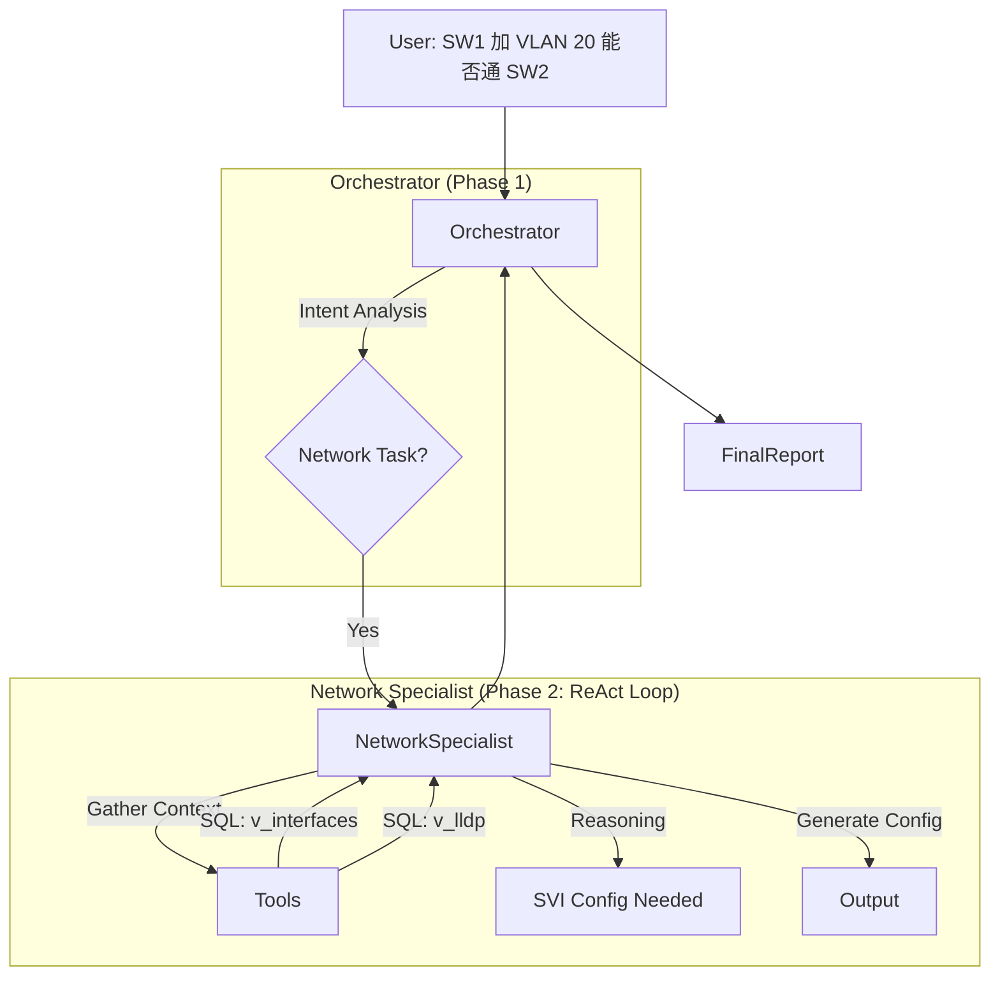

# OLAV Skill-Centric Unified Diagnosis Architecture (SCUD)

> **Version**: v1.2.0
> **Status**: Design Phase
> **Philosophy**: Unified Network Specialist, Hypothesis-Driven, Configuration Capable

---

## 1. 核心变革 (Core Transformation)

从 "微服务式 Agent" 转型为 **"统一网络专家 (Unified Network Specialist)"**。

### 1.1 核心原则

1.  **Unified Context (统一上下文)**: 网络协议（BGP/OSPF/STP）是紧密纠缠的。**Network Specialist** 作为一个单一 ReAct Agent，能在内存中关联 L2/L3 状态，避免跨 Agent 通信开销。
2.  **Configuration Capable (配置能力)**: 专家不仅能**诊断 (Read)**，还能**规划变更 (Write)**。例如："为了连通 VLAN 10，需要在 SW1 配置 SVI"。
3.  **Skill-Based (技能组合)**: 专家的能力来源于加载的 Skills (`bgp-skill`, `switching-skill`)。Skill 是工具包，Agent 是使用者。

---

## 2. 架构设计 (Architecture)

### 2.1 整体工作流



### 2.2 统一专家定义 (Network Specialist)

**角色**: L2-L7 全能网络工程师
**能力**: 加载所有 Network Topic Skills

**Config**:
```yaml
# .olav/agents/network_specialist.yaml
name: Network Specialist
model: claude-3-5-sonnet
skills:
  - skills/pre-checks/bgp.md        # BGP 诊断能力
  - skills/pre-checks/switching.md  # STP/VLAN 诊断能力
  - skills/pre-checks/routing.md    # OSPF/Static 诊断能力
  - skills/config/gen_config.md     # (New) 配置生成能力
```

---

## 3. 复杂任务示例 (Complex Scenarios)

### 3.1 场景：跨设备配置规划

**用户指令**: "SW1 上新建 VLAN 20，IP 192.168.20.1/24，要能 ping 通 SW2 的 VLAN 10 (192.168.10.1)"

**Network Specialist ReAct Process**:

1.  **Thought (Context)**: 我需要检查 SW1 和 SW2 的物理连接和当前 L2 配置。
2.  **Action**: `query_network("SELECT * FROM v_lldp WHERE device='SW1'")` -> 发现 SW1-Gi0/1 连接 SW2。
3.  **Action**: `query_network("SELECT * FROM v_interfaces WHERE device='SW1' AND interface='Gi0/1'")` -> 确认是 Trunk。
4.  **Thought (Reasoning)**: 链路具备 L2 互通基础。SW2 已有 VLAN 10。需要在 SW1 创建 VLAN 20 SVI 并通过 OSPF 发布路由。
5.  **Action**: `generate_config(device='SW1', template='vlan_svi_ospf', ...)`
6.  **Final Answer**: 输出详细配置步骤和回退方案。

---

## 4. 实施计划 (Implementation)

1.  **合并 Skills**: 将原本分散的 `bgp-expert`, `routing-expert` 降级为 Topic Skills（只含 Tools 和 Prompts，不含 Agent 逻辑）。
2.  **开发 Config Skills**: 新增 `generate_config` 工具，集成 Jinja2 模板引擎。
3.  **构建 Network Specialist**: 实现一个加载上述所有 Skill 的 ReAct Agent。

---

### 1.1 核心原则

1. **Skill-Centric (SOP as Code)**: 诊断知识（假设、检查步骤、特征向量）定义在 Markdown Skill 中，Agent 只负责执行。
2. **Hypothesis-Driven (假设驱动)**: 诊断过程不再是盲目的数据采集，而是 `提出假设 -> 验证假设 -> 修正假设` 的循环。
3. **Stratified Recon (分级侦查)**: 严格控制爆炸半径。`SQL (元数据) -> Snapshot (快照) -> CLI (实时)`，成本逐级递增。
4. **Knowledge RAG (知识增强)**: ReAct 循环中集成知识库检索，解决“未知”和“复杂”故障。

### 1.2 架构对比

| 维度 | 旧架构 (`analysis`) | 新架构 (SCUD) |
|:---|:---|:---|
| **诊断逻辑** | 硬编码在 Python 中 | 定义在 `.md` Skill 文件中 |
| **执行流** | 线性 (Step 1 -> 2 -> 3) | 环形 ReAct (Think -> Act -> Observe) |
| **数据源** | 独立采集，重复造轮子 | 复用 `inspect` 基础设施 + 统一接口 |
| **知识库** | 无集成 | 作为核心 Tool (`search_knowledge`) |
| **扩展性** | 修改代码 | 添加 Tool / 修改 Skill |

---

## 2. 架构设计 (Architecture)

### 2.1 整体工作流

```mermaid
graph TD
    User["User: R1 丢包严重"] --> IntentRouter
    IntentRouter --> ScopeAgent
    
    subgraph "Phase 1: Scoping (快速定界)"
        ScopeAgent -- "Query SQL" --> DeviceList[R1, SW1, R2]
        ScopeAgent -- "Search Knowledge" --> KnownIssues[Similar Cases]
    end
    
    DeviceList --> PlannerAgent
    KnownIssues --> PlannerAgent
    PlannerAgent -- "Load Skill" --> DiagSkill[skills/diagnosis/packet-loss.md]
    PlannerAgent --> InitialPlan
    
    subgraph "Phase 2: Execution (ReAct Loop)"
        InitialPlan --> ExecutorAgent
        ExecutorAgent <--> Tool1[query_network (SQL)]
        ExecutorAgent <--> Tool2[inspect_device (Snapshot)]
        ExecutorAgent <--> Tool3[run_cli (Real-time)]
        ExecutorAgent <--> Tool4[search_knowledge (RAG)]
        ExecutorAgent <--> Tool5[search_logs (External)]
    end
    
    ExecutorAgent --> RootCause
    RootCause --> ReportAgent
```

### 2.2 核心 Skill 定义 (New Standard)

文件: `.olav/skills/diagnosis/packet-loss.md`

```yaml
---
name: Packet Loss Diagnosis
id: diag-packet-loss
intent: diagnosis
fault_tags: [packet-loss, intermittent, performance]

# 1. 假设生成策略 (由 Agent 在推理时参考)
hypotheses:
  - id: H1
    desc: "L1/L2 链路质量问题 (CRC/Errors)"
    verify: "Check interface error counters"
    tools: [query_network, inspect_device]
  - id: H2
    desc: "L3 路由震荡或黑洞"
    verify: "Check route stability and nexthop"
    tools: [query_network, search_logs]
  - id: H3
    desc: "QoS/Policing 丢包"
    verify: "Check interface drop counters and policy-map"
    tools: [inspect_device, run_cli]
  - id: H4
    desc: "硬件资源瓶颈 (CPU/Mem/Buffer)"
    verify: "Check hardware resources"
    tools: [query_network, inspect_device]

# 2. 知识上下文引用
knowledge_context:
  - "known_issues/crc_errors_wan.md"
  - "architecture/qos_policy.md"
---

# Packet Loss SOP

Agent 请遵循以下 ReAct 逻辑进行诊断：

1. **Scope & Topology**: 
   - 使用 `query_network` 确定源目路径及沿途设备。
   - 使用 `search_knowledge` 查找该路径设备的历史案例。

2. **Verify H1 (Physical)**:
   - 优先查询 `v_interfaces` (SQL) 检查 `in_errors`, `out_errors`, `crc_errors`。
   - 如果数据过旧，对关键节点执行 `inspect_device`。

3. **Verify H2 (Routing)**:
   - 检查 `v_routes` 和 `v_ospf_neighbors`。
   - 使用 `search_logs` 搜索 "FLAP", "DOWN", "DUPLICATE" 关键词。

4. **Verify H4 (Hardware)**:
   - 检查 `v_cpu_utilization` 和 `v_memory_utilization`。
```

---

## 3. 核心工具链 (Toolchain)

所有工具通过统一接口暴露给 Agent，底层复用现有能力。

| Tool Name | 底层实现 | 职责 | 成本 |
|:---|:---|:---|:---:|
| `query_network` | `UnifiedDatabase.query(sql)` | 查询元数据、配置、最新状态 | 🟢 Low |
| `inspect_device` | `sync_tools.sync_devices()` | 采集设备完整快照 (NTC) | 🟡 Med |
| `run_cli` | `cli_executor.execute()` | 执行任意 Show 命令 (需授权) | 🔴 High |
| `search_knowledge` | `Vectorstore.similarity_search()` | RAG 检索历史案例、文档 | 🟢 Low |
| `search_logs` | (New) `LogAdapter.search()` | 查询外部日志系统 (Splunk/ELK) | 🟢 Low |

---

## 4. DeepAgents 集成 (DeepAgents Integration)

### 4.1 为什么使用 DeepAgents？

DeepAgents 是一个原生支持 **Plan-Execute** 和 **ReAct** 模式的 Agent 框架，避免我们重复造轮子。

| 功能 | 自己实现 | 使用 DeepAgents |
|:---|:---|:---|
| **Plan Agent** | 需要手写 Prompt + 解析逻辑 | 原生支持，开箱即用 |
| **ReAct Loop** | 需要实现 Think-Act-Observe 循环 | 内置 ReAct 引擎 |
| **Tool Calling** | 需要手动管理工具注册和调用 | 自动工具绑定和调用 |
| **维护成本** | 高 | 低 |

### 4.2 Plan Agent 实现

**职责**: 根据故障描述和设备范围，生成结构化的诊断计划。

```python
# src/olav/agents/diagnosis_planner.py

from deepagents import PlanAgent
from olav.core.skill_loader import get_skill_loader

class DiagnosisPlanAgent:
    """基于 DeepAgents 的诊断计划生成器"""
    
    def __init__(self):
        self.planner = PlanAgent(
            model="claude-sonnet-4",
            temperature=0.1  # 计划生成需要确定性
        )
    
    async def generate_plan(
        self,
        fault_description: str,
        fault_type: str,
        devices: list[str],
        skill_id: str = None
    ) -> dict:
        """
        生成诊断计划
        
        Args:
            fault_description: "R1 无法访问 R3"
            fault_type: "connectivity" | "performance" | "security"
            devices: ["R1", "SW1", "R3"]
            skill_id: 可选，指定使用的 Skill (如 "diag-packet-loss")
        
        Returns:
            {
                "plan": [
                    {"step": 1, "action": "query_network", "params": {...}},
                    {"step": 2, "action": "inspect_device", "params": {...}}
                ],
                "skill_used": "diag-packet-loss",
                "hypotheses": ["H1", "H2"]
            }
        """
        
        # 1. 加载相关 Skill
        skill_loader = get_skill_loader()
        if skill_id:
            skill = skill_loader.get_skill(skill_id)
        else:
            # 根据 fault_type 自动选择 Skill
            skill = skill_loader.get_skill_by_tags([fault_type])
        
        if not skill:
            raise ValueError(f"No skill found for fault_type: {fault_type}")
        
        # 2. 构建 Prompt (包含 Skill 的假设和 SOP)
        prompt = f"""
你是一名网络诊断专家。请为以下故障生成诊断计划：

**故障描述**: {fault_description}
**故障类型**: {fault_type}
**相关设备**: {', '.join(devices)}

**可用的诊断假设** (来自 Skill: {skill.id}):
{self._format_hypotheses(skill.frontmatter.get('hypotheses', []))}

**诊断 SOP**:
{skill.content}

**可用工具**:
- query_network: 查询 DuckDB (v_interfaces, v_routes, v_ospf_neighbors 等)
- inspect_device: 采集设备完整快照 (所有 NTC 命令)
- run_cli: 实时执行 CLI 命令 (需要用户批准)
- search_knowledge: 搜索历史案例和文档
- search_logs: 查询外部日志系统

**要求**:
1. 优先使用 query_network (成本低)
2. 只在必要时使用 inspect_device
3. 避免使用 run_cli，除非前两者无法获取信息
4. 每个步骤必须说明原因 (reason)

请以 JSON 格式返回计划。
"""
        
        # 3. 调用 DeepAgents Plan Agent
        plan_result = await self.planner.plan(prompt)
        
        return {
            "plan": plan_result["steps"],
            "skill_used": skill.id,
            "hypotheses": [h["id"] for h in skill.frontmatter.get("hypotheses", [])]
        }
    
    def _format_hypotheses(self, hypotheses: list) -> str:
        """格式化假设列表"""
        lines = []
        for h in hypotheses:
            lines.append(f"- {h['id']}: {h['desc']}")
            lines.append(f"  验证方法: {h['verify']}")
        return "\n".join(lines)
```

### 4.3 ReAct Agent 实现

**职责**: 执行诊断计划，动态调整策略，直到找到根因。

```python
# src/olav/agents/diagnosis_executor.py

from deepagents import ReActAgent, Tool
from olav.core.unified_database import UnifiedDatabase
from olav.tools.sync_tools import sync_devices

class DiagnosisReActAgent:
    """基于 DeepAgents 的诊断执行器"""
    
    def __init__(self):
        self.udb = UnifiedDatabase()
        self.observations = []
        
        # 注册工具到 DeepAgents
        self.agent = ReActAgent(
            model="claude-sonnet-4",
            tools=self._build_tools(),
            max_iterations=15  # 最多 15 轮 ReAct 循环
        )
    
    def _build_tools(self) -> list[Tool]:
        """从 Skill 动态构建工具集"""
        
        # 1. 加载 Diagnosis Skill
        from olav.core.skill_loader import get_skill_loader
        skill_loader = get_skill_loader()
        skill = skill_loader.get_skill("diagnosis-packet-loss")  # 示例
        
        # 2. 从 Skill 的 tools 字段动态注册
        tools = []
        
        for tool_def in skill.frontmatter.get("tools", []):
            tool_name = tool_def["name"]
            tool_type = tool_def["type"]
            
            if tool_type == "builtin":
                # 注册内置工具
                if tool_name == "query_network":
                    tools.append(Tool(
                        name="query_network",
                        description=tool_def["description"],
                        func=self._query_network,
                        parameters={
                            "sql": {"type": "string", "description": "SQL 查询语句"}
                        }
                    ))
                elif tool_name == "inspect_device":
                    tools.append(Tool(
                        name="inspect_device",
                        description=tool_def["description"],
                        func=self._inspect_device,
                        parameters={
                            "devices": {"type": "array", "description": "设备名列表"}
                        }
                    ))
                elif tool_name == "run_cli":
                    tools.append(Tool(
                        name="run_cli",
                        description=tool_def["description"],
                        func=self._run_cli,
                        parameters={
                            "device": {"type": "string"},
                            "command": {"type": "string"}
                        }
                    ))
                elif tool_name == "search_knowledge":
                    tools.append(Tool(
                        name="search_knowledge",
                        description=tool_def["description"],
                        func=self._search_knowledge,
                        parameters={
                            "query": {"type": "string", "description": "搜索关键词"}
                        }
                    ))
            
            elif tool_type == "external":
                # 动态加载外部适配器
                adapter_name = tool_def["adapter"]
                adapter = self._load_external_adapter(adapter_name)
                
                tools.append(Tool(
                    name=tool_name,
                    description=tool_def["description"],
                    func=adapter.execute
                ))
        
        return tools
    
    def _load_external_adapter(self, adapter_name: str):
        """动态加载外部适配器"""
        # 从配置加载适配器
        from config.settings import get_settings
        settings = get_settings()
        
        if adapter_name == "splunk":
            from olav.adapters.splunk_adapter import SplunkAdapter
            return SplunkAdapter(
                host=settings.splunk_host,
                token=settings.splunk_token
            )
        elif adapter_name == "prometheus":
            from olav.adapters.prometheus_adapter import PrometheusAdapter
            return PrometheusAdapter(url=settings.prometheus_url)
        else:
            raise ValueError(f"Unknown adapter: {adapter_name}")

    
    async def _query_network(self, sql: str) -> dict:
        """执行 SQL 查询"""
        try:
            results = self.udb.query(sql)
            return {
                "source": "sql",
                "data": results,
                "count": len(results)
            }
        except Exception as e:
            return {"error": str(e)}
    
    async def _inspect_device(self, devices: list[str]) -> dict:
        """采集设备快照"""
        results = await sync_devices(devices)
        return {
            "source": "snapshot",
            "devices": devices,
            "data": results
        }
    
    async def _run_cli(self, device: str, command: str) -> dict:
        """实时 CLI 查询 (需要 HITL 批准)"""
        # TODO: 实现 HITL 批准逻辑
        return {"error": "CLI execution requires user approval"}
    
    async def _search_knowledge(self, query: str) -> dict:
        """搜索知识库"""
        # TODO: 实现向量检索
        return {"results": []}
    
    async def diagnose(
        self,
        plan: dict,
        fault_description: str
    ) -> dict:
        """
        执行诊断 (ReAct Loop)
        
        Args:
            plan: DiagnosisPlanAgent 生成的计划
            fault_description: 故障描述
        
        Returns:
            {
                "root_cause": "...",
                "observations": [...],
                "recommendations": [...]
            }
        """
        
        context = f"""
你是一名网络诊断专家。用户报告: {fault_description}

**诊断计划** (参考，可根据实际情况调整):
{self._format_plan(plan['plan'])}

**可用假设** (来自 Skill):
{', '.join(plan['hypotheses'])}

**ReAct 指引**:
1. Thought: 分析当前发现，决定下一步行动
2. Action: 选择工具并执行
3. Observation: 记录结果并分析

**目标**: 找到根本原因 (Root Cause) 并给出修复建议。

当你有足够信息确定根因时，输出最终结论。
"""
        
        # 调用 DeepAgents ReAct Agent
        result = await self.agent.run(context)
        
        return {
            "root_cause": result.get("conclusion"),
            "observations": result.get("observations", []),
            "recommendations": result.get("recommendations", [])
        }
    
    def _format_plan(self, plan: list) -> str:
        """格式化计划"""
        lines = []
        for step in plan:
            lines.append(f"Step {step['step']}: {step['action']} - {step.get('reason', '')}")
        return "\n".join(lines)
```

### 4.4 CLI 集成

```python
# src/olav/cli/cli_main.py

@app.command()
def diagnosis(
    description: str = typer.Argument(..., help="故障描述，如 'R1 无法访问 R3'"),
    fault_type: str = typer.Option("auto", help="故障类型: connectivity | performance | security | auto")
):
    """
    智能故障诊断
    
    Examples:
        olav diagnosis "R1 无法访问 R3"
        olav diagnosis "R1 CPU 过高" --fault-type performance
    """
    
    from olav.agents.topology_agent import TopologyAgent
    from olav.agents.diagnosis_planner import DiagnosisPlanAgent
    from olav.agents.diagnosis_executor import DiagnosisReActAgent
    
    # 1. Scoping: 确定设备范围
    topology_agent = TopologyAgent()
    devices = asyncio.run(topology_agent.get_affected_devices(
        fault_description=description,
        fault_type=fault_type
    ))
    
    console.print(f"[cyan]Scoping: 确定相关设备 {devices}[/cyan]")
    
    # 2. Planning: 生成诊断计划
    planner = DiagnosisPlanAgent()
    plan = asyncio.run(planner.generate_plan(
        fault_description=description,
        fault_type=fault_type,
        devices=devices
    ))
    
    console.print(f"[cyan]Planning: 使用 Skill '{plan['skill_used']}'[/cyan]")
    
    # 3. Execution: ReAct 诊断
    executor = DiagnosisReActAgent()
    result = asyncio.run(executor.diagnose(plan, description))
    
    # 4. Report
    console.print("\n[bold green]诊断结果[/bold green]")
    console.print(f"根本原因: {result['root_cause']}")
    console.print(f"修复建议: {result['recommendations']}")
```

---

## 5. 实施计划 (Implementation Roadmap)

### Phase 1: 基础设施重构 (v0.10.0)
- [ ] **Data Layer**: 完善 `v_logs` (DuckDB 虚拟表或工具适配)。
- [ ] **Tool Layer**: 封装 `inspect_device` 支持按设备列表采集。
- [ ] **Knowledge Layer**: 实现 `search_knowledge` 工具。

### Phase 2: Agent 重构 (v0.10.1)
- [ ] **Planner**: 引入 `scoping` 阶段，基于 SQL 快速圈定范围。
- [ ] **Executor**: 实现基于 ReAct 的 `DiagnosisAgent`，加载 Markdown Skill。
- [ ] **Skill**: 编写核心诊断 Skill (`connectivity.md`, `packet-loss.md`)。

---

## 5. 垃圾代码清理 (Legacy Code Cleanup)

为了保持代码库的整洁和架构的一致性，以下代码模块在新架构实施时**必须删除**：

### 5.1 需要删除的 Python 模块

| 路径 | 说明 | 替代方案 |
|:---|:---|:---|
| `src/olav/agents/analysis_agent.py` | 旧的线性分析 Agent | `DiagnosisReActAgent` |
| `src/olav/experts/routing.py` | 硬编码的路由专家逻辑 | `skills/diagnosis/connectivity.md` + Tool |
| `src/olav/experts/switching.py` | 硬编码的交换专家逻辑 | `skills/diagnosis/l2-issue.md` + Tool |
| `src/olav/experts/security.py` | 硬编码的安全专家逻辑 | `skills/diagnosis/security.md` + Tool |
| `src/olav/core/legacy_prompts.py` | 旧的 Prompt 模板 | Skill Markdown 中的 Prompt |

### 5.2 需要清理的配置/文档

| 路径 | 说明 |
|:---|:---|
| `docs/03_expert_architecture_refactoring-old.md` | 过时的设计文档 |
| `.olav/skills/legacy/*` | 任何非 Markdown 格式的旧 Skill |

### 5.3 清理原则

1. **Zero Hardcoding**: 任何包含具体故障诊断逻辑的 Python 代码都应被删除，逻辑应移至 Markdown Skill。
2. **Unified Tooling**: 不要保留专门为 Analysis 写的采集函数，必须复用 `inspect` 和 `cli` 模块。
3. **No Duplicate Logic**: 拓扑计算、路径分析逻辑应统一沉淀为 `TopologyAgent` 或 SQL View，不分散在多个文件。
