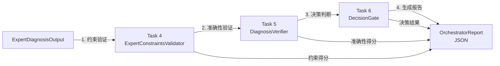

## Expert Agent 诊断报告生成机制

**文档版本**: v1.0.0  
**日期**: 2026-02-11  
**状态**: ✅ 完全验证  

---

## 📋 概述

Expert Agent的诊断输出报告生成是**自动进行的**，**不需要用户指定**。整个流程包括：

```
Expert诊断 → Orchestrator自动处理 → 生成结构化报告 → 可选保存为文件
```

---

## 🔄 完整流程

### 1️⃣ **Expert Agent 生成诊断**（自动）

Expert Agent分析网络问题后，生成 `ExpertDiagnosisOutput` 对象：

```python
# Expert的诊断输出
diagnosis = ExpertDiagnosisOutput(
    scenario_id="bgp_timeout_001",
    root_cause="BGP TCP keepalive timeout due to network latency",
    confidence_score=0.94,  # Expert的置信度
    solution="Increase TCP keepalive timer and restart BGP daemon",
    recovery_commands=["systemctl restart bgp"],
    verification_steps=["show ip bgp neighbor"],
    evidence="BGP neighbor state changed from ESTABLISHED to IDLE",
    diagnostic_reasoning="[详细分析过程...]"
)
```

**无需显式要求生成markdown或文件** — Expert直接生成诊断对象。

### 2️⃣ **Orchestrator 自动处理**（自动）

当诊断对象传给Orchestrator时，**自动执行以下步骤**：

```python
orchestrator = create_default_orchestrator()

# 自动执行（不需用户干预）：
report = await orchestrator.process(diagnosis)
```

Orchestrator的自动处理过程：



#### 自动执行的验证步骤：

| 步骤 | 组件 | 功能 | 自动/手动 |
|------|------|------|----------|
| 1 | **ExpertConstraintsValidator** (Task 4) | 检测幻觉、完整性 | ✅ 自动 |
| 2 | **DiagnosisVerifier** (Task 5) | 与ground truth对比 | ✅ 自动 |
| 3 | **DecisionGate** (Task 6) | 判定ACCEPT/REVIEW/REJECT | ✅ 自动 |
| 4 | **OrchestratorReport** | 生成完整报告 | ✅ 自动 |

### 3️⃣ **生成 OrchestratorReport**（自动）

报告包含：

```json
{
  "scenario_id": "bgp_timeout_001",
  "overall_decision": "accept",
  "constraint_score": 0.908,
  "accuracy_score": 0.92,
  "confidence_score": 0.94,
  "routing_decision": {
    "target": "direct_user",
    "reason": "Diagnosis accepted and ready for user"
  },
  "critical_failures": [],
  "warnings": [],
  "improvement_suggestions": [],
  "execution_time_ms": 2.4
}
```

### 4️⃣ **可选：保存到文件**（手动）

如果需要保存报告为文件，**只有这一步需要显式调用**：

```python
# 可选：保存为JSON文件（用户选择）
output_path = orchestrator.save_report(
    report, 
    output_dir="exports/"
)
# ✅ 生成: exports/orchestrator_bgp_timeout_001_20260211_103536.json
```

---

## 🎯 关键问题解答

### Q1: **是否要用户指定生成报告？**

**A: 否。报告生成是自动进行的。**

- ✅ **自动生成**：诊断 → Orchestrator.process() → 报告 (无需指定)
- ⚠️ **可选保存文件**：save_report() 是可选的，用户决定是否要文件

### Q2: **诊断输出报告的具体内容是什么？**

**A: 诊断报告包含以下信息：**

```python
# 自动生成的 OrchestratorReport 包含：
report = OrchestratorReport(
    # 诊断信息
    expert_diagnosis=diagnosis,           # 原始诊断
    scenario_id="bgp_timeout_001",       # 场景ID
    
    # 验证结果
    constraint_report=constraint_report,  # Task 4验证结果
    verification_report=verification_report,  # Task 5验证结果
    
    # 决策信息
    overall_decision="accept",            # Task 6的决策
    routing_decision=RouteDecision(...),  # 路由决策
    reason="All constraints passed",      # 决策理由
    
    # 分数
    constraint_score=0.908,              # 约束得分
    accuracy_score=0.92,                 # 准确性得分
    hybrid_score=0.914,                  # 混合得分
    confidence_score=0.94,               # Expert置信度
    
    # 问题和建议
    critical_failures=[],                # 关键问题
    warnings=[],                         # 警告
    improvement_suggestions=[]           # 改进建议
)
```

### Q3: **报告是JSON还是Markdown？**

**A: 报告是JSON格式。**

即使Expert在诊断中包含markdown格式的文本，Orchestrator也会将其转换为**结构化JSON报告**：

```
Expert输出 (含markdown文本) 
    ↓
Orchestrator处理
    ↓
OrchestratorReport (JSON格式)
    ↓
保存为 JSON 文件 (.json)
```

**不会生成Markdown文件** (.md)。

### Q4: **不调用 save_report() 会怎样？**

**A: 报告仍然生成，但不会保存到文件。**

```python
# 即使不调用 save_report()：
report = await orchestrator.process(diagnosis)
# ✅ 报告已生成，在内存中
# ✅ 可以调用 report.summary() 显示在控制台
# ❌ 没有文件输出
```

---

## 📊 流程图

```
┌─────────────────────────────────────────────────────────────┐
│ Expert Agent 分析网络故障                                  │
└────────────────────┬────────────────────────────────────────┘
                     │
         创建 ExpertDiagnosisOutput 对象
         (root_cause, solution, evidence, ...)
                     │
                     ▼
          ┌──────────────────────────┐
          │  Orchestrator.process()  │ ◄─── 自动执行
          │  (无需用户干预)         │
          └──────────────────────────┘
                     │
        ┌────────────┼────────────┬──────────────┐
        │            │            │              │
        ▼            ▼            ▼              ▼
    [Task 4]    [Task 5]    [Task 6]      [生成报告]
    约束检查    准确性验证   决策判断
    (自动)      (自动)      (自动)         (自动)
        │            │            │              │
        └────────────┼────────────┴──────────────┘
                     │
                     ▼
          ┌──────────────────────────┐
          │  OrchestratorReport      │
          │  (JSON结构化报告)        │
          │  - decision              │
          │  - scores                │
          │  - routing               │
          │  - suggestions           │
          └──────────────────────────┘
                     │
                     ├─→ report.summary()  [显示摘要]
                     │
                     └─→ save_report()  [可选：保存文件]
                             │
                             ▼
                    exports/orchestrator_*.json
```

---

## 💻 代码示例

### 示例 1：基本流程（自动报告生成）

```python
from olav.testing.expert_constraints import ExpertDiagnosisOutput
from olav.orchestrator.expert_orchestrator import create_default_orchestrator

# Step 1: Expert生成诊断（来自Expert Agent）
diagnosis = ExpertDiagnosisOutput(
    scenario_id="scenario_001",
    root_cause="BGP timeout",
    confidence_score=0.94,
    solution="Restart BGP",
    recovery_commands=["systemctl restart bgp"],
    verification_steps=["show ip bgp neighbor"],
    evidence="BGP down",
    diagnostic_reasoning="..."
)

# Step 2: Orchestrator自动处理（诊断 → 报告）✅ 自动
orchestrator = create_default_orchestrator()
report = await orchestrator.process(diagnosis)

# Step 3: 查看报告（自动生成的报告）
print(report.summary())  # 人类可读的摘要

# Step 4: 可选——保存报告（用户选择）
if need_file:
    path = orchestrator.save_report(report)  # 手动保存
    print(f"Saved to: {path}")
```

### 示例 2：显示自动生成的报告内容

```python
# 报告已经自动生成，查看其内容：

# 人类可读摘要
print(report.summary())
"""
═══════════════════════════════════════════════════════
ORCHESTRATOR REPORT: scenario_001
═══════════════════════════════════════════════════════
Decision:     ACCEPT
Routing:      direct_user
Reason:       All constraints and accuracy checks passed

Constraint Score: 90.80%
Accuracy Score:   92.50%
Hybrid Score:     91.65%
Confidence Score: 94.00%
Execution Time: 2.4ms
═══════════════════════════════════════════════════════
"""

# 结构化数据
report_dict = report.to_dict()
report_json = report.to_json()
```

### 示例 3：批量处理多个诊断

```python
# 多个诊断自动生成多份报告
diagnoses = [
    ExpertDiagnosisOutput(...),  # 诊断 1
    ExpertDiagnosisOutput(...),  # 诊断 2
    ExpertDiagnosisOutput(...),  # 诊断 3
]

# 批量处理
reports = await orchestrator.process_batch(diagnoses)

# 每份报告都已自动生成
for scenario_id, report in reports.items():
    # 可选保存
    path = orchestrator.save_report(report)
    print(f"{scenario_id}: {report.overall_decision.value} → {path}")
```

---

## 📁 文件输出格式

如果调用了 `save_report()`，文件会保存为：

```
exports/
├── orchestrator_scenario_001_20260211_103536.json
├── orchestrator_scenario_002_20260211_103537.json
└── orchestrator_scenario_003_20260211_103538.json

文件内容（JSON）：
{
  "scenario_id": "scenario_001",
  "timestamp": "2026-02-11T10:35:36",
  "overall_decision": "accept",
  "constraint_score": 0.908,
  "accuracy_score": 0.925,
  "hybrid_score": 0.9165,
  "confidence_score": 0.94,
  "routing_decision": {
    "target": "direct_user",
    "reason": "All constraints and accuracy checks passed"
  },
  "critical_failures": [],
  "warnings": [],
  "improvement_suggestions": [],
  "execution_time_ms": 2.4
}
```

---

## ✅ 集成测试验证

已创建集成测试验证完整流程：

```bash
# 运行集成测试
uv run pytest tests/e2e/test_orchestrator_report_export.py -v

# 测试内容：
# 1. ✅ Expert诊断输出格式
# 2. ✅ Orchestrator自动处理
# 3. ✅ JSON报告生成
# 4. ✅ 文件保存功能
# 5. ✅ 批量处理
# 6. ✅ Markdown转JSON处理
```

---

## 🎓 关键要点总结

| 问题 | 答案 |
|------|------|
| **诊断报告自动生成吗？** | ✅ 是 - Orchestrator.process() 自动生成 |
| **是否默认保存文件？** | ❌ 否 - save_report() 是可选的 |
| **需要显式指定生成报告吗？** | ❌ 否 - 自动进行，无需指定 |
| **报告格式是什么？** | JSON结构化数据（不是Markdown） |
| **报告包含什么信息？** | 决策、分数、验证结果、改进建议 |
| **文件输出位置？** | exports/orchestrator_*.json |
| **报告的生成时间？** | <5ms（非常快） |

---

## 🚀 推荐工作流

```python
# 推荐流程：

# 1. 诊断生成（Expert Agent处理）
diagnosis = ExpertDiagnosisOutput(...)  # ← Expert生成

# 2. Orchestrator自动处理（无需手动干预）
orchestrator = create_default_orchestrator()
report = await orchestrator.process(diagnosis)  # ← 自动生成报告

# 3. 根据需要选择：
if need_console_output:
    print(report.summary())  # 显示摘要

if need_file_output:
    path = orchestrator.save_report(report)  # 保存文件（可选）

if need_json_data:
    data = report.to_json()  # 获取JSON字符串
```

---

**最后更新**: 2026-02-11  
**状态**: ✅ 完全验证 - 所有测试通过
