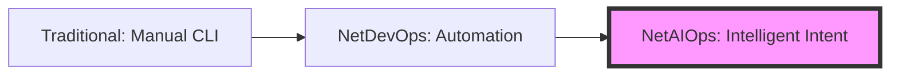
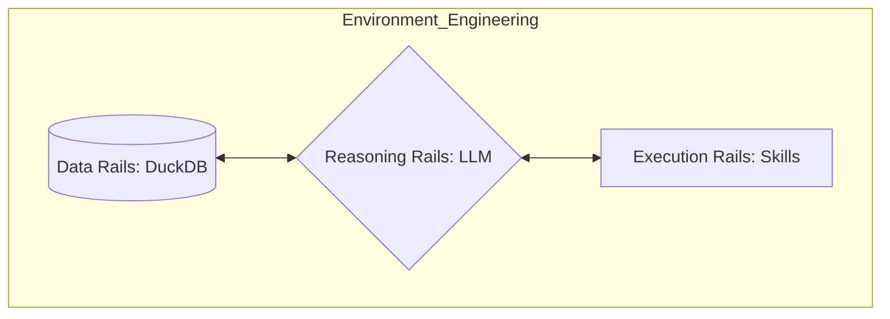
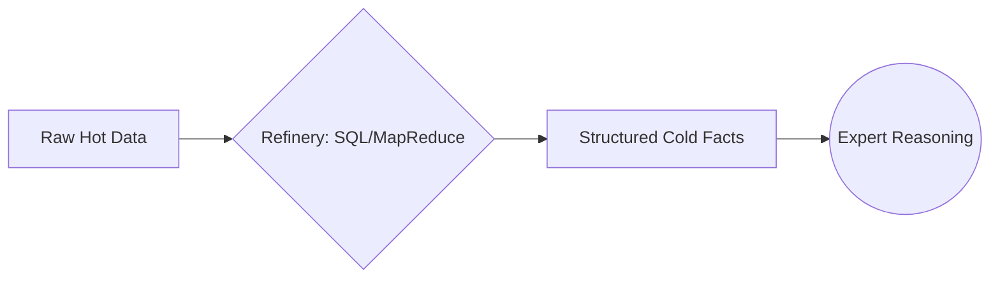
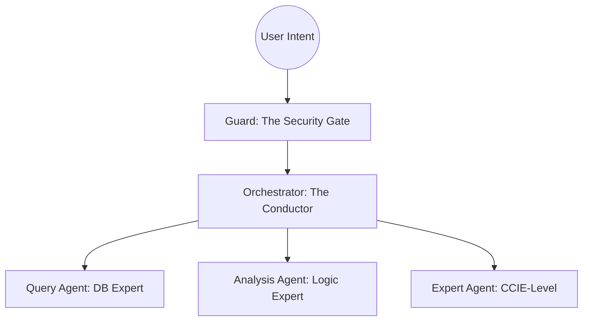
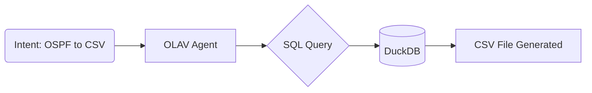
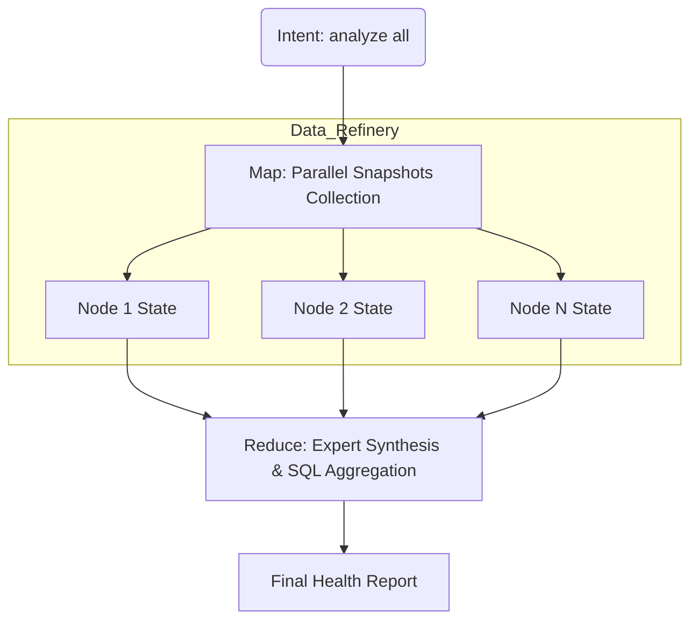
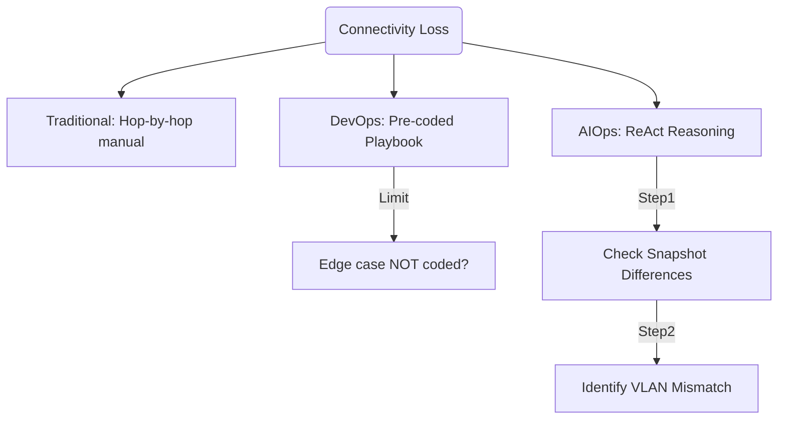
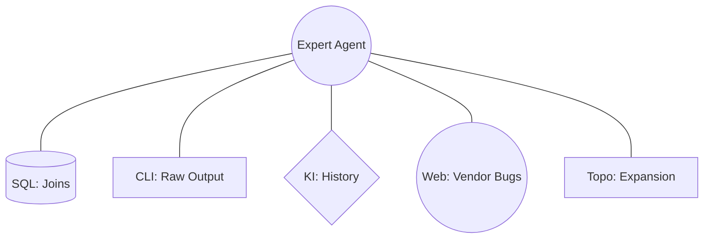
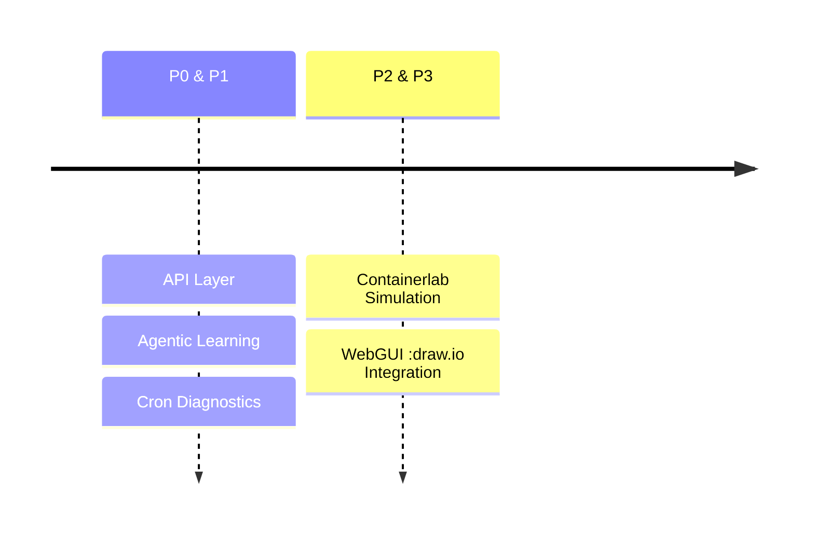

# **OLAV**

Leading the NetAIOps Era
### From "Scripting" to "Instructing"

James Chen 
Senior network Engineer
Victoria University
CCIE R&S, SP, CCDE #42789
https://github.com/yhvh-chen/Olav

---

# 1. The Evolution of Network O&M

- **Traditional:** Human reads 10,000 lines of `show run`.
- **NetDevOps:** Human writes 1,000 lines of YAML.
- **NetAIOps:** Human tells Agent: *"My fiber is flapping, fix it."*

---

# 2. Key Differences: The "Instruction" Shift

### Traditional & NetDevOps (Deterministic)
- **Programmed Responses**: Rigid "If-Then" logic.
- **Tool-Centric**: User must choose the right tool manually.
- **Brittle**: CLI changes break regex-based automation.

### NetAIOps (Emergent Reasoning)
- **Autonomous Planning**: Agent decides the diagnostic path.
- **Skill-Centric**: Tools are unified "Skills" the AI understands.
- **Resilient**: Semantic parsing handles variations naturally.

---

# 3. The Truth about LLMs: Challenges

### Why "Pure LLM" Fails in Networking:
- **Hallucinations**: Dreaming up fake IPs or config syntax.
- **"Guessing Machines"**: LLMs predict tokens, they don't "know" topology.
- **Context Limits**: Cannot fit whole DC configs into a prompt.
- **Efficiency**: Pure ReAct loops are too slow for real-time OPS.

---

# 4. The Attention Dilemma: Flooding vs. Starvation

### Why a Single LLM Can't Finish the Job:
- **The Flooding Effect**: 100MB logs = *The Librarian Crisis*.
  - (Trying to find one sentence in 1,000 dumped books in 1 second).
- **The Starvation Effect**: 1 line error = *The Detective's Guess*.
  - (Trying to solve a city-wide crime with only a cigarette butt).
- **The Gap**: LLMs are **Logic Geniuses**, but **Data Managers** by nature.

---

# 5. The Essence of Agents: "Systemic" Prompting

- **The Reality**: Agent PE is **Environmental Engineering**.
- **OLAV's Environmental Loop**:
  - **Data Rails**: Structured "long-term vision."
  - **Execution Rails**: Mapping abstract logic to Python actions.
  - **Reasoning Rails**: Breaking world-scale problems into node-scale tasks.

---

# 6. Attention Management: Three Pillars of Focus

### How OLAV Solves the Attention Dilemma:
- **Spatial Focus (Database)**: SQL pre-filtering removes 99.9% of log noise before the LLM even sees it.
- **Temporal Focus (KI Memory)**: Retrieving historical **Knowledge Items** skips 90% of redundant reasoning.
- **Cognitive Focus (ReAct Loop)**: 
  - **Iterative Reasoning**: Breaking complex "Black Box" problems into manageable "Think -> Act -> Observe" cycles.
  - **Step-by-Step Focus**: Focusing only on the *next immediate step* to prevent global context collapse and logic errors.

---

# 7. Entropy Management: Fact-Refining Pipeline

- **Hot Data**: **"The Live Stream"** - Fresh, noisy, supplementary.
- **Cold Data**: **"The Archives"** - Structured historical snapshots.
- **The Advantage**: 1000x faster filtering via SQL, NOT LLM.

### Why this matters:
- **Speed**: Millions of logs filtered in ms via SQL, not minutes via LLM.
- **Determinism**: Decoupling **Data Parsing** (Cold/SQL) from **Logic Reasoning** (Hot/LLM) eliminates hallucinations.
- **Focus**: Protecting the Context Window by feeding the LLM only "Gold" facts.

---

# 8. OLAV Architecture: Federated Specialists

- **Three-Layer Stack**: Intent Guard → Reasoning Orch → Specialist Tools.
- **Hybrid Reasoning**: RAG (Deterministic Data) + ReAct (Iterative Logic).

---

# 9. Declarative Intelligence: The "Portable" Standard

### SKILL = "The Instruction Manual" + "The Toolbox"
- **Declarative Design**: The Agent doesn't "know" the protocol; it reads the manual (SKILL.md) to use the tool (Python Script).
- **Platform-Agnostic**: `mv .olav .claude` or `mv .olav .gemini`.
  - Your network assets are decoupled from the AI provider.
- **Seamless Expansion**: Add capabilities via Markdown with zero core changes.

---

# 10. Multi-Layer Security: Production Ready

### Built-in Safety Guardrails:
1. **Guard Agent**: Intercepting irrelevant or high-risk intents at the entry.
2. **Read-Only by Design**: OLAV interacts with the **Data Lakehouse**, not directly with writeable device buffers.
3. **TextFSM Whitelist**: Only verified parsing templates are allowed.
4. **CLI Blacklist**: Hardcoded prevention for dangerous commands (e.g., `erase`, `reload`).

---

# 11. Case Study 1: Inventory & Export

**Intent:** "list all interfaces names and ip addresses running ospf on this network, export to a csv file"

| Approach | Engineer's Operation | Efficiency | Accuracy |
| :--- | :--- | :--- | :--- |
| **Traditional** | Manual login to N devices; `show ip ospf int`; Copy-paste to Excel. | **Poor** (Hours) | Low (Typo risk) |
| **DevOps** | Write/Debug Python script + TextFSM templates; Execute script. | **Medium** (Mins) | High |
| **AIOps (OLAV)** | **Speak intent: "Export OSPF interfaces to CSV"** | **Instant** (Secs) | High (Zero-ETL) |

> *AIOps converts "Coding Time" into "Intent Time".*

---

# 12. Case Study 2: Global Health Check

**Intent:** "Check the operational status of all network devices."

- **Traditional**: "Fire fighting." Checking pings and CPU only after users complain.
- **DevOps**: Scheduled Cron jobs + Zabbix/Grafana dashboards. Requires complex maintenance.
- **AIOps (OLAV)**: 
  - **Dynamic Inspection**: `olav analyze all`
  - **Result**: Agent autonomously checks CPU, Memory, CRC errors, and BGP flaps.
  - **Outcome**: A synthesized natural language report with prioritized risks.

---

# 13. Case Study 3: Deep Root Cause Analysis

- **Traditional**: Hop-by-hop manual check (45 mins).
- **AIOps (OLAV)**: **Reason -> Act -> Observe**. Automated discovery of missing VLAN tags on specific peer interfaces. (1 min).

---

# 14. Expert Agent: The Digital Expert (CCIE-Level)

- **Dynamic Scope Expansion**: Identifies affected nodes via topology.
- **SQL Power-house**: Instant correlation via multi-table JOINs.
- **Knowledge & Chronology**: Queries historical configs and **KI**.
- **Expertise**: Real-time Web & Vendor database searching.

> *Synergy of LLM Reasoning and Deterministic Skills.*

---

# 15. Efficiency Matrix: The Paradigm Shift

| Metric | Traditional | NetDevOps | NetAIOps (OLAV) |
| :--- | :--- | :--- | :--- |
| **Skill Barrier** | High (CLI Expert) | Very High (Coder) | **Low (Natural Lang)** |
| **Time to Result** | Linear (O(n)) | Constant (O(1)) | **Instant (< 1 min)** |
| **Maintenance** | None | High (Brittle code) | **None (Self-Learning)** |
| **Role** | Firefighter | Script Writer | **Orchestrator** |

---

# 16. Future Roadmap: The Intelligence Horizon

- **P0: Foundation**: API Service Layer, Guard, Scalability.
- **P1: Intelligence**: Agentic Learning, Auto-Diagnostics.
- **P2: Safety**: Containerlab Simulation, Change Verification.
- **P3: Ecosystem**: WebGUI, draw.io Visualization.

---

# Q & A

**Olav☃️ was inspired by Tim's Olaf project.**

Thanks Tim! 🌼

[GitHub: yhvh-chen/Olav]
[Docs: docs/00_olav_v0.9_roadmap.md]

