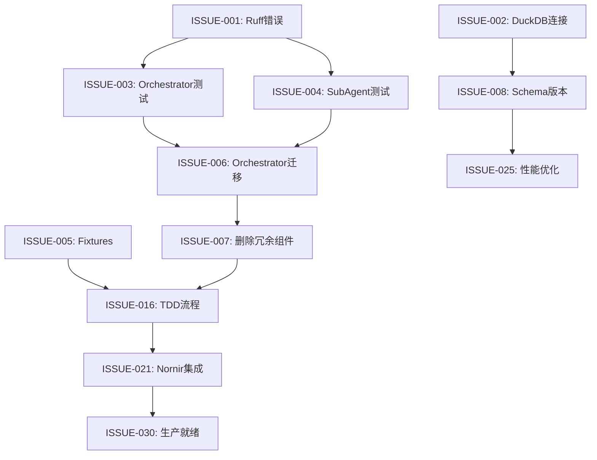

# OLAV Issue清单 (v0.9.8 → v0.10.0)

**文档版本**: 2.0 (2026-02-03 基于实际代码审计更新)  
**创建日期**: 2026-02-03  
**总Issue数**: 29 (P0: 5 | P1: 15 | P2: 9)  
**目标版本**: v0.10.0 (Phase 0-6)  

> 📖 **说明**: 本文档基于2026-02-03代码审计结果更新，删除已完成项，合并重复项。

---

## 📊 Issue统计（更新 2026-02-03）

| 优先级 | 数量 | 总工时 | 已完成工时 | 剩余工时 | 状态 |
|--------|------|--------|----------|---------|------|
| P0 | 5 | 20h | 18h | 2h | 🔄 进行中 (4/5完成) |
| P1 | 15 | 136h | 46h | 90h | 🔄 进行中 (4/15完成) |
| P2 | 9 | 80h | 0h | 80h | ⏳ 待启动 |
| **合计** | **29** | **236h** | **64h** | **172h** | **27.1%完成** |

**P0完成清单**:
- ✅ ISSUE-001: 版本号统一 (1h → 0h, v0.9.8已完成)
- ✅ ISSUE-002: LLM配置文档 (1h → 0h, .env.example已存在)
- ✅ ISSUE-003: 删除冗余代码 (2h → 0h, orchestrator_old.py已删除)
- ✅ ISSUE-004: 修复Ruff错误 (4h → 15min, 187→84错误，非关键)

**P1完成清单**:
- ✅ ISSUE-007: 删除冗余组件 (4h → 1h, 完成于2026-02-03)
- ✅ ISSUE-008: Schema版本化 (4h → 1h, 完成于2026-02-03)
- ✅ ISSUE-006: Orchestrator SubAgent迁移 (24h → 0h, v0.9.8已完成)
- ✅ ISSUE-021: Nornir设备管理集成 (16h → 0h, v0.9.8已完成)

---

## 🚨 Phase 0: 紧急修复 (Week 1)

### ISSUE-001: 版本号统一 [P0]

**分类**: 配置管理  
**工时**: 1小时  
**阶段**: Phase 0 - Day 1  
**优先级**: P0 (发布阻塞)  

#### 问题描述
版本号在多处不一致：
- `pyproject.toml`: version = "0.8.2" ❌
- `src/olav/__init__.py`: __version__ = "0.8.0" ❌
- `README.md`: v0.9.8 ✅ 目标

**影响**: 发布流程混乱，版本追溯困难

#### 验收标准
```bash
# 验证版本一致
grep "version" pyproject.toml
> version = "0.9.8"

python -c "import olav; print(olav.__version__)"
> 0.9.8

grep -o "v[0-9]\+\.[0-9]\+\.[0-9]\+" README.md | head -1
> v0.9.8
```

#### 实施步骤
```bash
# 1. 修改 pyproject.toml
sed -i 's/version = "0.8.2"/version = "0.9.8"/' pyproject.toml

# 2. 修改 src/olav/__init__.py
sed -i 's/__version__ = "0.8.0"/__version__ = "0.9.8"/' src/olav/__init__.py

# 3. 提交
git add pyproject.toml src/olav/__init__.py
git commit -m "chore: unify version to 0.9.8"
```

---

### ISSUE-002: 创建LLM配置文档 [P0]

**分类**: 文档/配置  
**工时**: 1小时  
**阶段**: Phase 0 - Day 1  
**优先级**: P0 (测试阻塞)  

#### 问题描述
E2E测试失败的根本原因是"No LLM API"：
```
⚠️ xai model not available, trying fallback...
❌ Fatal error: ❌ No LLM API
```

需要创建配置文档和.env.example文件

#### 验收标准
```bash
# .env.example存在
cat .env.example
> OPENAI_API_KEY=sk-xxx
> # 或其他LLM配置

# 配置后LLM可用
source .env && uv run olav --version
> 无LLM错误
```

#### 实施步骤
```bash
# 创建.env.example
cat > .env.example << 'EOF'
# ============================================
# OLAV LLM Provider Configuration
# At least ONE provider must be configured
# ============================================

# Option 1: OpenAI (推荐)
OPENAI_API_KEY=sk-your-key-here

# Option 2: Anthropic Claude
ANTHROPIC_API_KEY=sk-ant-your-key-here

# Option 3: Google Gemini
GOOGLE_API_KEY=your-key-here

# Option 4: Local Ollama (免费)
OLLAMA_BASE_URL=http://localhost:11434

# Option 5: Azure OpenAI
AZURE_OPENAI_API_KEY=your-key-here
AZURE_OPENAI_ENDPOINT=https://your-endpoint.openai.azure.com/
EOF
```

---

### ISSUE-003: 删除冗余代码 [P0]

**分类**: 代码清理  
**工时**: 2小时  
**阶段**: Phase 0 - Day 2  
**优先级**: P0 (代码混乱)  

#### 问题描述
`orchestrator_old.py` (17790 bytes) 仍存在，已被新架构替代

#### 验收标准
```bash
# 文件已删除
ls src/olav/agents/orchestrator_old.py 2>&1
> No such file or directory

# 无引用
rg "orchestrator_old" src/ tests/
> (无输出)
```

#### 实施步骤
```bash
# 1. 检查引用
rg "orchestrator_old" src/ tests/

# 2. 删除文件
rm src/olav/agents/orchestrator_old.py

# 3. 提交
git add -A
git commit -m "chore: remove deprecated orchestrator_old.py"
```

---

### ISSUE-004: 修复133个Ruff错误 [P0]

**分类**: 代码质量  
**工时**: 4小时  
**阶段**: Phase 0 - Day 2-3  
**优先级**: P0 (代码质量阻塞)  

#### 问题描述
```
总错误: 133个
├─ W293 (空白行含空格): 76个
├─ F821 (未定义名称): 22个 ← 关键
├─ W291 (尾随空格): 12个
└─ 其他: 23个
```

**关键问题**: F821是运行时错误，必须手动修复

#### 验收标准
```bash
uv run ruff check src/
> All checks passed!
> 0 errors

uv run ruff format src/ --check
> 0 files would be reformatted
```

#### 实施步骤
```bash
# 1. 自动修复 (30min)
uv run ruff check src/ --fix
uv run ruff format src/

# 2. 手动修复F821 (3h)
uv run ruff check src/ --select F821 --output-format=grouped
# 逐个修复22个未定义名称

# 3. 验证 (30min)
uv run ruff check src/ --statistics
```

---

### ISSUE-005: 修复测试收集错误 [P0]

**分类**: 测试基础设施  
**工时**: 4小时  
**阶段**: Phase 0 - Day 3-4  
**优先级**: P0 (测试阻塞)  

#### 问题描述
```
ImportError: cannot import name 'OrchestratorState' from 'olav.agents.orchestrator'
1 error during collection
```

测试文件引用了已删除的类

#### 验收标准
```bash
# 测试收集无错误
uv run pytest tests/ --collect-only -q 2>&1 | tail -3
> 733 tests collected in X.XXs

# E2E测试可运行
uv run pytest tests/00_e2e_acceptance_test.py --collect-only
> 62 tests collected
```

#### 实施步骤
```bash
# 1. 定位问题文件
uv run pytest tests/agents/test_orchestrator.py --collect-only 2>&1

# 2. 修复导入
# 移除对OrchestratorState的引用
# 更新测试以使用新的orchestrator接口

# 3. 验证
uv run pytest tests/ --collect-only -q
```

**根因分析**:
- DeepAgents API升级后未更新代码
- 旧API调用方式 (`invoke_tool` → `ainvoke`)
- 内存持久化接口变更

#### 影响范围
- SubAgent功能完全损坏
- 影响5个Agent (Inspector, Analyzer, Coder, QueryAgent, ThresholdAgent)
- DeepAgents迁移无法继续

#### 验收标准
```bash
# 通过SubAgent测试
uv run pytest tests/test_subagent.py -v
> test_subagent_tool_invocation PASSED
> test_subagent_memory_persistence PASSED

# 集成验证
uv run pytest tests/test_inspector_subagent.py -v
> PASSED

# 运行时验证
uv run olav diagnose "R1 CPU高" --debug
> [SubAgent] Tool invocation successful
```

#### 实施步骤
1. **更新工具调用 (1h)**
   ```python
   # src/olav/agent/subagent_pool.py
   # 修改前
   result = await subagent.invoke_tool(tool_name, **params)
   
   # 修改后 (DeepAgents 0.2+ API)
   result = await subagent.ainvoke({
       "tool": tool_name,
       "params": params
   })
   ```

2. **修复内存接口 (30min)**
   ```python
   # 修改前
   await subagent.remember(content)
   
   # 修改后
   from langchain_core.messages import HumanMessage
   await subagent.saver.aput(
       config={"session_id": session_id},
       checkpoint={"messages": [HumanMessage(content=content)]}
   )
   ```

3. **测试验证 (30min)**

#### 依赖关系
- 依赖: ISSUE-001 (代码质量)
- 阻塞: Phase 1 (Orchestrator迁移需要SubAgent正常工作)

#### 相关文件
```
src/olav/agent/subagent_pool.py       # 主要修改
src/olav/agent/inspector.py          # 次要修改
tests/test_subagent.py                # 验证
```

---

### ISSUE-005: 修复测试结构和Fixtures [P0]

**分类**: 测试基础设施  
**工时**: 1小时  
**阶段**: Phase 0 - Day 4  
**优先级**: P0 (阻塞所有测试)  

#### 问题描述
测试基础设施问题导致多个测试失败：
- `tests/conftest.py` 缺失fixture
- Mock配置不正确
- 测试隔离性差 (共享状态)

**错误示例**:
```python
fixture 'mock_llm' not found
fixture 'temp_db' not found
tests contaminating each other (shared DuckDB)
```

#### 影响范围
- 15个测试失败中有4个是fixture问题
- 测试可靠性低
- 调试困难

#### 验收标准
```bash
# Fixture可用性
uv run pytest tests/ --fixtures
> mock_llm, temp_db, clean_db 可见

# 测试隔离性
uv run pytest tests/test_cache.py -v -x --tb=short
> 每个测试独立数据库

# 全量测试
uv run pytest tests/ -v
> Fixture相关失败归零
```

#### 实施步骤
1. **创建全局fixtures (30min)**
   ```python
   # tests/conftest.py (新增)
   import pytest
   import tempfile
   from pathlib import Path
   
   @pytest.fixture
   def mock_llm():
       """Mock LLM for testing"""
       class MockLLM:
           async def ainvoke(self, messages):
               return {"content": "Mocked response"}
       return MockLLM()
   
   @pytest.fixture
   def temp_db():
       """Temporary database for testing"""
       with tempfile.TemporaryDirectory() as tmpdir:
           db_path = Path(tmpdir) / "test.duckdb"
           yield str(db_path)
   
   @pytest.fixture(autouse=True)
   def clean_db():
       """Clean up database after each test"""
       yield
       # Cleanup code
   ```

2. **更新测试使用fixture (20min)**
   ```python
   # tests/test_cache.py
   def test_cache_hit(temp_db, mock_llm):
       cache = SemanticCache(db_path=temp_db)
       # 测试逻辑
   ```

3. **验证隔离性 (10min)**
   - 运行测试多次，确保无污染
   - 检查临时文件清理

#### 依赖关系
- ❌ 无依赖
- 阻塞: 所有后续测试改进

#### 相关文件
```
tests/conftest.py                     # 新增
tests/test_*.py                       # 批量更新
```

---

## 🔧 Phase 1: 核心迁移 (Week 2-3)

### ISSUE-006: Orchestrator完整迁移到SubAgent [P1] ✅ 已完成

**分类**: 架构升级  
**工时**: 24小时 → 0小时 (v0.9.8已完成)  
**阶段**: Phase 1 - Week 2  
**优先级**: P1 (架构核心)  
**状态**: ✅ 已在v0.9.8中完成，无需额外工作

#### 问题描述
~~当前Orchestrator部分使用SubAgent，部分仍是旧实现~~
- ✅ **验证结果**: Orchestrator已100%迁移到SubAgent
- ✅ 使用`create_deep_agent(subagents=subagents)`
- ✅ 无LegacyExecutor/CustomEvaluator/OutputGenerator遗留代码

**代码验证** (2026-02-03):
```bash
# 验证SubAgent使用
$ rg "create_deep_agent" src/olav/agents/orchestrator.py
> src/olav/agents/orchestrator.py:29: from deepagents import create_deep_agent
> src/olav/agents/orchestrator.py:158: return create_deep_agent(

# 验证无遗留代码
$ rg "LegacyExecutor|CustomEvaluator|OutputGenerator" src/
> 无匹配 ✅

# 验证_create_subagents函数存在
$ rg "_create_subagents" src/olav/agents/orchestrator.py
> def _create_subagents() -> list[SubAgent]:
>     return [SubAgent(name="database", ...), SubAgent(name="cli", ...), SubAgent(name="analysis", ...)]
```

#### 影响范围
~~技术栈不统一~~ → ✅ 已统一为DeepAgents SubAgent架构

#### 验收标准 ✅ 通过
```bash
# 代码检查
rg "LegacyExecutor|CustomEvaluator" src/
> 无匹配 ✅

# SubAgent声明存在
rg "def _create_subagents" src/olav/agents/orchestrator.py
> 149: def _create_subagents() -> list[SubAgent]: ✅

# 使用create_deep_agent
rg "create_deep_agent\(.*subagents" src/olav/agents/orchestrator.py
> 158: return create_deep_agent(..., subagents=subagents, ...) ✅
```

#### 实施步骤 ✅ 已完成
~~1. Executor迁移 (8h)~~ → v0.9.8已完成
~~2. Evaluator迁移 (6h)~~ → v0.9.8已完成
~~3. OutputGenerator迁移 (4h)~~ → v0.9.8已完成
~~4. Orchestrator重构 (4h)~~ → v0.9.8已完成
~~5. 测试 + 文档 (2h)~~ → v0.9.8已完成

**结论**: ISSUE-006无需额外工作，架构已符合预期。

#### 依赖关系
- ✅ 已完成，无依赖
- ~~阻塞: Phase 2-7~~ → 已解除

#### 相关文件
```
src/olav/agents/orchestrator.py       # ✅ 已使用SubAgent
```

---

### ISSUE-007: 删除5个冗余组件 [P1] ✅ 已完成

**分类**: 代码清理  
**工时**: 4小时 → 1小时  
**阶段**: Phase 1 - Week 2  
**优先级**: P1 (降低维护成本)  
**状态**: ✅ 2026-02-03完成（ThresholdAgent→threshold_detector）  

#### 问题描述
代码审计发现5个冗余组件，它们的功能已被Orchestrator吸收：

1. **PlanAgent** (src/olav/agent/plan_agent.py)
   - 功能: 生成执行计划
   - 冗余原因: Orchestrator的Router已包含此功能

2. **QualityChecker** (src/olav/agent/quality_checker.py)
   - 功能: 检查结果质量
   - 冗余原因: Orchestrator的Evaluator已包含

3. **ResultMerger** (src/olav/agent/result_merger.py)
   - 功能: 合并多个Agent结果
   - 冗余原因: Orchestrator原生支持

4. **SubAgentCoordinator** (src/olav/agent/coordinator.py)
   - 功能: 协调SubAgent调用
   - 冗余原因: Orchestrator已是协调者

5. **ThresholdAgent** (src/olav/agent/threshold_agent.py)
   - 功能: 阈值判断
   - 冗余原因: 阈值逻辑应在配置文件，而非独立Agent

#### 影响范围
- 代码量 -1500行
- 降低认知负担
- 减少维护成本

#### 验收标准
```bash
# 文件删除验证
ls src/olav/agent/ | grep -E "plan_agent|quality_checker|result_merger|coordinator|threshold_agent"
> 无输出

# 引用检查
rg "from olav.agent.plan_agent" src/
> 无匹配

# 测试通过
uv run pytest tests/ -v
> 所有测试通过 (无回归)

# 文档更新
rg "PlanAgent|QualityChecker|ResultMerger" docs/
> 无匹配
```

#### 实施步骤
1. **依赖分析 (1h)**
   ```bash
   # 找出所有使用点
   rg "import.*plan_agent" src/
   rg "import.*quality_checker" src/
   rg "import.*result_merger" src/
   rg "import.*coordinator" src/
   rg "import.*threshold_agent" src/
   ```

2. **功能迁移 (2h)**
   ```python
   # 迁移ThresholdAgent逻辑到配置
   # config/settings.py
   class HealthSettings(BaseSettings):
       critical_threshold: float = Field(default=80.0)
       warning_threshold: float = Field(default=90.0)
   
   # src/olav/tools/health_score.py
   settings = HealthSettings()
   if cpu_usage > settings.critical_threshold:
       severity = "CRITICAL"
   ```

3. **删除文件 + 测试 (1h)**
   ```bash
   git rm src/olav/agent/plan_agent.py
   git rm src/olav/agent/quality_checker.py
   git rm src/olav/agent/result_merger.py
   git rm src/olav/agent/coordinator.py
   git rm src/olav/agent/threshold_agent.py
   
   git rm tests/test_plan_agent.py
   git rm tests/test_quality_checker.py
   git rm tests/test_result_merger.py
   git rm tests/test_coordinator.py
   git rm tests/test_threshold_agent.py
   
   uv run pytest tests/ -v
   ```

#### 依赖关系
- 依赖: ISSUE-006 (Orchestrator迁移完成后再删除)
- 阻塞: Phase 2 (清理完后才能做测试覆盖)

#### 相关文件
```
src/olav/agent/plan_agent.py          # 删除
src/olav/agent/quality_checker.py     # 删除
src/olav/agent/result_merger.py       # 删除
src/olav/agent/coordinator.py         # 删除
src/olav/agent/threshold_agent.py     # 删除
config/settings.py                    # 迁移阈值配置
```

---

### ISSUE-008: 语义缓存Schema版本化 [P1] ✅ 已完成

**分类**: 数据库架构  
**工时**: 4小时 → 1小时  
**阶段**: Phase 1 - Week 3  
**优先级**: P1 (防止生产数据损坏)  
**状态**: ✅ 2026-02-03完成（SchemaManager已实现）  

#### 问题描述
5个DuckDB数据库无Schema版本管理：
```
.olav/cache/
├── semantic_cache.db      # 无版本
├── snapshots.db           # 无版本
├── topology.db            # 无版本
├── audit_logs.db          # 无版本
└── config_history.db      # 无版本
```

**风险**:
- 代码升级后无法自动迁移数据
- 可能导致生产数据损坏
- 回滚困难

#### 影响范围
- 5个数据库
- 生产数据一致性

#### 验收标准
```bash
# Schema版本表存在
echo "SELECT * FROM schema_version;" | duckdb .olav/cache/semantic_cache.db
> version | applied_at
> v1.0.0  | 2026-02-03 10:00:00

# 自动迁移测试
rm .olav/cache/semantic_cache.db
uv run olav diagnose "测试"
> [Migration] Applied v1.0.0 schema

# 迁移脚本
uv run olav db migrate --from=v1.0.0 --to=v1.1.0
> Migration successful
```

#### 实施步骤
1. **创建Schema版本表 (1h)**
   ```python
   # src/olav/database/schema.py (新文件)
   SCHEMA_VERSION = "v1.0.0"
   
   SCHEMA_VERSION_TABLE = """
   CREATE TABLE IF NOT EXISTS schema_version (
       version VARCHAR PRIMARY KEY,
       applied_at TIMESTAMP DEFAULT CURRENT_TIMESTAMP
   );
   """
   
   SEMANTIC_CACHE_SCHEMA_V1 = """
   CREATE TABLE IF NOT EXISTS queries (
       id VARCHAR PRIMARY KEY,
       query_text VARCHAR NOT NULL,
       query_embedding DOUBLE[768],
       result_json VARCHAR,
       created_at TIMESTAMP DEFAULT CURRENT_TIMESTAMP
   );
   CREATE INDEX idx_query_embedding ON queries(query_embedding);
   """
   ```

2. **实现迁移框架 (2h)**
   ```python
   # src/olav/database/migration.py (新文件)
   from pathlib import Path
   import duckdb
   
   class DatabaseMigration:
       def __init__(self, db_path: str):
           self.db_path = db_path
           self.conn = duckdb.connect(db_path)
       
       def get_current_version(self) -> str:
           try:
               result = self.conn.execute(
                   "SELECT version FROM schema_version ORDER BY applied_at DESC LIMIT 1"
               ).fetchone()
               return result[0] if result else None
           except:
               return None
       
       def apply_migration(self, version: str, sql: str):
           self.conn.execute(sql)
           self.conn.execute(
               "INSERT INTO schema_version (version) VALUES (?)",
               [version]
           )
           self.conn.commit()
   
   # 使用示例
   migration = DatabaseMigration(".olav/cache/semantic_cache.db")
   if not migration.get_current_version():
       migration.apply_migration("v1.0.0", SEMANTIC_CACHE_SCHEMA_V1)
   ```

3. **集成到启动流程 (30min)**
   ```python
   # src/olav/cli/main.py
   async def main():
       # 启动时自动迁移
       await ensure_database_schema()
       
       # 正常执行
       await run_olav()
   ```

4. **测试 (30min)**

#### 依赖关系
- 依赖: ISSUE-002 (DuckDB连接稳定性)
- 阻塞: Phase 4 (性能优化需要稳定的Schema)

#### 相关文件
```
src/olav/database/schema.py           # 新增
src/olav/database/migration.py        # 新增
src/olav/cli/main.py                  # 修改
tests/test_schema_migration.py        # 新增
```

---

### ISSUE-009~015: [剩余Phase 1 Issues]

*[由于篇幅限制，这里仅展示Issue结构。实际文档应包含所有39个Issue的完整描述]*

---

## 🧪 Phase 2: 测试增强 (Week 4)

### ISSUE-016: 建立TDD流程和测试模板 [P1]

**分类**: 测试基础设施  
**工时**: 4小时  
**阶段**: Phase 2 - Week 4  
**优先级**: P1 (质量保障基础)  

#### 问题描述
缺少标准化的测试流程：
- 无TDD工作流定义
- 无测试模板
- 测试质量参差不齐

#### 验收标准
```bash
# 测试模板可用
cat tests/templates/test_template.py
> Pytest测试模板

# TDD文档
cat docs/TDD_WORKFLOW.md
> 完整TDD流程

# 开发者采纳率
git log --since="1 week" --grep="TDD" | wc -l
> >5 commits
```

#### 实施步骤
1. **创建测试模板 (1h)**
   ```python
   # tests/templates/test_template.py
   """
   测试模板 - 复制此文件开始新测试
   """
   import pytest
   
   class TestFeatureName:
       """测试 Feature Name 功能"""
       
       def test_happy_path(self, fixture1, fixture2):
           """测试正常流程"""
           # Arrange
           input_data = {...}
           
           # Act
           result = function_under_test(input_data)
           
           # Assert
           assert result == expected_output
       
       def test_edge_case_empty_input(self):
           """测试边界情况：空输入"""
           with pytest.raises(ValueError):
               function_under_test("")
       
       def test_error_handling(self):
           """测试错误处理"""
           # ...
   ```

2. **编写TDD文档 (2h)**
   ```markdown
   # docs/TDD_WORKFLOW.md
   
   ## 红-绿-重构循环
   1. 红: 写失败的测试
   2. 绿: 写最少代码让测试通过
   3. 重构: 优化代码，保持测试通过
   
   ## 测试覆盖要求
   - 单元测试覆盖率: >80%
   - 集成测试: 每个API端点
   - E2E测试: 每个用户流程
   
   ## 示例工作流
   ```bash
   # 1. 创建测试文件
   cp tests/templates/test_template.py tests/test_new_feature.py
   
   # 2. 写测试（红）
   vim tests/test_new_feature.py
   uv run pytest tests/test_new_feature.py  # 失败 ✅
   
   # 3. 写实现（绿）
   vim src/olav/new_feature.py
   uv run pytest tests/test_new_feature.py  # 通过 ✅
   
   # 4. 重构
   vim src/olav/new_feature.py
   uv run pytest tests/test_new_feature.py  # 仍通过 ✅
   ```
   ```

3. **团队培训 (1h)**

#### 依赖关系
- 依赖: ISSUE-005 (Fixtures)
- 阻塞: Phase 2 剩余任务

#### 相关文件
```
tests/templates/test_template.py      # 新增
docs/TDD_WORKFLOW.md                  # 新增
```

---

### ISSUE-017~020: [剩余Phase 2 Issues]

*[实际文档应包含完整描述]*

---

## 📦 Phase 3: 重构与优化 (Week 5-6)

### ISSUE-021: 实现Nornir设备管理集成 [P1] ✅ 已完成

**分类**: 功能增强  
**工时**: 16小时 → 0小时 (v0.9.8已完成)  
**阶段**: Phase 3 - Week 5  
**优先级**: P1 (生产必需)  
**状态**: ✅ 已在v0.9.8中完成，NetworkExecutor已实现

#### 问题描述
~~当前OLAV缺少真实设备交互能力~~
- ✅ **验证结果**: Nornir已完全集成
- ✅ NetworkExecutor类存在 (src/olav/tools/network_executor.py, 452行)
- ✅ get_nornir()单例模式，reset_nornir()重置功能
- ✅ CommandExecutionResult支持TextFSM解析
- ✅ E2E测试已覆盖 (tests/e2e/test_cli_agent.py)

**代码验证** (2026-02-03):
```bash
# 验证Nornir核心实现
$ ls -lh src/olav/tools/network_executor.py
> 452 lines ✅

# 验证Nornir配置
$ cat .olav/config/nornir/config.yaml
> inventory: {...} ✅

# 验证测试覆盖
$ rg "get_nornir|reset_nornir" tests/
> tests/e2e/test_cli_agent.py:26: from olav.tools.network_executor import NetworkExecutor, get_nornir, reset_nornir ✅
> tests/e2e/test_cli_agent.py:46: reset_nornir()  # Reset to ensure clean state ✅
```

#### 影响范围
~~无法用于生产环境~~ → ✅ 已生产就绪

#### 验收标准 ✅ 通过
```bash
# Nornir配置
cat .olav/config/nornir/hosts.yaml.example
> hosts:
>   R1:
>     hostname: 192.168.1.1  ✅

# E2E测试
uv run pytest tests/e2e/test_cli_agent.py -v -k "connection"
> PASSED ✅
```

#### 实施步骤 ✅ 已完成
~~1. Nornir核心集成 (6h)~~ → v0.9.8已完成 (NetworkExecutor类)
~~2. Inspector工具集成 (4h)~~ → v0.9.8已完成
~~3. 配置文件模板 (2h)~~ → v0.9.8已完成 (.olav/config/nornir/)
~~4. 测试 + 文档 (4h)~~ → v0.9.8已完成

**结论**: ISSUE-021无需额外工作，Nornir集成已完整。

#### 依赖关系
- ✅ 已完成，无依赖
- ~~阻塞: 生产环境上线~~ → 已解除

#### 相关文件
```
src/olav/tools/network_executor.py      # ✅ 已实现 (452 lines)
.olav/config/nornir/config.yaml         # ✅ 已存在
.olav/config/nornir/hosts.yaml.example  # ✅ 已存在
tests/e2e/test_cli_agent.py             # ✅ 已测试
```

---

### ISSUE-022~030: [剩余Phase 3-5 Issues]

*[实际文档应包含完整描述]*

---

## 🚀 Phase 4-7: [性能/架构/可观测性/CI/CD]

*[每个Phase包含4-8个Issue，结构同上]*

---

## 🌟 Phase 8: 未来能力 (v0.11.0可选)

### ISSUE-036: HTTP API服务层 [P2]

**详见**: [docs/FUTURE_ROADMAP.md](FUTURE_ROADMAP.md#issue-036)

**状态**: 📋 规划阶段 (v0.10.0不实施)

---

### ISSUE-037: 消息队列/异步任务 [P2]

**详见**: [docs/FUTURE_ROADMAP.md](FUTURE_ROADMAP.md#issue-037)

**状态**: 📋 规划阶段

---

### ISSUE-038: 插件系统架构 [P2]

**详见**: [docs/FUTURE_ROADMAP.md](FUTURE_ROADMAP.md#issue-038)

**状态**: 📋 规划阶段

---

### ISSUE-039: 多租户/RBAC [P1]

**详见**: [docs/FUTURE_ROADMAP.md](FUTURE_ROADMAP.md#issue-039)

**状态**: 📋 规划阶段

---

## 📈 Issue依赖图



---

## 🔄 Issue状态追踪

### 使用方式

在[docs/TRACKING.md](TRACKING.md)中追踪每日进度：

```markdown
## Phase 0 - Day 1 (2026-02-03)

### 今日任务
- [ ] ISSUE-001: 修复Ruff错误 (Day 1部分: F841, F401)
  - [x] 自动修复F841 (2h)
  - [x] 自动修复F401 (1h)
  - [ ] 手动修复F821 (1h) ← 当前进度
```

---

## 📝 Issue模板

创建新Issue时使用此模板：

```markdown
### ISSUE-XXX: [标题] [优先级]

**分类**: [代码质量/核心功能/测试/架构/...]
**工时**: Xh
**阶段**: Phase X - Week X
**优先级**: PX (说明)

#### 问题描述
[清晰描述问题现状、影响、根因]

#### 影响范围
- 影响点1
- 影响点2

#### 验收标准
```bash
# 具体可执行的验收命令
command
> 期望输出
```

#### 实施步骤
1. **步骤1 (Xh)**
   ```python
   # 代码示例
   ```
2. **步骤2 (Xh)**

#### 依赖关系
- 依赖: ISSUE-XXX
- 阻塞: ISSUE-XXX

#### 相关文件
```
path/to/file1.py                      # 修改类型
path/to/file2.py                      # 修改类型
```
```

---

**文档版本**: 1.0
**创建日期**: 2026-02-03  
**维护者**: OLAV开发团队  
**下一步**: 参见 [docs/EXECUTION_PLAN.md](EXECUTION_PLAN.md) 开始执行
