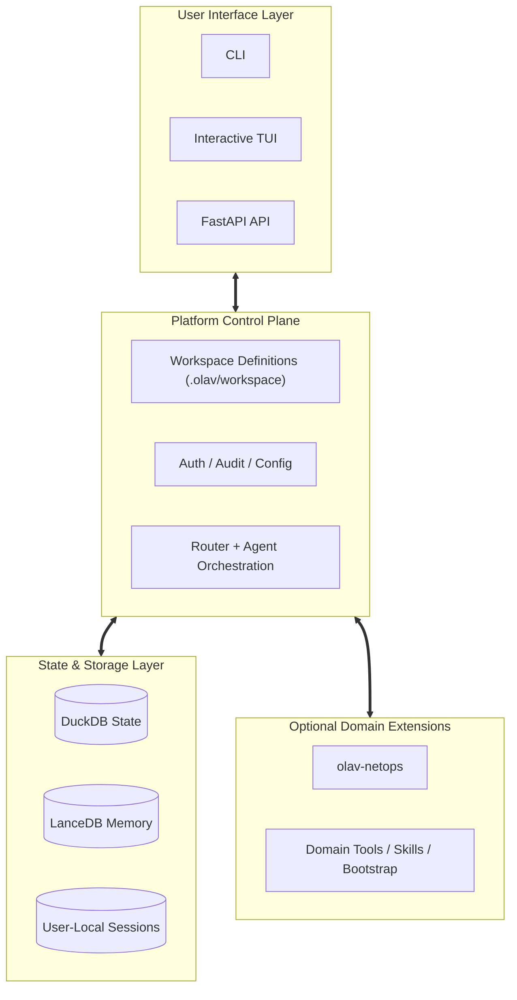
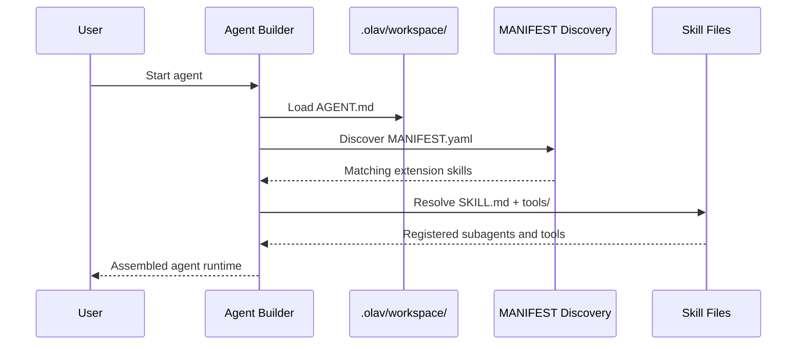

# Core Concepts: Online Analytical Vertex (OLAV)

OLAV is the platform core for AI-assisted operational workflows.

In the current repository, OLAV is best understood as a two-layer model:

1. `src/olav/` provides the platform core.
2. `olav-netops/` provides an optional NetOps extension package.

That split matters when reading the architecture: not every network-specific capability is part of the minimal platform bootstrap.

---

## High-Level Architecture

OLAV follows a layered architecture designed to separate platform control-plane concerns from optional domain capabilities.



---

## 1. The Foundation: Platform Core Vs Domain Extensions
The most important current concept is the split between the platform core and domain packages.

The platform core is responsible for:

- CLI and API entry points
- auth, audit, and user/session boundaries
- workspace discovery and lifecycle control
- agent orchestration and routing
- shared DuckDB / LanceDB state

Domain extensions are responsible for:

- domain-specific tools
- domain-specific bootstrap flows
- external dependencies
- domain runtime config and collection logic

Today, `olav-netops` is the main example of that extension model.

## 2. Shared State And User-Local State
OLAV uses a split-state model.

- Shared project state lives under `.olav/`.
- User-local secrets and sessions live under `~/.olav/`.

In practical terms:

- DuckDB tables and audit data are project-scoped shared state.
- LanceDB memory is platform-managed shared knowledge state.
- tokens, caches, and session/checkpoint files are user-local.

This split is one of the core architectural boundaries of the platform.

## 3. Agents Are Workspace-Declared Capabilities
OLAV does not rely on a single monolithic agent. Agent behavior is assembled from workspace-defined control-plane files.

In the current codebase:

- built-in platform capabilities are commonly declared directly in `AGENT.md`
- package-managed extension capabilities can be injected through `MANIFEST.yaml`
- the active agent surface is therefore a combination of static declarations and discovered extensions

This is a control-plane model, not just a prompt-file model.

## 4. Agent And Skill Registration Model



The current rules are:

1. `AGENT.md` explicit subagents are authoritative.
2. `MANIFEST.yaml` is used for discovery and injection of managed extensions.
3. `SKILL.md` is required for prompt/documentation and validation.
4. Python modules under `tools/` provide the actual runtime tool implementations.

This means OLAV currently uses a hybrid registration model, not a single universal one.

## 5. The Config Agent Is A Platform Control-Plane Agent
The Config Agent is the best example of the current hybrid model.

Built-in subagents such as `discovery`, `creator`, `knowledge`, and `system` are statically declared in the platform workspace.

Domain-specific capabilities such as `sync` and `learner` can be injected by an extension package when that extension is installed and validated.

So the Config Agent is not a flat bundle of always-present skills. It is a platform agent that can be extended by managed domain packages.

---

## 6. Self-Improving Loop: Trace-Driven Feedback

OLAV goes beyond static query execution — it **learns from its own failures** and gets measurably smarter over time without model fine-tuning or manual prompt engineering.

Every agent run produces structured trace data in `audit.duckdb`. A background agent (`trace_learner`) periodically analyzes failed runs, extracts reusable constraints via LLM, and writes them to LanceDB long-term memory. `GuardrailInjector` then retrieves these constraints and prepends them to the system prompt on every subsequent invocation.

```
Agent Run
    │
    ├── AuditCallbackPlugin ──── tokens, tool calls, errors ──▶ audit.duckdb
    └── SemanticRouter ──────── routing_decision event ────────▶ audit.duckdb
                      │
              (take_snapshot / daily cron / /trace-review)
                      │
                      ▼
                 trace_learner
                  ┌── read failed runs
                  ├── LLM: extract constraints
                  └── write ──▶ LanceDB memory[audit]
                            │
                       GuardrailInjector
                            │
                    injected into system prompt
                        on next agent run  ◀───┐
                            │               │
                            └───────────────┘
```

**Three trigger paths** for the learn cycle:
- Automatic: runs after every `take_snapshot` inventory sync
- Scheduled: daily at 03:00, registered by `python olav-netops/scripts/netops_init.py` into `~/.olav/cron.tab`
- Manual: `/trace-review` slash command in the interactive CLI

> See [05_AGENTIC_FEATURES.md](./05_AGENTIC_FEATURES.md) for the full technical reference.

---

## 7. Data Lifecycle: From Device to Intelligence

OLAV processes network data through a complete pipeline:

```
User Query
    ↓
[CLI / Query Agent] → Natural Language Understanding
    ↓
[Middleware] → Capability Resolution (which skill to invoke)
    ↓
[Skill] → Device Connection (SSH/API) + Raw Data Capture
    ↓
[Parser] → TextFSM/netutils/LLM Parsing → Structured JSON
    ↓
[LanceDB] → Vector Embedding (for semantic search)
    ↓
[Agent] → Multi-step Reasoning + Cross-reference
[User] → Synthesized Answer (text + charts + code)
```

**Key Insight**: Data is treated as immutable facts; only the *interpretation* (LLM agents) can evolve with new queries.

---

## 8. Built-In Workflows Vs Extension Workflows

### Platform-Built-In Workflows

Examples of platform-first workflows include:

- authentication and token management
- workspace status and validation
- audit recording and trace review
- prompt assembly and agent orchestration

### Extension-Provided Workflows

Examples of extension-provided workflows include:

- NetOps bootstrap
- device inventory collection
- topology generation
- domain-specific troubleshooting and simulation

The practical rule is simple:

1. If the capability belongs to the control plane, it belongs to the platform.
2. If the capability depends on domain-specific tooling and runtime dependencies, it belongs to an extension package.

---

## 9. Sessions & Checkpoints: Stateful Reasoning

OLAV agents maintain conversation history for **multi-turn reasoning**:

```
Session Structure:
├── .olav/sessions/{user}/
│   ├── {agent_id}.history.json
│
└── ~/.olav/sessions/  (user-local, isolated)
    ├── quick.checkpoint
    ├── ops.checkpoint
    └── audit.checkpoint
```

**Key Features**:
- **Checkpoints**: LangGraph InMemorySaver stores intermediate reasoning steps
- **Recovery**: If interrupted, agent resumes from last checkpoint
- **Isolation**: Each user gets their own session, no cross-contamination
- **Cleanup**: Sessions expire after 30 days or on `/clear` command

---

## 10. Project Structure: Workspace Vs Runtime Config

### `.olav/workspace/` (Project-Shared Control Plane)
```
.olav/workspace/
├── config/
│   ├── AGENT.md
│   ├── MANIFEST.yaml
│   ├── creator/
│   │   └── SKILL.md
│   ├── discovery/
│   │   └── SKILL.md
│   └── tools/
├── audit/
│   ├── AGENT.md
│   └── ...
└── <extension-entry>/
    ├── MANIFEST.yaml
    ├── SKILL.md or AGENT.md
    └── tools/
```
**Purpose**: Define declarative control-plane artifacts such as `AGENT.md`, `SKILL.md`, `MANIFEST.yaml`, prompts, and tools.

### `.olav/config/` And `~/.olav/` (Runtime State)
```
 .olav/config/
├── api.json                   # Project-shared runtime config

~/.olav/
├── token                      # User-local auth token
├── sessions/
│   └── {agent_id}.checkpoint
├── cache/
└── ...
```
**Purpose**: `.olav/config/` holds shared runtime configuration. `~/.olav/` holds user-local secrets, sessions, and cache state.

---

## 11. Multi-User Isolation & Security

OLAV is designed for **concurrent multi-user environments**:

| Layer | Isolation | Mechanism |
|-------|-----------|-----------|
| **Sessions** | Per-user | `~/.olav/sessions/{user}/` |

**Key Principle**: Users operating on the same `.olav/databases/` (shared DuckDB) never see each other's session state.

---

## 12. OLAV vs Other Solutions

| Criterion | OLAV | NetBox | Nautobot | OpenNTI |
|-----------|------|--------|----------|---------|
| **Multi-vendor** | ✅ TextFSM + LLM | ⚠️ Custom plugins | ⚠️ Custom plugins | ⚠️ Limited |
| **Agentic Reasoning** | ✅ LLM-native | ❌ None | ❌ None | ❌ None |
| **Self-Improving Loop** | ✅ trace_learner + GuardrailInjector | ❌ No | ❌ No | ❌ No |
| **Time-Travel Debugging** | ✅ Snapshot diffs | ❌ No | ❌ No | ❌ No |
| **Skill-Centric Extensibility** | ✅ SKILL.md | ⚠️ Plugin API | ⚠️ Plugin API | ❌ Limited |
| **Real-time Simulation** | ✅ What-if graphs | ❌ No | ❌ No | ❌ No |
| **Multi-user Sessions** | ✅ Built-in | ⚠️ RBAC only | ⚠️ RBAC only | ❌ No |
| **Cost** | ✅ Open-source | ✅ Open-source | ⚠️ Premium tiers | ⚠️ Licensing |

---

## 13. Design Principles

OLAV is built on seven core principles:

1. **LLM-Native**: Complexity lives in semantic discovery (LLM), not hardcoded rules.
2. **Schema-on-Read**: Store raw parsed data; semantics applied at query time via views.
3. **Immutable Snapshots**: Every historical moment is preserved; only interpretations change.
4. **Skill-Centric**: All intelligence is modular; agents orchestrate, not monoliths.
5. **Federated, Isolated**: Users share data but never state; concurrency is built-in.
6. **Self-Improving**: `trace_learner` extracts failure constraints; `GuardrailInjector` injects them — no redeployment required.
7. **Audit-First**: Every command logged; security policies machine-enforced.

---

## 14. Quick Start by Role

### For Network Engineers
```bash
olav "Show all DOWN interfaces"
olav --agent ops "Analyze why BGP is flapping"
olav --agent ops "Simulate removing R1-R2 link"
```

### For Network Architects
```bash
olav --agent ops "Build a network redundancy report"
olav --agent audit "Check compliance against Design Standards"
olav "What happens if Core-1 fails?"
```

### For DevOps / Automation
```bash
olav "Export network topology as Terraform"
olav --sandbox modal "Deploy config to R1 safely"
olav "Audit: Compare prod network vs intended state"
```

---

**Next**: Continue with [05_AGENTIC_FEATURES.md](./05_AGENTIC_FEATURES.md), [07_API_OPENAPI.md](./07_API_OPENAPI.md), and [08_AGENT_SKILL_REGISTRATION.md](./08_AGENT_SKILL_REGISTRATION.md).
