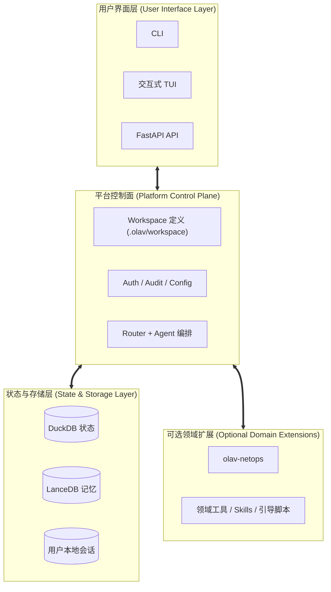
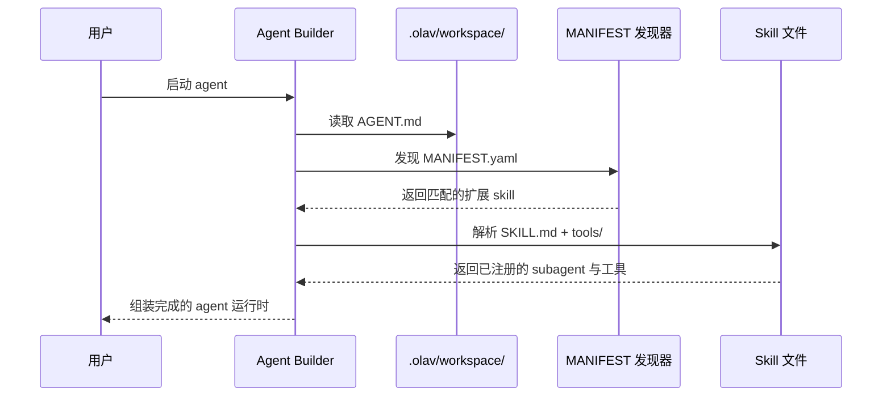

# 核心概念：在线分析中心 (Online Analytical Vertex - OLAV)

OLAV 是 AI 辅助运维工作流的平台核心。

在当前仓库里，OLAV 最好按“两层结构”来理解：

1. `src/olav/` 提供平台核心。
2. `olav-netops/` 提供可选的 NetOps 扩展包。

这意味着阅读架构时必须区分：哪些能力属于平台本体，哪些能力属于可选扩展，而不是默认都把它们视作最小平台的一部分。

---

## 高层架构 (High-Level Architecture)

OLAV 采用分层架构，目的是把平台控制面与可选领域能力解耦。



---

## 1. 平台核心与领域扩展
当前最重要的概念，是平台核心与领域扩展的边界。

平台核心负责：

- CLI 与 API 入口
- 认证、审计、用户与会话边界
- workspace 发现与生命周期控制
- agent 编排与路由
- 共享 DuckDB / LanceDB 状态

领域扩展负责：

- 领域专用工具
- 领域专用 bootstrap 流程
- 外部依赖
- 领域运行态配置与采集逻辑

当前 `olav-netops` 就是这套模型下最主要的扩展示例。

## 2. 共享状态与用户本地状态
OLAV 当前采用“共享状态 + 用户本地状态”的分层模型。

- 项目共享状态位于 `.olav/`。
- 用户本地密钥、缓存和会话位于 `~/.olav/`。

具体来说：

- DuckDB 表与审计数据是项目共享状态。
- LanceDB 记忆是平台管理的共享知识状态。
- token、cache、session/checkpoint 文件是用户本地状态。

这是平台当前最关键的边界之一。

## 3. Agent 是由 Workspace 控制面装配的能力集合
OLAV 不是依赖单一的大 Agent，而是通过 workspace 控制面文件来装配 agent 能力。

在当前代码里：

- 平台内建能力通常直接在 `AGENT.md` 中静态声明
- 受管扩展能力可以通过 `MANIFEST.yaml` 注入
- 因此，实际 agent 能力面是“静态声明 + 发现到的扩展”共同组成的

这是一套控制面模型，而不只是 prompt 文件模型。

## 4. Agent 与 Skill 的注册模型



当前规则可以概括为：

1. `AGENT.md` 显式声明始终优先。
2. `MANIFEST.yaml` 用于受管扩展的发现与注入。
3. `SKILL.md` 负责 prompt / 文档 / 校验。
4. `tools/` 下的 Python 模块才提供实际运行时工具。

也就是说，OLAV 当前是混合注册模型，而不是所有 skill 都走一条统一路径。

## 5. Config Agent 是平台控制面 Agent
Config Agent 是当前混合模型最典型的例子。

`discovery`、`creator`、`knowledge`、`system` 这类子能力属于平台静态声明。

而 `sync`、`learner` 这类领域能力，则可以由扩展包在安装和校验后注入。

因此，Config Agent 并不是一个永远固定不变的 skill 集，而是一个可以被受管扩展增强的平台 agent。

---

## 6. 自我进化闭环：Trace 驱动的持续优化

OLAV 不仅仅执行静态查询——它能**从自身的失败中学习**，在不微调模型、不手动修改 Prompt 的情况下持续变得更智能。

每次 Agent 运行都会在 `audit.duckdb` 中产生结构化 Trace 数据。后台工具 `trace_learner` 定期分析失败的 run 记录，通过 LLM 提取可复用的约束规则，并将其写入 LanceDB 长期记忆。`GuardrailInjector` 在此后的每次调用中检索这些约束，并将其追加到 system prompt 的前端。

```
Agent 运行
    │
    ├── AuditCallbackPlugin ─── Token、工具调用、错误 ──▶ audit.duckdb
    └── SemanticRouter ──────── routing_decision 事件 ──▶ audit.duckdb
                                          │
                   （take_snapshot / 每日定时任务 / /trace-review）
                                          │
                                          ▼
                                 trace_learner
                              ┌── 读取失败 run 记录
                              ├── LLM：提取约束规则
                              └── 写入 ──▶ LanceDB memory[audit]
                                                    │
                                           GuardrailInjector
                                                    │
                                      注入下次运行的 system prompt ◀──┐
                                                    │                  │
                                                    └──────────────────┘
```

**三种触发路径**：
- 自动触发：每次 `take_snapshot` 库存同步完成后
- 定时触发：每天凌晨 3:00，由 `python olav-netops/scripts/netops_init.py` 注册到 `~/.olav/cron.tab`
- 手动触发：交互式 CLI 中的 `/trace-review` slash 命令

> 完整技术参考请见 [05_AGENTIC_FEATURES.md](./05_AGENTIC_FEATURES.md)。

---

## 7. 数据生命周期

OLAV 通过完整的数据处理管道处理网络数据：

```
用户查询
    ↓
[CLI / Query Agent] → 自然语言理解
    ↓
[中间件] → 能力解析（调用哪个技能）
    ↓
[Skill] → 设备连接 (SSH/API) + 原始数据采集
    ↓
[解析器] → TextFSM/netutils/LLM 解析 → 结构化 JSON
    ↓
[DuckDB] → 快照存储 + 全文索引
    ↓
[LanceDB] → 向量嵌入（用于语义搜索）
    ↓
[Agent] → 多步推理 + 交叉引用
    ↓
[用户] → 综合答复（文本 + 图表 + 代码）
```

**核心洞察**：数据被视为不可变的事实；只有*解释*（LLM Agent）会随新查询而演进。

---

## 8. 平台内建工作流与扩展工作流

### 平台内建工作流

平台内建工作流主要包括：

- 用户认证与 token 管理
- workspace 状态查看与校验
- 审计记录与 trace review
- prompt 装配与 agent 编排

### 扩展提供的工作流

扩展提供的工作流通常包括：

- NetOps 引导
- 设备 inventory 采集
- 拓扑生成
- 领域专用排障与仿真

可以用一个简单原则来判断边界：

1. 如果能力属于控制面，它属于平台。
2. 如果能力依赖领域专用工具链和运行时依赖，它属于扩展包。

---

## 9. 会话与检查点：有状态推理

OLAV Agent 维护对话历史以支持**多轮推理**：

```
会话结构：
├── .olav/sessions/{user}/
│   ├── {agent_id}.checkpoint.sqlite
│   ├── {agent_id}.history.json
│   └── {agent_id}.metadata.yaml
│
└── ~/.olav/sessions/  (用户本地化，隔离)
    ├── quick.checkpoint
    ├── ops.checkpoint
    └── audit.checkpoint
```

**关键特性**：
- **检查点**：LangGraph InMemorySaver 存储中间推理步骤
- **恢复**：中断后，Agent 从上一检查点恢复
- **隔离**：每个用户拥有各自的会话，无交叉污染
- **清理**：会话在 30 天后或执行 `/clear` 命令时过期

---

## 10. 项目结构：Workspace 与运行态配置

### `.olav/workspace/`（项目共享控制面）
```
.olav/workspace/
├── config/
│   ├── AGENT.md
│   ├── MANIFEST.yaml
│   ├── creator/
│   │   └── SKILL.md
│   ├── discovery/
│   │   └── SKILL.md
│   └── tools/
├── audit/
│   ├── AGENT.md
│   └── ...
└── <extension-entry>/
    ├── MANIFEST.yaml
    ├── SKILL.md 或 AGENT.md
    └── tools/
```
**目的**：存放 `AGENT.md`、`SKILL.md`、`MANIFEST.yaml`、prompts 和 tools 这些声明式控制面文件。

### `.olav/config/` 与 `~/.olav/`（运行态状态）
```
.olav/config/
├── api.json                   # 项目共享运行态配置

~/.olav/
├── token                      # 用户本地 token
├── sessions/
│   └── {agent_id}.checkpoint
├── cache/
└── ...
```
**目的**：`.olav/config/` 保存共享运行态配置；`~/.olav/` 保存用户本地 secret、session 和 cache。

---

## 11. 多用户隔离与安全

OLAV 设计用于**并发多用户环境**：

| 层级 | 隔离方式 | 机制 |
|------|---------|------|
| **会话** | 按用户 | `~/.olav/sessions/{user}/` |
| **日志** | 按用户审计跟踪 | `.olav/logs/users/{user}.log` |
| **凭据** | 静态加密 | `~/.olav/config/`（仅用户可读） |
| **数据访问** | RBAC via SQL 视图 | DuckDB 行级安全 |
| **命令** | 黑名单/白名单 | Config Agent 通过 `api.json` 强制 |

**核心原则**：在同一个 `.olav/databases/`（共享 DuckDB）上运营的用户永远看不到彼此的会话状态。

---

## 12. OLAV vs 其他方案

| 评估维度 | OLAV | NetBox | Nautobot | OpenNTI |
|---------|------|--------|----------|---------|
| **多厂商支持** | ✅ TextFSM + LLM | ⚠️ 自定义插件 | ⚠️ 自定义插件 | ⚠️ 有限 |
| **Agent 推理** | ✅ LLM 原生 | ❌ 无 | ❌ 无 | ❌ 无 |
| **自我进化闭环** | ✅ trace_learner + GuardrailInjector | ❌ 无 | ❌ 无 | ❌ 无 |
| **时间旅行调试** | ✅ 快照 diff | ❌ 否 | ❌ 否 | ❌ 否 |
| **技能中心可扩展性** | ✅ SKILL.md | ⚠️ 插件 API | ⚠️ 插件 API | ❌ 有限 |
| **实时仿真** | ✅ 假设场景 | ❌ 否 | ❌ 否 | ❌ 否 |
| **多用户会话** | ✅ 内置 | ⚠️ 仅 RBAC | ⚠️ 仅 RBAC | ❌ 无 |
| **成本** | ✅ 开源 | ✅ 开源 | ⚠️ 付费层 | ⚠️ 许可证 |

---

## 13. 设计原则

OLAV 基于七个核心原则构建：

1. **LLM 原生**：复杂性存在于语义发现（LLM），而非硬编码规则。
2. **Schema-on-Read**：存储原始解析数据；语义在查询时通过视图应用。
3. **不可变快照**：保留每个历史时刻；只有解释会随之改变。
4. **技能中心**：所有智能都是模块化的；Agent 编排，非单体系统。
5. **联邦化、隔离**：用户共享数据但从不共享状态；并发内置。
6. **自我进化**：`trace_learner` 从失败中提取约束；`GuardrailInjector` 自动注入——无需重新部署。
7. **审计优先**：每个命令都被记录；安全策略由机器强制执行。

---

## 14. 按角色快速开始

### 对于网络工程师
```bash
olav "显示所有断开的接口"
olav --agent ops "分析为什么 BGP 在抖动"
olav --agent ops "仿真移除 R1-R2 链接"
```

### 对于网络架构师
```bash
olav --agent ops "构建网络冗余报告"
olav --agent audit "检查是否符合设计标准"
olav "如果 Core-1 故障会怎样？"
```

### 对于 DevOps / 自动化
```bash
olav "将网络拓扑导出为 Terraform"
olav --sandbox modal "安全部署配置到 R1"
olav "审计：对比生产网络 vs 预期状态"
```

---

**后续**：继续阅读 [05_AGENTIC_FEATURES.md](./05_AGENTIC_FEATURES.md)、[07_API_OPENAPI.md](./07_API_OPENAPI.md) 和 [08_AGENT_SKILL_REGISTRATION.md](./08_AGENT_SKILL_REGISTRATION.md)。
